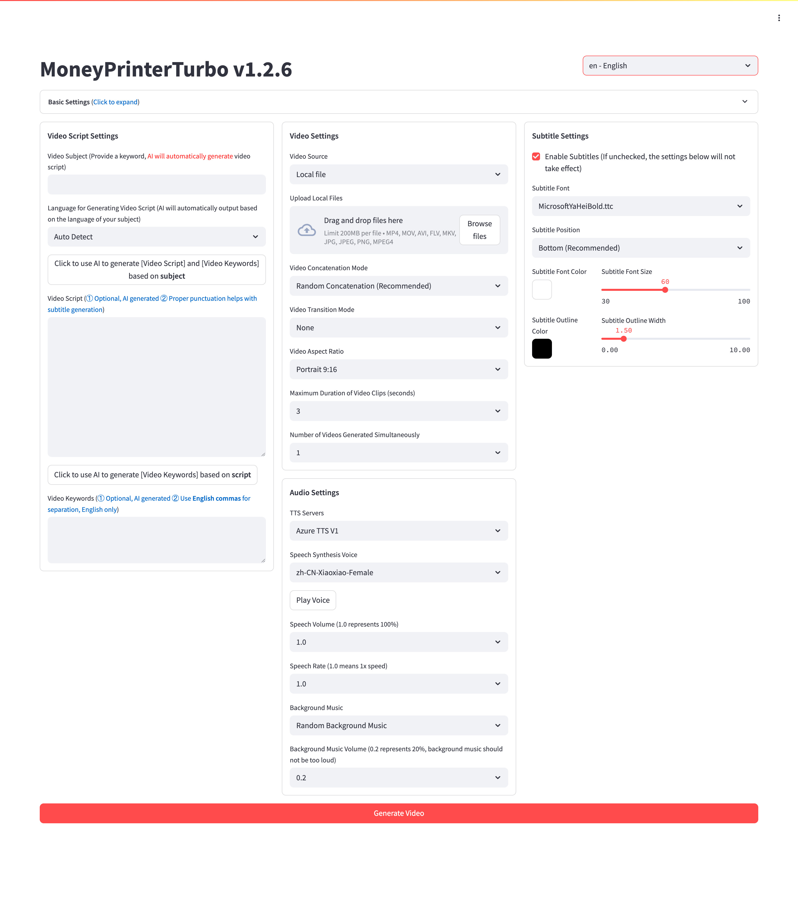

<div align="center">
<h1 align="center">MoneyPrinterTurbo 💸</h1>

<p align="center">
  <a href="https://github.com/harry0703/MoneyPrinterTurbo/stargazers"></a>
  <a href="https://github.com/harry0703/MoneyPrinterTurbo/issues"></a>
  <a href="https://github.com/harry0703/MoneyPrinterTurbo/network/members"></a>
  <a href="https://github.com/harry0703/MoneyPrinterTurbo/blob/main/LICENSE"></a>
</p>

<h3>English | <a href="README.md">简体中文</a></h3>

<div align="center">
  <a href="https://trendshift.io/repositories/8731" target="_blank"></a>
</div>

Simply provide a <b>topic</b> or <b>keyword</b> for a video, and it will automatically generate the video copy, video
materials, video subtitles, and video background music before synthesizing a high-definition short video.

### WebUI



### API Interface


</div>

## Special Thanks 🙏

Due to the **deployment** and **usage** of this project, there is a certain threshold for some beginner users. We would
like to express our special thanks to

**RecCloud (AI-Powered Multimedia Service Platform)** for providing a free `AI Video Generator` service based on this
project. It allows for online use without deployment, which is very convenient.

- Chinese version: https://reccloud.cn
- English version: https://reccloud.com


## Thanks for Sponsorship 🙏

Thanks to Picwish https://picwish.cn for supporting and sponsoring this project, enabling continuous updates and maintenance.

Picwish focuses on the **image processing field**, providing a rich set of **image processing tools** that extremely simplify complex operations, truly making image processing easier.


## Features 🎯

- [x] Complete **MVC architecture**, **clearly structured** code, easy to maintain, supports both `API`
  and `Web interface`
- [x] Supports **AI-generated** video copy, as well as **customized copy**
- [x] Supports various **high-definition video** sizes
    - [x] Portrait 9:16, `1080x1920`
    - [x] Landscape 16:9, `1920x1080`
- [x] Supports **batch video generation**, allowing the creation of multiple videos at once, then selecting the most
  satisfactory one
- [x] Supports setting the **duration of video clips**, facilitating adjustments to material switching frequency
- [x] Supports video copy in both **Chinese** and **English**
- [x] Supports **multiple voice** synthesis, with **real-time preview** of effects
- [x] Supports **subtitle generation**, with adjustable `font`, `position`, `color`, `size`, and also
  supports `subtitle outlining`
- [x] Supports **background music**, either random or specified music files, with adjustable `background music volume`
- [x] Video material sources are **high-definition** and **royalty-free**, and you can also use your own **local materials**
- [x] Supports integration with various models such as **OpenAI**, **Moonshot**, **Azure**, **gpt4free**, **one-api**,
  **Qwen**, **Google Gemini**, **Ollama**, **DeepSeek**, **ERNIE**, **pollinations** and more
    - For users in China, it is recommended to use **DeepSeek** or **Moonshot** as the large model provider (directly accessible in China, no VPN needed. Free credits upon registration, generally sufficient for use)

❓[How to Use the Free OpenAI GPT-3.5 Model?](https://github.com/harry0703/MoneyPrinterTurbo/blob/main/README-en.md#common-questions-)

### Future Plans 📅

- [ ] GPT-SoVITS dubbing support
- [ ] Optimize voice synthesis using large models for more natural and emotionally rich voice output
- [ ] Add video transition effects for a smoother viewing experience
- [ ] Add more video material sources, improve the matching between video materials and script
- [ ] Add video length options: short, medium, long
- [ ] Support more voice synthesis providers, such as OpenAI TTS
- [ ] Automate upload to YouTube platform

## Video Demos 📺

### Portrait 9:16

<table>
<thead>
<tr>
<th align="center"><g-emoji class="g-emoji" alias="arrow_forward">▶️</g-emoji> How to Add Fun to Your Life </th>
<th align="center"><g-emoji class="g-emoji" alias="arrow_forward">▶️</g-emoji> What is the Meaning of Life</th>
</tr>
</thead>
<tbody>
<tr>
<td align="center"><video src="https://github.com/harry0703/MoneyPrinterTurbo/assets/4928832/a84d33d5-27a2-4aba-8fd0-9fb2bd91c6a6"></video></td>
<td align="center"><video src="https://github.com/harry0703/MoneyPrinterTurbo/assets/4928832/112c9564-d52b-4472-99ad-970b75f66476"></video></td>
</tr>
</tbody>
</table>

### Landscape 16:9

<table>
<thead>
<tr>
<th align="center"><g-emoji class="g-emoji" alias="arrow_forward">▶️</g-emoji> What is the Meaning of Life</th>
<th align="center"><g-emoji class="g-emoji" alias="arrow_forward">▶️</g-emoji> Why Exercise</th>
</tr>
</thead>
<tbody>
<tr>
<td align="center"><video src="https://github.com/harry0703/MoneyPrinterTurbo/assets/4928832/346ebb15-c55f-47a9-a653-114f08bb8073"></video></td>
<td align="center"><video src="https://github.com/harry0703/MoneyPrinterTurbo/assets/4928832/271f2fae-8283-44a0-8aa0-0ed8f9a6fa87"></video></td>
</tr>
</tbody>
</table>

## System Requirements 📦

- Recommended minimum 4 CPU cores or more, 8G of memory or more, GPU is not required
- Windows 10 or MacOS 11.0, and their later versions

## Quick Start 🚀

Download the one-click startup package, extract and use directly (the path should not contain **Chinese characters**, **special characters**, or **spaces**)

### Windows
- Baidu Netdisk (1.2.1 latest version): https://pan.baidu.com/s/1pSNjxTYiVENulTLm6zieMQ?pwd=g36q Extraction code: g36q

After downloading, it is recommended to **double-click** `update.bat` first to update to the **latest code**, then double-click `start.bat` to launch

After launching, the browser will open automatically (if it opens blank, it is recommended to use **Chrome** or **Edge**)

### Other Systems

One-click startup packages have not been created yet. See the **Installation & Deployment** section below. It is recommended to use **docker** for deployment, which is more convenient.

## Installation & Deployment 📥

### Prerequisites

- Try to avoid using **Chinese paths** to prevent unpredictable issues
- Ensure your **network** is stable, VPN needs to be in `global traffic` mode

#### ① Clone the Project

```shell
git clone https://github.com/harry0703/MoneyPrinterTurbo.git
```

#### ② Modify the Configuration File

- Copy the `config.example.toml` file and rename it to `config.toml`
- Follow the instructions in the `config.toml` file to configure `pexels_api_keys` and `llm_provider`, and according to
  the llm_provider's service provider, set up the corresponding API Key

### Docker Deployment 🐳

#### ① Launch the Docker Container

If you haven't installed Docker, please install it first https://www.docker.com/products/docker-desktop/
If you are using a Windows system, please refer to Microsoft's documentation:

1. https://learn.microsoft.com/en-us/windows/wsl/install
2. https://learn.microsoft.com/en-us/windows/wsl/tutorials/wsl-containers

```shell
cd MoneyPrinterTurbo
docker-compose up
```

> Note：The latest version of docker will automatically install docker compose in the form of a plug-in, and the start command is adjusted to `docker compose up `

#### ② Access the Web Interface

Open your browser and visit http://0.0.0.0:8501

#### ③ Access the API Interface

Open your browser and visit http://0.0.0.0:8080/docs Or http://0.0.0.0:8080/redoc

### Manual Deployment 📦

> Video tutorials
>
> - Complete usage demonstration: https://v.douyin.com/iFhnwsKY/
> - How to deploy on Windows: https://v.douyin.com/iFyjoW3M

#### ① Install Dependencies

It is recommended to use [pdm](https://pdm-project.org/en/latest/#installation)

```shell
git clone https://github.com/harry0703/MoneyPrinterTurbo.git
cd MoneyPrinterTurbo
pdm sync
```

#### ② Install ImageMagick

###### Windows:

- Download https://imagemagick.org/script/download.php Choose the Windows version, make sure to select the **static library** version, such as ImageMagick-7.1.1-32-Q16-x64-**static**.exe
- Install the downloaded ImageMagick, **do not change the installation path**
- Modify the `config.toml` configuration file, set `imagemagick_path` to your actual installation path

###### MacOS:

```shell
brew install imagemagick
````

###### Ubuntu

```shell
sudo apt-get install imagemagick
```

###### CentOS

```shell
sudo yum install ImageMagick
```

#### ③ Launch the Web Interface 🌐

Note that you need to execute the following commands in the `root directory` of the MoneyPrinterTurbo project

###### Windows

```bat
webui.bat
```

###### MacOS or Linux

```shell
sh webui.sh
```

After launching, the browser will open automatically

#### ④ Launch the API Service 🚀

```shell
python main.py
```

After launching, you can view the `API documentation` at http://127.0.0.1:8080/docs and directly test the interface
online for a quick experience.

## Voice Synthesis 🗣

A list of all supported voices can be viewed here: [Voice List](./docs/voice-list.txt)

2024-04-16 v1.1.2 Added 9 new Azure voice synthesis voices that require API KEY configuration. These voices sound more realistic.

## Subtitle Generation 📜

Currently, there are 2 ways to generate subtitles:

- **edge**: Faster generation speed, better performance, no specific requirements for computer configuration, but the
  quality may be unstable
- **whisper**: Slower generation speed, poorer performance, specific requirements for computer configuration, but more
  reliable quality

You can switch between them by modifying the `subtitle_provider` in the `config.toml` configuration file

It is recommended to use `edge` mode, and switch to `whisper` mode if the quality of the subtitles generated is not
satisfactory.

> Note:
>
> 1. In whisper mode, you need to download a model file from HuggingFace, about 3GB in size, please ensure good internet connectivity
> 2. If left blank, it means no subtitles will be generated.

> Since HuggingFace is not accessible in China, you can use the following methods to download the `whisper-large-v3` model file

Download links:

- Baidu Netdisk: https://pan.baidu.com/s/11h3Q6tsDtjQKTjUu3sc5cA?pwd=xjs9
- Quark Netdisk: https://pan.quark.cn/s/3ee3d991d64b

After downloading the model, extract it and place the entire directory in `.\MoneyPrinterTurbo\models`,
The final file path should look like this: `.\MoneyPrinterTurbo\models\whisper-large-v3`

```
MoneyPrinterTurbo
  ├─models
  │   └─whisper-large-v3
  │          config.json
  │          model.bin
  │          preprocessor_config.json
  │          tokenizer.json
  │          vocabulary.json
```

## Background Music 🎵

Background music for videos is located in the project's `resource/songs` directory.
> The current project includes some default music from YouTube videos. If there are copyright issues, please delete
> them.

## Subtitle Fonts 🅰

Fonts for rendering video subtitles are located in the project's `resource/fonts` directory, and you can also add your
own fonts.

## Common Questions 🤔

### ❓How to Use the Free OpenAI GPT-3.5 Model?

[OpenAI has announced that ChatGPT with 3.5 is now free](https://openai.com/blog/start-using-chatgpt-instantly), and
developers have wrapped it into an API for direct usage.

**Ensure you have Docker installed and running**. Execute the following command to start the Docker service:

```shell
docker run -p 3040:3040 missuo/freegpt35
```

Once successfully started, modify the `config.toml` configuration as follows:

- Set `llm_provider` to `openai`
- Fill in `openai_api_key` with any value, for example, '123456'
- Change `openai_base_url` to `http://localhost:3040/v1/`
- Set `openai_model_name` to `gpt-3.5-turbo`

> Note: This method may be unstable

### ❓AttributeError: 'str' object has no attribute 'choices'

This issue is caused by the large language model not returning a correct response.

It's likely a network issue. Use a **VPN**, or set `openai_base_url` to your proxy, which should solve the problem.

At the same time, it is recommended to use **Moonshot** or **DeepSeek** as the large model provider, as these service providers have faster access and are more stable in China.

### ❓RuntimeError: No ffmpeg exe could be found

Normally, ffmpeg will be automatically downloaded and detected.
However, if your environment has issues preventing automatic downloads, you may encounter the following error:

```
RuntimeError: No ffmpeg exe could be found.
Install ffmpeg on your system, or set the IMAGEIO_FFMPEG_EXE environment variable.
```

In this case, you can download ffmpeg from https://www.gyan.dev/ffmpeg/builds/, unzip it, and set `ffmpeg_path` to your
actual installation path.

```toml
[app]
# Please set according to your actual path, note that Windows path separators are \\
ffmpeg_path = "C:\\Users\\harry\\Downloads\\ffmpeg.exe"
```

### ❓Error generating audio or downloading videos

[issue 56](https://github.com/harry0703/MoneyPrinterTurbo/issues/56)

```
failed to generate audio, maybe the network is not available.
if you are in China, please use a VPN.
```

[issue 44](https://github.com/harry0703/MoneyPrinterTurbo/issues/44)

```
failed to download videos, maybe the network is not available.
if you are in China, please use a VPN.
```

This is likely due to network issues preventing access to foreign services. Please use a VPN to resolve this.

### ❓ImageMagick is not installed on your computer

[issue 33](https://github.com/harry0703/MoneyPrinterTurbo/issues/33)

1. Follow the `example configuration` provided `download address` to
   install https://imagemagick.org/archive/binaries/ImageMagick-7.1.1-30-Q16-x64-static.exe, using the static library
2. Do not install in a path with Chinese characters to avoid unpredictable issues

[issue 54](https://github.com/harry0703/MoneyPrinterTurbo/issues/54#issuecomment-2017842022)

For Linux systems, you can manually install it, refer to https://cn.linux-console.net/?p=16978

Thanks to [@wangwenqiao666](https://github.com/wangwenqiao666) for their research and exploration

### ❓ImageMagick's security policy prevents operations related to temporary file @/tmp/tmpur5hyyto.txt

You can find these policies in ImageMagick's configuration file policy.xml.
This file is usually located in /etc/ImageMagick-`X`/ or a similar location in the ImageMagick installation directory.
Modify the entry containing `pattern="@"`, change `rights="none"` to `rights="read|write"` to allow read and write operations on files.

### ❓OSError: [Errno 24] Too many open files

This issue is caused by the system's limit on the number of open files. You can solve it by modifying the system's file open limit.

Check the current limit:

```shell
ulimit -n
```

If it's too low, you can increase it, for example:

```shell
ulimit -n 10240
```

### ❓Whisper model download failed, with the following error

LocalEntryNotfoundEror: Cannot find an appropriate cached snapshotfolderfor the specified revision on the local disk and
outgoing trafic has been disabled.
To enablerepo look-ups and downloads online, pass 'local files only=False' as input.

or

An error occured while synchronizing the model Systran/faster-whisper-large-v3 from the Hugging Face Hub:
An error happened while trying to locate the files on the Hub and we cannot find the appropriate snapshot folder for the
specified revision on the local disk. Please check your internet connection and try again.
Trying to load the model directly from the local cache, if it exists.

Solution: [Click to see how to manually download the model from netdisk](#subtitle-generation-)

## Feedback & Suggestions 📢

- You can submit an [issue](https://github.com/harry0703/MoneyPrinterTurbo/issues) or
  a [pull request](https://github.com/harry0703/MoneyPrinterTurbo/pulls).

## Reference Projects 📚

This project is based on https://github.com/FujiwaraChoki/MoneyPrinter and has been refactored with a lot of
optimizations and added functionalities. Thanks to the original author for their spirit of open source.

## License 📝

Click to view the [`LICENSE`](LICENSE) file

## Star History

[](https://star-history.com/#harry0703/MoneyPrinterTurbo&Date)
