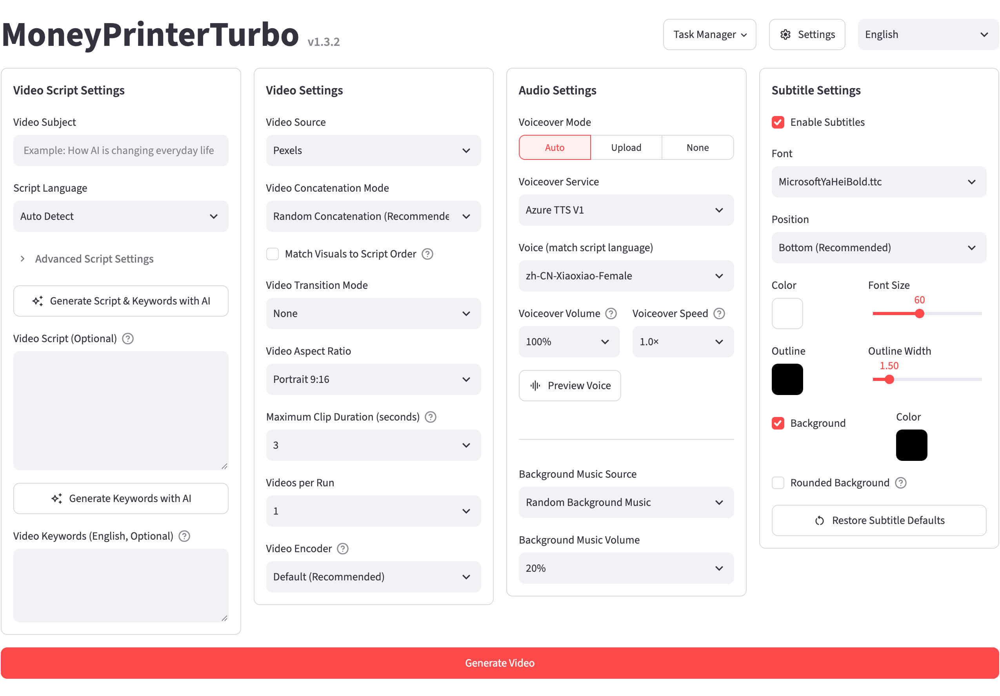
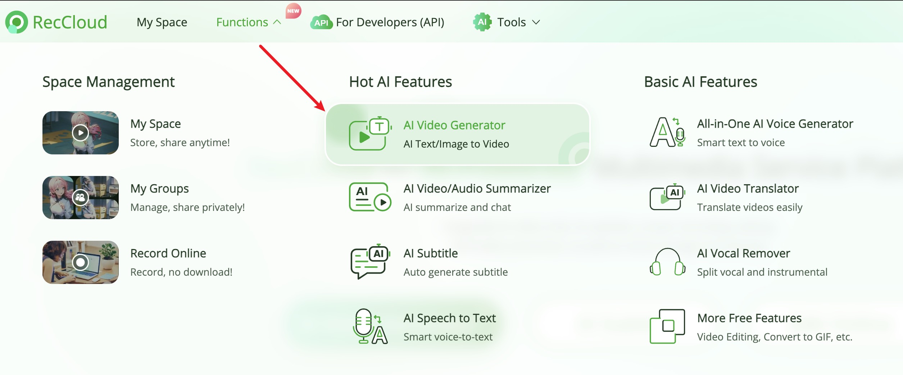
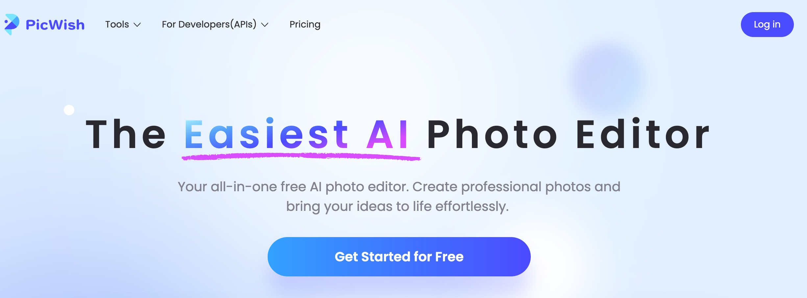

<div align="center">
<h1 align="center">MoneyPrinterTurbo 💸</h1>

<p align="center">
  <a href="https://github.com/harry0703/MoneyPrinterTurbo/stargazers"></a>
  <a href="https://github.com/harry0703/MoneyPrinterTurbo/issues"></a>
  <a href="https://github.com/harry0703/MoneyPrinterTurbo/network/members"></a>
  <a href="https://github.com/harry0703/MoneyPrinterTurbo/blob/main/LICENSE"></a>
</p>

<h3>English | <a href="README.md">简体中文</a> | <a href="README-ar.md">العربية</a></h3>

<div align="center">
  <a href="https://trendshift.io/repositories/8731" target="_blank"></a>
</div>

Simply provide a <b>topic</b> or <b>keyword</b> for a video, and it will automatically generate the video copy, video
materials, video subtitles, and video background music before synthesizing a high-definition short video.

<p align="center">
  <sub>
    Thanks to <a href="https://aihubmix.com/?aff=CEve">AIHubMix</a> for sponsoring this project. AIHubMix deeply adapts to OpenAI, Claude, Gemini, DeepSeek, Zhipu, Qwen, and other leading models, providing one-stop access to GPT-5.5, deepseek-v4-flash, and 700+ models including free options with production-grade stability.
  </sub>
</p>

### WebUI



### API Interface


</div>

## Features 🎯

- [x] Complete **MVC architecture**, **clearly structured** code, easy to maintain, supports both `API`
      and `Web interface`
- [x] Supports **AI-generated** video copy, as well as **customized copy**
- [x] Supports various **high-definition video** sizes
  - [x] Portrait 9:16, `1080x1920`
  - [x] Landscape 16:9, `1920x1080`
- [x] Supports **batch video generation**, allowing the creation of multiple videos at once, then selecting the most
      satisfactory one
- [x] Supports setting the **duration of video clips**, facilitating adjustments to material switching frequency
- [x] Supports video copy in both **Chinese** and **English**
- [x] Supports **multiple voice** synthesis, with **real-time preview** of effects
- [x] Supports **subtitle generation**, with adjustable `font`, `position`, `color`, `size`, and also
      supports `subtitle outlining`
- [x] Supports **background music**, either random or specified music files, with adjustable `background music volume`
- [x] Video material sources are **high-definition** and **royalty-free**, and you can also use your own **local materials**
- [x] Supports multiple stock video providers: **Pexels**, **Pixabay**, and **Coverr** (free HD/4K stock videos, subject to [Coverr license terms](https://coverr.co/license); mostly 16:9 landscape; register at [coverr.co/developers](https://coverr.co/developers?ctx=header_navigation), Demo tier 50 requests/hour)
- [x] Supports integration with various models such as **OpenAI**, **AIHubMix**, **Moonshot**, **Azure**, **gpt4free**, **one-api**, **Qwen**, **Google Gemini**, **Ollama**, **DeepSeek**, **MiniMax**, **ERNIE**, **Pollinations**, **ModelScope** and more

## Video Demos 📺

### Portrait 9:16

<table>
<thead>
<tr>
<th align="center"><g-emoji class="g-emoji" alias="arrow_forward">▶️</g-emoji> How to Add Fun to Your Life </th>
<th align="center"><g-emoji class="g-emoji" alias="arrow_forward">▶️</g-emoji> What is the Meaning of Life</th>
</tr>
</thead>
<tbody>
<tr>
<td align="center"><video src="https://github.com/harry0703/MoneyPrinterTurbo/assets/4928832/a84d33d5-27a2-4aba-8fd0-9fb2bd91c6a6"></video></td>
<td align="center"><video src="https://github.com/harry0703/MoneyPrinterTurbo/assets/4928832/112c9564-d52b-4472-99ad-970b75f66476"></video></td>
</tr>
</tbody>
</table>

### Landscape 16:9

<table>
<thead>
<tr>
<th align="center"><g-emoji class="g-emoji" alias="arrow_forward">▶️</g-emoji> What is the Meaning of Life</th>
<th align="center"><g-emoji class="g-emoji" alias="arrow_forward">▶️</g-emoji> Why Exercise</th>
</tr>
</thead>
<tbody>
<tr>
<td align="center"><video src="https://github.com/harry0703/MoneyPrinterTurbo/assets/4928832/346ebb15-c55f-47a9-a653-114f08bb8073"></video></td>
<td align="center"><video src="https://github.com/harry0703/MoneyPrinterTurbo/assets/4928832/271f2fae-8283-44a0-8aa0-0ed8f9a6fa87"></video></td>
</tr>
</tbody>
</table>

## System Requirements 📦

- Recommended platforms: Windows 10+, macOS 11+, or a mainstream Linux distribution
- A GPU is not required, but it is recommended if you want faster local transcription, faster video processing, or smoother batch generation

| Item | Minimum      | Recommended  | Optimal    |
| ---- | ------------ | ------------ | ---------- |
| CPU  | 4 cores      | 6 to 8 cores | 8+ cores   |
| RAM  | 4 GB         | 8 GB         | 16+ GB     |
| GPU  | Not required | 4+ GB VRAM   | 8+ GB VRAM |

- If you mainly rely on cloud LLMs, cloud TTS, and online material sources, CPU and RAM matter more than GPU
- If you use `faster-whisper`, batch generation, or heavier local processing, a GPU will improve throughput noticeably

## Quick Start 🚀

### Recommended Paths

- Windows users: use the one-click package first for the fastest local trial
- MacOS / Linux users: use `uv sync --frozen` for the primary local setup path
- If you want a more isolated runtime: use Docker deployment

### Run in Google Colab

Want to try MoneyPrinterTurbo without setting up a local environment? Run it directly in Google Colab!

[](https://colab.research.google.com/github/harry0703/MoneyPrinterTurbo/blob/main/docs/MoneyPrinterTurbo.ipynb)

### Windows

The downloadable package is still the older `v1.2.6` bundled build. After downloading, run `update.bat` first to bring it up to the latest code.

Google Drive (v1.2.6): https://drive.google.com/file/d/1HsbzfT7XunkrCrHw5ncUjFX8XX4zAuUh/view?usp=sharing

After downloading, it is recommended to **double-click** `update.bat` first to update to the **latest code**, then double-click `start.bat` to launch

After launching, the browser will open automatically (if it opens blank, it is recommended to use **Chrome** or **Edge**)

### Other Systems

One-click startup packages have not been created yet. See the **Installation & Deployment** section below. It is recommended to use **docker** for deployment, which is more convenient.

## Installation & Deployment 📥

### Prerequisites

#### ① Clone the Project

```shell
git clone https://github.com/harry0703/MoneyPrinterTurbo.git
```

#### ② Modify the Configuration File

- Copy the `config.example.toml` file and rename it to `config.toml`
- Follow the instructions in the `config.toml` file to configure `pexels_api_keys` and `llm_provider`, and according to
  the llm_provider's service provider, set up the corresponding API Key
- To use the recommended multi-model provider, you can set `llm_provider` to `aihubmix` and enter the corresponding API key.

### Docker Deployment 🐳

#### ① Launch the Docker Container

If you haven't installed Docker, please install it first https://www.docker.com/products/docker-desktop/
If you are using a Windows system, please refer to Microsoft's documentation:

1. https://learn.microsoft.com/en-us/windows/wsl/install
2. https://learn.microsoft.com/en-us/windows/wsl/tutorials/wsl-containers

```shell
cd MoneyPrinterTurbo
docker-compose up
```

> Note：The latest version of docker will automatically install docker compose in the form of a plug-in, and the start command is adjusted to `docker compose up `

#### ② Access the Web Interface

Open your browser and visit http://127.0.0.1:8501

#### ③ Access the API Interface

Open your browser and visit http://127.0.0.1:8080/docs or http://127.0.0.1:8080/redoc

### Manual Deployment 📦

#### ① Create a Python Virtual Environment

It is recommended to use [uv](https://docs.astral.sh/uv/) to manage the Python environment and dependencies, with Python `3.11` as the default runtime.

```shell
git clone https://github.com/harry0703/MoneyPrinterTurbo.git
cd MoneyPrinterTurbo
uv python install 3.11
uv sync --frozen
```

If you are not using `uv` yet, you can still use `venv + pip`.

```shell
python3.11 -m venv .venv
source .venv/bin/activate
pip install -r requirements.txt
```

Notes:

- `pyproject.toml` is now the primary dependency manifest.
- `uv.lock` pins the resolved environment, so `uv sync --frozen` is recommended by default.
- `requirements.txt` is kept only for legacy `pip`-based installation.

#### ② Launch the Web Interface 🌐

Note that you need to execute the following commands in the `root directory` of the MoneyPrinterTurbo project

###### Windows

```powershell
.\webui.bat
```

You can also run `webui.bat` in CMD.
`webui.bat` prefers the project `.venv` or bundled Python from the portable package. If no project Python is found but `uv` is installed, it automatically falls back to `uv run streamlit`.
To allow other devices on your LAN to access the WebUI, run `set MPT_WEBUI_HOST=0.0.0.0` before running `webui.bat`.

###### MacOS or Linux

```shell
uv run streamlit run ./webui/Main.py --browser.gatherUsageStats=False
```

If you have already activated the virtual environment manually, you can still run:

```shell
sh webui.sh
```

After launching, the browser will open automatically

#### ③ Launch the API Service 🚀

```shell
uv run python main.py
```

If you have already activated the virtual environment manually, you can still run:

```shell
python main.py
```

#### ④ Pure CLI Mode (No Browser) ⌨️

If you cannot use a browser or port forwarding, you can generate videos directly from the command line:

```shell
uv run python cli.py --video-subject "The Role of Money"
```

You can also provide local materials and control the stop stage:

```shell
uv run python cli.py \
  --video-subject "The Role of Money" \
  --video-source local \
  --video-materials "1.mp4,2.mp4" \
  --stop-at video
```

## Special Thanks 🙏

Due to the **deployment** and **usage** of this project, there is a certain threshold for some beginner users. We would
like to express our special thanks to

**RecCloud (AI-Powered Multimedia Service Platform)** for providing a free `AI Video Generator` service based on this
project. It allows for online use without deployment, which is very convenient.

- Chinese version: https://reccloud.cn
- English version: https://reccloud.com



## Thanks for Sponsorship 🙏

Thanks to Picwish https://picwish.com for supporting and sponsoring this project, enabling continuous updates and maintenance.

Picwish focuses on the **image processing field**, providing a rich set of **image processing tools** that extremely simplify complex operations, truly making image processing easier.



## Voice Synthesis 🗣

A list of all supported voices can be viewed here: [Voice List](./docs/voice-list.txt)

The default TTS provider is **Edge TTS** (free, no API key required). In the WebUI it appears as **"Azure TTS V1"** — this is the same thing. To switch voices, set `voice_name` in `config.toml` or select one from the WebUI voice dropdown.

> **Note:** "Azure TTS V1" (Edge TTS, free) and "Azure TTS V2" (paid Azure Speech SDK) are two different options in the WebUI. Only V2 requires an Azure API key.

To use higher-quality **Azure TTS V2** voices, configure your Azure Speech credentials in `config.toml`:

```toml
[azure]
speech_key = "your-azure-speech-key"
speech_region = "eastus"
```

Azure TTS V2 voices require an [Azure Speech Services](https://portal.azure.com/) subscription. The 9 Azure voices added in v1.1.2 sound noticeably more natural than Edge TTS for most use cases.

## Subtitle Generation 📜

Currently, there are 2 ways to generate subtitles:

- **edge**: Uses Edge TTS timestamps to align subtitles. Fast, no GPU required, works on any machine. Accuracy depends on the TTS timing signal — occasionally misaligns on complex sentences.
- **whisper**: Runs `faster-whisper` locally to transcribe the generated audio and produce word-level timestamps. Slower (a few seconds to ~1 minute per clip on CPU depending on model size), requires downloading a model (~250 MB for `large-v3-turbo`, ~3 GB for `large-v3`), but produces more accurate subtitles regardless of TTS provider.

You can switch between them by modifying the `subtitle_provider` in the `config.toml` configuration file

It is recommended to use `edge` mode, and switch to `whisper` mode if the quality of the subtitles generated is not
satisfactory.

> Note:
>
> 1. In whisper mode, you need to download a model file from HuggingFace, about 3GB in size, please ensure good internet connectivity
> 2. If left blank, it means no subtitles will be generated.

> Since HuggingFace is not accessible in China, you can use the following methods to download the `whisper-large-v3` model file

Download links:

- Baidu Netdisk: https://pan.baidu.com/s/11h3Q6tsDtjQKTjUu3sc5cA?pwd=xjs9
- Quark Netdisk: https://pan.quark.cn/s/3ee3d991d64b

After downloading the model, extract it and place the entire directory in `.\MoneyPrinterTurbo\models`,
The final file path should look like this: `.\MoneyPrinterTurbo\models\whisper-large-v3`

```
MoneyPrinterTurbo
  ├─models
  │   └─whisper-large-v3
  │          config.json
  │          model.bin
  │          preprocessor_config.json
  │          tokenizer.json
  │          vocabulary.json
```

## Background Music 🎵

Background music for videos is located in the project's `resource/songs` directory.

> The current project includes some default music from YouTube videos. If there are copyright issues, please delete
> them.

## Subtitle Fonts 🅰

Fonts for rendering video subtitles are located in the project's `resource/fonts` directory, and you can also add your
own fonts.

## Common Questions 🤔

### ❓RuntimeError: No ffmpeg exe could be found

Normally, ffmpeg will be automatically downloaded and detected.
However, if your environment has issues preventing automatic downloads, you may encounter the following error:

```
RuntimeError: No ffmpeg exe could be found.
Install ffmpeg on your system, or set the IMAGEIO_FFMPEG_EXE environment variable.
```

In this case, you can download ffmpeg from https://www.gyan.dev/ffmpeg/builds/, unzip it, and set `ffmpeg_path` to your
actual installation path.

```toml
[app]
# Please set according to your actual path, note that Windows path separators are \\
ffmpeg_path = "C:\\Users\\harry\\Downloads\\ffmpeg.exe"
```

### ❓ImageMagick is not installed on your computer

> **This error no longer applies to the current version.**
>
> Since the project upgraded to **MoviePy 2.x**, subtitle rendering uses **Pillow** instead of ImageMagick. You do not need to install ImageMagick. If you are seeing this error, you may be running an older version of the code — run `git pull` to update, or use `update.bat` on Windows.

### ❓OSError: [Errno 24] Too many open files

This issue is caused by the system's limit on the number of open files. You can solve it by modifying the system's file open limit.

Check the current limit:

```shell
ulimit -n
```

If it's too low, you can increase it, for example:

```shell
ulimit -n 10240
```

### ❓Whisper model download failed, with the following error

```
LocalEntryNotFoundError: Cannot find an appropriate cached snapshot folder for the specified revision on the local disk and
outgoing traffic has been disabled.
To enable repo look-ups and downloads online, pass 'local_files_only=False' as input.
```

or

```
An error occurred while synchronizing the model Systran/faster-whisper-large-v3 from the Hugging Face Hub:
An error happened while trying to locate the files on the Hub and we cannot find the appropriate snapshot folder for the
specified revision on the local disk. Please check your internet connection and try again.
Trying to load the model directly from the local cache, if it exists.
```

Solution: [Click to see how to manually download the model from netdisk](#subtitle-generation-)

## Feedback & Suggestions 📢

- You can submit an [issue](https://github.com/harry0703/MoneyPrinterTurbo/issues) or
  a [pull request](https://github.com/harry0703/MoneyPrinterTurbo/pulls).

## License 📝

Click to view the [`LICENSE`](LICENSE) file

## Star History

[](https://star-history.com/#harry0703/MoneyPrinterTurbo&Date)
