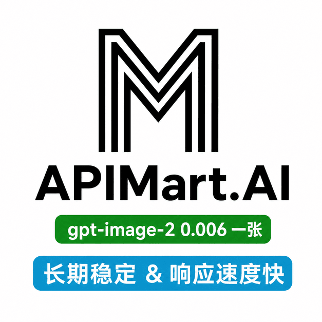
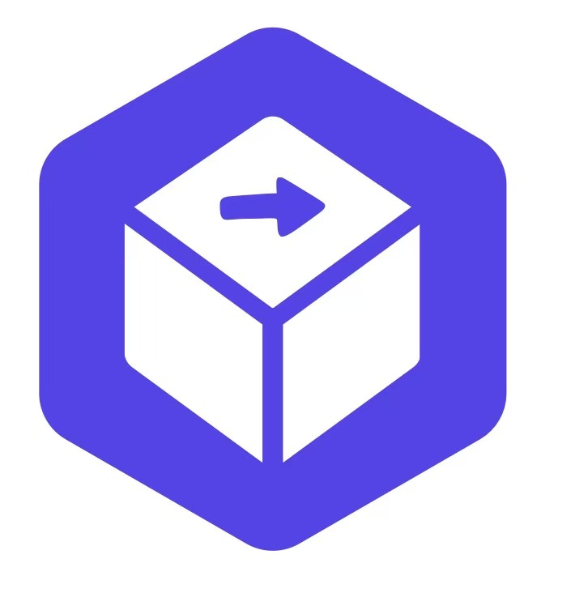

<div align="center">

# MoneyPrinterTurbo 💸

### An All-in-One AI Short Video Generator

Provide a video <b>topic</b> or <b>keyword</b>, and MoneyPrinterTurbo will generate the script, match footage, create subtitles and background music, and produce an HD short video.

[](https://github.com/harry0703/MoneyPrinterTurbo/releases)
[](https://github.com/harry0703/MoneyPrinterTurbo/releases/latest)
[](https://www.python.org/)
[](https://github.com/harry0703/MoneyPrinterTurbo/releases/latest)

<a href="https://trendshift.io/repositories/8731" target="_blank"></a>
<a href="https://www.star-history.com/harry0703/moneyprinterturbo"></a>

English | [简体中文](README.md) | [日本語](README-ja.md) | [Releases](https://github.com/harry0703/MoneyPrinterTurbo/releases) | [Issues](https://github.com/harry0703/MoneyPrinterTurbo/issues)

</div>

## Screenshots 🖥️

<h4 align="center">WebUI</h4>


<h4 align="center">API</h4>


---

## Special Thanks ❤️

<div align="center">
  <a href="https://platform.kimi.ai?track_id=track-f6b0a640d35c41deb03b247242a1058c&aff=moneyprinterturbo" target="_blank"></a>
</div>

Thanks to [Kimi](https://platform.kimi.ai?track_id=track-f6b0a640d35c41deb03b247242a1058c&aff=moneyprinterturbo) for sponsoring this project! [Kimi K3](https://www.kimi.com/blog/kimi-k3?aff=moneyprinterturbo) is Moonshot AI's most capable model and the world's first open 3T-class model. With native vision and a 1-million-token context window, K3 delivers frontier performance across knowledge work, reasoning, and long-horizon tasks. Within MoneyPrinterTurbo, K3 powers video creation by writing scripts and extracting the search keywords that determine the final footage—the better it understands the content, the more relevant the results.

**Exclusive offer for MoneyPrinterTurbo users: new users who register through the dedicated link receive bonus API credit equal to 10% of their first successful top-up, up to CNY 1,000. The offer ends September 30, 2026. Visit the Kimi Open Platform ([中文站](https://platform.kimi.com?track_id=track-2f5441d6ffd84c509dd079d78e9db5dc&aff=moneyprinterturbo) | [Global](https://platform.kimi.ai?track_id=track-f6b0a640d35c41deb03b247242a1058c&aff=moneyprinterturbo)) to try the API.**

<br>
<table align="center">
  <tr>
    <td align="center" width="120">
      <a href="https://www.byteplus.com/en/product/modelark?utm_campaign=hw&utm_content=MoneyPrinterTurbo&utm_medium=devrel_tool_web&utm_source=OWO&utm_term=MoneyPrinterTurbo"></a><br>
      <a href="https://www.byteplus.com/en/product/modelark?utm_campaign=hw&utm_content=MoneyPrinterTurbo&utm_medium=devrel_tool_web&utm_source=OWO&utm_term=MoneyPrinterTurbo"><strong>BytePlus ModelArk</strong></a>
    </td>
    <td align="left">
      Thanks to ByteDance VolcEngine for sponsoring this project! VolcEngine Ark's Agent/Coding Plan for leading Chinese models starts at CNY 9.9 for first-time buyers and supports GLM-5.3, Kimi-K3, DeepSeek, MiniMax, Doubao, and more. New users receive 25 million free tokens. One unified API is designed for coding and agent development. <a href="https://www.byteplus.com/en/product/modelark?utm_campaign=hw&utm_content=MoneyPrinterTurbo&utm_medium=devrel_tool_web&utm_source=OWO&utm_term=MoneyPrinterTurbo">Visit now</a>
    </td>
  </tr>
  <tr>
    <td align="center" width="120">
      <a href="https://www.ccsub.net/register?ref=VCVDAWWY"></a><br>
      <a href="https://www.ccsub.net/register?ref=VCVDAWWY"><strong>CCSub</strong></a>
    </td>
    <td align="left">
      Thanks to <a href="https://www.ccsub.net/register?ref=VCVDAWWY">CCSub</a> for sponsoring this project! CCSub is a stable, affordable AI API relay platform — your drop-in replacement for a Claude.ai subscription. One API key gives you access to Claude Opus 4.8, Sonnet, Haiku, GPT-5, and Gemini at roughly 30% of direct API cost, with no VPN required from anywhere in the world. Compatible with Claude Code, Codex, Cursor, Cline, Continue, Windsurf, and all major AI coding tools. Register at <a href="https://www.ccsub.net/register?ref=VCVDAWWY">www.ccsub.net</a> and get $5 free credit on sign-up.
    </td>
  </tr>
  <tr>
    <td align="center" width="120">
      <a href="https://go.apimart.ai/gh-moneyprinterturbo"></a>
    </td>
    <td align="left">
      Thanks to <a href="https://go.apimart.ai/gh-moneyprinterturbo">APIMart</a> for sponsoring this project! APIMart is a low-cost API platform for AI image &amp; video generation — <strong>GPT-Image-2 from &#36;0.006/image, 160+ images per dollar</strong>. <strong>One async API covers both image and video—switch models without changing code.</strong> Submit a task, get an ID, and fetch results via polling or callback. Batch tens of thousands of images without timeouts. Pay-as-you-go with no monthly fee — <a href="https://go.apimart.ai/gh-moneyprinterturbo">sign up here</a> to get started.
    </td>
  </tr>
  <tr>
    <td align="center" width="120">
      <a href="https://metaso.cn/minimax-h3/?s=MPT"></a><br>
      <a href="https://metaso.cn/minimax-h3/?s=MPT"><strong>Metaso</strong></a>
    </td>
    <td align="left">
      <strong>MiniMax H3 Video Generation API by Metaso</strong><br>
      Metaso offers a cost-effective MiniMax H3 video generation service: <strong>768p for just CNY 0.09 per second and 2K for CNY 0.15 per second</strong>. It supports native 2K output, synchronized audio and video, an OpenAI-compatible API, and ComfyUI—all without requiring you to deploy or manage GPUs.<br>
      🎁 Sign up through the <a href="https://metaso.cn/minimax-h3/?s=MPT">exclusive MoneyPrinterTurbo link</a> to receive bonus credits and special offers.
    </td>
  </tr>
  <tr>
    <td align="center" width="120">
      <a href="https://infistar.cc/register?aff=6T4EYXP2&amp;ref_source=link"></a><br>
      <a href="https://infistar.cc/register?aff=6T4EYXP2&amp;ref_source=link"><strong>Infistar.ai</strong></a>
    </td>
    <td align="left">
      Thanks to <a href="https://infistar.cc/register?aff=6T4EYXP2&amp;ref_source=link">Infistar.ai</a> for sponsoring this project!<br>
      ⚡ Low-cost, reliable access: pricing starts at just 10% of official rates, with transparent model multipliers and detailed usage records. Dynamic routing across multiple providers helps avoid rate limits and unexpected service interruptions.<br>
      🧠 Leading LLMs for script creation: access OpenAI, Claude, Google Gemini, DeepSeek, Qwen, and other leading models through an OpenAI-compatible API. Infistar.ai provides low-latency, high-concurrency support for MoneyPrinterTurbo's script generation and media keyword extraction workflows.<br>
      🎨 A cutting-edge multimodal ecosystem: access leading image and video generation models including FLUX, Midjourney, Seedance, Kling, Sora, and Luma, all ready for the next generation of AI video creation.<br>
      🎁 MoneyPrinterTurbo users can sign up through the <a href="https://infistar.cc/register?aff=6T4EYXP2&amp;ref_source=link">dedicated referral link</a> and view the latest exclusive offers available from Infistar.ai.
    </td>
  </tr>
  <tr>
    <td align="center" width="120">
      <a href="https://www.shengsuanyun.com/?from=CH_XUQ4OTSK"></a><br>
      <a href="https://www.shengsuanyun.com/?from=CH_XUQ4OTSK"><strong>Shengsuan Cloud</strong></a>
    </td>
    <td align="left">
      Thanks to <a href="https://www.shengsuanyun.com/?from=CH_XUQ4OTSK">Shengsuan Cloud</a> for sponsoring this project! Shengsuan Cloud is an API aggregation platform for AI-native teams, providing unified, usage-based access to leading language and multimodal models including Claude, ChatGPT, and Gemini.<br>
      The platform focuses on compliant API services and also offers enterprise gateways with team cost and permission management, intelligent routing, security controls, BYOK credential management, and invoice support.<br>
      🎁 New users who register through <a href="https://www.shengsuanyun.com/?from=CH_XUQ4OTSK">this link</a> can receive CNY 10 in trial credits.
    </td>
  </tr>
  <tr>
    <td align="center" width="120">
      <a href="https://reccloud.com"></a><br>
      <a href="https://reccloud.com"><strong>RecCloud</strong></a>
    </td>
    <td align="left">
      Due to the <strong>deployment</strong> and <strong>usage</strong> of this project, there is a certain threshold for some beginner users. We would like to express our special thanks to <a href="https://reccloud.com">RecCloud (AI-Powered Multimedia Service Platform)</a> for providing a free <code>AI Video Generator</code> service based on this project. It allows for online use without deployment, which is very convenient.
    </td>
  </tr>
  <tr>
    <td align="center" width="120">
      <a href="https://picwish.com"></a><br>
      <a href="https://picwish.com"><strong>Picwish</strong></a>
    </td>
    <td align="left">
      Thanks to <a href="https://picwish.com">Picwish</a> for supporting and sponsoring this project, enabling continuous updates and maintenance. Picwish focuses on the <strong>image processing field</strong>, providing a rich set of <strong>image processing tools</strong> that extremely simplify complex operations, truly making image processing easier.
    </td>
  </tr>
</table>

## Another Open-Source Project from the Creator: MangoDisk ⭐

<p align="center">
  <a href="https://mangodisk.app">
    <picture>
      <source media="(prefers-color-scheme: dark)" srcset="https://assets.mangodisk.app/images/screenshots/en/dark-01-deep-cleanup.jpg">
      <source media="(prefers-color-scheme: light)" srcset="https://assets.mangodisk.app/images/screenshots/en/light-01-deep-cleanup.jpg">
      
    </picture>
  </a>
</p>

<p align="center">
  <strong>An open-source disk cleaner, storage analyzer, and system optimizer for macOS and Windows</strong><br>
  Clean caches, large files, duplicates, and app leftovers; analyze disk usage; manage apps and startup items; and maintain your system.
</p>

<p align="center">
  <a href="https://mangodisk.app">Visit the MangoDisk Website</a> · <a href="https://github.com/harry0703/MangoDisk">View on GitHub</a>
</p>

---

## Features 🎯

### Creation Workflows

- [x] Use **AI Agent, WebUI, API, or CLI** workflows for quick creation or automated production
- [x] Go from a topic to script, voiceover, footage, subtitles, music, and editing automatically, while retaining control over every stage
- [x] Generate multiple output variants in batches, review task history, and import or export generation settings and API keys

### Scripts and Model Providers

- [x] Generate or rewrite **multilingual video scripts** with AI, or supply a complete custom script
- [x] Use leading providers including [Kimi / Moonshot AI](https://platform.kimi.ai?track_id=track-f6b0a640d35c41deb03b247242a1058c&aff=moneyprinterturbo), [OpenAI](https://platform.openai.com/api-keys), [Anthropic Claude](https://platform.claude.com/settings/keys), [Google Gemini](https://aistudio.google.com/app/apikey), [DeepSeek](https://platform.deepseek.com/api_keys), [Alibaba Cloud Qwen](https://qwen.ai/apiplatform), [Microsoft Azure OpenAI](https://portal.azure.com/#view/Microsoft_Azure_ProjectOxford/CognitiveServicesHub/~/OpenAI), [ByteDance VolcEngine Ark](https://console.volcengine.com/ark), [xAI Grok](https://console.x.ai/), [MiniMax](https://platform.minimax.io/), and [Xiaomi MiMo](https://platform.xiaomimimo.com/docs/zh-CN/quick-start/first-api-call)
- [x] Connect through [Shengsuan Cloud](https://www.shengsuanyun.com/?from=CH_XUQ4OTSK), [APIMart](https://go.apimart.ai/gh-moneyprinterturbo), [Cloudflare AI Gateway](https://dash.cloudflare.com/), [Alibaba ModelScope](https://modelscope.cn/docs/model-service/API-Inference/intro), [AIHubMix](https://aihubmix.com/), [AIML API](https://aimlapi.com/app/keys), [EvoLink](https://evolink.ai/dashboard/keys), [OpenRouter](https://openrouter.ai/settings/keys), [Ollama](https://ollama.com/), [Claude Code subscription](https://code.claude.com/docs), [OneAPI](https://github.com/songquanpeng/one-api), [LiteLLM](https://docs.litellm.ai/docs/providers), [Groq](https://console.groq.com/keys), [Pollinations AI](https://enter.pollinations.ai/), and other compatible gateways or local runtimes

### Video and Image Footage

- [x] Upload your own **local images and videos**, or get HD stock footage from [Pexels (free)](https://www.pexels.com/api/), [Pixabay (free)](https://pixabay.com/api/docs/), and [Coverr](https://coverr.co/developers?ctx=header_navigation)
- [x] Generate `768P` or `2K` source footage with [Metaso MiniMax H3](https://metaso.cn/minimax-h3/?s=MPT), with 4–15 second clips in `9:16`, `16:9`, or `1:1`
- [x] Create multiple AI video clips with [Shengsuan Cloud AI Video](https://www.shengsuanyun.com/?from=CH_XUQ4OTSK), then combine them with the project's voiceover, subtitle, and editing workflow
- [x] Use the native [Volcano Engine Ark Seedance](https://console.volcengine.com/ark/region:ark+cn-beijing/apikey) integration to generate cohesive visuals from individual script segments
- [x] Turn script keywords into original video footage with [WaveSpeed AI](https://wavespeed.ai)
- [x] Access Seedance, Wan, and other text-to-video models through [OFox](https://ofox.ai) with a single API key
- [x] Connect [OpenAI-compatible text-to-image](https://platform.openai.com/docs/guides/image-generation) services or custom image gateways and turn generated images into animated video clips
- [x] Adjust clip duration, frame fitting, and material order to suit different aspect ratios and storytelling styles

### Voiceover, Subtitles, and Background Music

- [x] Choose automatic voiceover, uploaded audio, or no voiceover, with voice samples and full narration previews
- [x] Use **Edge TTS (free, no API key required)**, Azure Speech, SiliconFlow, Google Gemini, Xiaomi MiMo, MiniMax, ElevenLabs, Chatterbox, Fish Audio, and other voice services
- [x] Generate subtitles and configure their font, position, color, size, outline, and background style
- [x] Use random, local, or AI-generated background music with independent volume control

### Output and Publishing

- [x] Export portrait `9:16 (1080×1920)`, landscape `16:9 (1920×1080)`, or square `1:1 (1080×1080)` videos
- [x] Publish completed videos directly to **TikTok, Instagram, and YouTube Shorts**

## Gallery 🎬

All examples below were generated with MoneyPrinterTurbo.

### Portrait 9:16

<table width="100%">
<tr>
<td align="center" width="25%"><a href="https://harry0703.github.io/mpt-assets/?video=03-zh-portrait-city-morning.mp4"></a><br><strong>When the City Wakes</strong><br>Chinese · 14 sec</td>
<td align="center" width="25%"><a href="https://harry0703.github.io/mpt-assets/?video=05-zh-portrait-clean-energy.mp4"></a><br><strong>The Future of Clean Energy</strong><br>Chinese · 24 sec</td>
<td align="center" width="25%"><a href="https://harry0703.github.io/mpt-assets/?video=07-zh-portrait-space-exploration.mp4"></a><br><strong>Why We Still Explore Space</strong><br>Chinese · 27 sec</td>
<td align="center" width="25%"><a href="https://harry0703.github.io/mpt-assets/?video=17-zh-portrait-seed-journey.mp4"></a><br><strong>A Seed's Journey</strong><br>Chinese · 44 sec</td>
</tr>
<tr>
<td align="center" width="25%"><a href="https://harry0703.github.io/mpt-assets/?video=09-en-portrait-future-robotics.mp4"></a><br><strong>The Future of Everyday Robotics</strong><br>English · 21 sec</td>
<td align="center" width="25%"><a href="https://harry0703.github.io/mpt-assets/?video=11-en-portrait-small-habits.mp4"></a><br><strong>Small Habits, Lasting Change</strong><br>English · 19 sec</td>
<td align="center" width="25%"><a href="https://harry0703.github.io/mpt-assets/?video=13-en-portrait-creative-work.mp4"></a><br><strong>Making Space for Creative Work</strong><br>English · 20 sec</td>
<td align="center" width="25%"><a href="https://harry0703.github.io/mpt-assets/?video=15-en-portrait-coffee-science.mp4"></a><br><strong>The Science Inside Coffee</strong><br>English · 23 sec</td>
</tr>
</table>

### Landscape 16:9

<table width="100%">
<tr>
<td align="center" width="25%"><a href="https://harry0703.github.io/mpt-assets/?video=02-zh-landscape-deep-ocean.mp4"></a><br><strong>Light in the Deep Ocean</strong><br>Chinese · 23 sec</td>
<td align="center" width="25%"><a href="https://harry0703.github.io/mpt-assets/?video=04-zh-landscape-reading-power.mp4"></a><br><strong>How Reading Shapes Us</strong><br>Chinese · 23 sec</td>
<td align="center" width="25%"><a href="https://harry0703.github.io/mpt-assets/?video=06-zh-landscape-pour-over-coffee.mp4"></a><br><strong>The Details of Pour-Over Coffee</strong><br>Chinese · 23 sec</td>
<td align="center" width="25%"><a href="https://harry0703.github.io/mpt-assets/?video=08-zh-landscape-spring-journey.mp4"></a><br><strong>Spring Is Made for Travel</strong><br>Chinese · 14 sec</td>
</tr>
<tr>
<td align="center" width="25%"><a href="https://harry0703.github.io/mpt-assets/?video=10-en-landscape-ocean-conservation.mp4"></a><br><strong>Why Ocean Conservation Matters</strong><br>English · 25 sec</td>
<td align="center" width="25%"><a href="https://harry0703.github.io/mpt-assets/?video=14-en-landscape-sustainable-cities.mp4"></a><br><strong>Designing More Sustainable Cities</strong><br>English · 27 sec</td>
<td align="center" width="25%"><a href="https://harry0703.github.io/mpt-assets/?video=16-en-landscape-mountain-perspective.mp4"></a><br><strong>What Mountains Teach Us</strong><br>English · 18 sec</td>
<td align="center" width="25%"><a href="https://harry0703.github.io/mpt-assets/?video=18-en-landscape-history-of-flight.mp4"></a><br><strong>A Brief History of Human Flight</strong><br>English · 59 sec</td>
</tr>
</table>

## System Requirements 📦

- Recommended platforms: Windows 10+, macOS 11+, or a mainstream Linux distribution
- Local deployment requires Python 3.11 or later; Python 3.11 is recommended
- A GPU is not required, but it is recommended if you want faster local transcription, faster video processing, or smoother batch generation

| Item | Minimum      | Recommended  | Optimal    |
| ---- | ------------ | ------------ | ---------- |
| CPU  | 4 cores      | 6 to 8 cores | 8+ cores   |
| RAM  | 4 GB         | 8 GB         | 16+ GB     |
| GPU  | Not required | 4+ GB VRAM   | 8+ GB VRAM |

- If you mainly rely on cloud LLMs, cloud TTS, and online material sources, CPU and RAM matter more than GPU
- If you use `faster-whisper`, batch generation, or heavier local processing, a GPU will improve throughput noticeably

## Quick Start 🚀

### Recommended Paths

- If you do not want to install or configure the project manually: generate videos with an AI Agent
- Windows users: use the one-click package first for the fastest local trial
- macOS / Linux users: use `uv` for the primary local setup path
- If you want a more isolated runtime: use Docker deployment

### Generate Videos with an AI Agent

If your AI Agent can read Skill documents and operate a local terminal, send it the prompt below. The Agent will install and configure MoneyPrinterTurbo, generate the video, and return the video file path. It will ask only for required API keys that are not already configured. This workflow currently supports macOS and Windows.

```text
Use this Skill: https://raw.githubusercontent.com/harry0703/MoneyPrinterTurbo/main/docs/skill/SKILL.md
Create a video with the topic "How AI is changing everyday life."
```

### Run in Google Colab

Want to try MoneyPrinterTurbo without setting up a local environment? Run it directly in Google Colab!

[](https://colab.research.google.com/github/harry0703/MoneyPrinterTurbo/blob/main/docs/MoneyPrinterTurbo.ipynb)

### Windows

Download the latest Windows one-click package from GitHub Releases, then extract it directly.

- [Download the latest Windows one-click package](https://github.com/harry0703/MoneyPrinterTurbo/releases/latest)

After downloading, it is recommended to **double-click** `update.bat` first to update to the **latest code**, then double-click `start.bat` to launch

After launching, the browser will open automatically (if it opens blank, it is recommended to use **Chrome** or **Edge**)

### macOS / Linux

Use the local setup or Docker instructions below.

## Installation & Deployment 📥

### Prerequisites

- Local deployment requires Python 3.11 or later
- On Windows, avoid project paths containing non-ASCII characters, special characters, or spaces

#### ① Clone the Project

```shell
git clone https://github.com/harry0703/MoneyPrinterTurbo.git
```

#### ② Complete the Initial Setup

On first launch, the project creates `config.toml` from `config.example.toml`, so you do not need to create the file manually. Before using cloud LLMs, online footage, or AI video services, add the corresponding API keys in the WebUI basic settings.

### Docker Deployment 🐳

#### ① Launch the Docker Container

If Docker is not installed, [download and install Docker Desktop](https://www.docker.com/products/docker-desktop/) first.
If you are using a Windows system, please refer to Microsoft's documentation:

1. [Install WSL](https://learn.microsoft.com/en-us/windows/wsl/install)
2. [Use Docker containers with WSL](https://learn.microsoft.com/en-us/windows/wsl/tutorials/wsl-containers)

```shell
cd MoneyPrinterTurbo
docker compose -f docker-compose.release.yml up
```

> The recommended default is `docker-compose.release.yml`, which pulls the prebuilt image from GitHub Container Registry: `ghcr.io/harry0703/moneyprinterturbo:latest`.
> If you need to build the image locally, you can still run `docker compose up`.
> Before the first start, copy `config.example.toml` to `config.toml` so it can be mounted into the containers.

#### ② Access the WebUI

Open your browser and visit http://127.0.0.1:8501

#### ③ Access the API Documentation

Open your browser and visit http://127.0.0.1:8080/docs or http://127.0.0.1:8080/redoc

> The API allows same-origin browser access by default. Set the `CORS_ALLOWED_ORIGINS` environment variable only when a separate browser frontend must call the API directly from another origin, for example `http://localhost:3000,https://frontend.example.com`. CORS does not affect curl, Postman, n8n, or other server-side clients.

### Manual Deployment 📦

#### ① Create a Python Virtual Environment

Use [uv](https://docs.astral.sh/uv/) to manage the Python environment and dependencies. The project supports Python 3.11 or later; the example below uses Python 3.11.

```shell
git clone https://github.com/harry0703/MoneyPrinterTurbo.git
cd MoneyPrinterTurbo
uv python install 3.11
uv sync --frozen
```

If you are not using `uv` yet, you can still use `venv + pip`.

```shell
python3.11 -m venv .venv
source .venv/bin/activate
pip install -r requirements.txt
```

Notes:

- `pyproject.toml` is now the primary dependency manifest.
- `uv.lock` pins the resolved environment, so `uv sync --frozen` is recommended by default.
- `requirements.txt` is kept only for legacy `pip`-based installation.

#### ② Launch the WebUI 🌐

Note that you need to execute the following commands in the `root directory` of the MoneyPrinterTurbo project

###### Windows

```powershell
.\webui.bat
```

You can also run `webui.bat` in CMD.
`webui.bat` prefers the project `.venv` or bundled Python from the portable package. If no project Python is found but `uv` is installed, it automatically falls back to `uv run streamlit`.
To allow other devices on your LAN to access the WebUI, run `set MPT_WEBUI_HOST=0.0.0.0` before running `webui.bat`.

###### macOS or Linux

```shell
sh webui.sh
```

The script automatically uses the project virtual environment or `uv` and selects an available local port. To allow access from other devices on your LAN, run:

```shell
MPT_WEBUI_HOST=0.0.0.0 sh webui.sh
```

After launching, the browser will open automatically

#### ③ Launch the API Service 🚀

```shell
uv run python main.py
```

If you have already activated the virtual environment manually, you can still run:

```shell
python main.py
```

#### ④ Pure CLI Mode (No Browser) ⌨️

If you cannot use a browser or port forwarding, generate videos directly from the
command line. The simplest complete generation command is:

```shell
uv run python cli.py --video-subject "How AI is changing everyday life"
```

Subtitle style and voiceover options resolve in this order: **explicit CLI option >
saved `[ui]` value in `config.toml` > built-in default**. Other generation settings,
such as background music, video count, and paragraph count, are not inherited from
the WebUI. If the WebUI is set to use uploaded audio, pass `--custom-audio-file`
explicitly, since the uploaded path is not persisted.

For the complete command reference, parameter descriptions, and usage instructions,
run:

```shell
uv run python cli.py --help
```

To run several tasks sequentially, pass a UTF-8 JSON array or JSONL manifest. CLI
options act as defaults, and each object overrides fields from `VideoParams`:

```json
[
  { "video_subject": "How solar panels work" },
  { "video_subject": "How wind turbines work", "video_aspect": "16:9" }
]
```

```shell
uv run python cli.py --batch-file ./tasks.json --stop-at video
```

The manifest is resolved from the current working directory. Relative
`custom_audio_file` and local `video_materials[].url` values inside it are resolved
from the manifest's directory; file paths supplied as CLI defaults keep their normal
current-working-directory semantics. A manifest is limited to 100 tasks and 1 MiB.
All entries are validated before the first task starts, tasks continue after an
individual runtime failure, and the command prints one JSON summary when finished.
The summary contains `total`, `succeeded`, `failed`, and `tasks`; each task entry has
`index`, `task_id`, `status`, `result`, `failed_stage`, and `error`.

## Voiceover, Subtitles, and Background Music 🎙️

### Voice Synthesis

**Azure TTS V1** in the WebUI is powered by **Edge TTS** and is free to use without an API key. MoneyPrinterTurbo also supports **Azure TTS V2**, **SiliconFlow TTS**, **Google Gemini TTS**, **Xiaomi MiMo TTS**, **ElevenLabs TTS**, self-hosted **Chatterbox TTS**, **Fish Audio TTS**, and a no-voice mode.

Select a provider and voice in the WebUI, then follow the on-screen instructions for any required credentials. Edge TTS does not require an API key; [Azure TTS V2](https://portal.azure.com/) and other cloud providers require credentials from their respective platforms. See the available Edge TTS voices in the [voice list](./docs/voice-list.txt).

### Subtitle Generation

Two subtitle generation modes are available:

- **edge**: Uses TTS timestamps, runs quickly without a GPU, and is the default mode.
- **whisper**: Uses local `faster-whisper` transcription when a more accurate subtitle timeline is needed. The model is downloaded on first use.

Set `subtitle_provider` in `config.toml` to switch modes. Whisper uses the approximately 3 GB `large-v3` model by default. To use the smaller and faster, approximately 1.6 GB `large-v3-turbo` model:

```toml
[app]
subtitle_provider = "whisper"

[whisper]
model_size = "large-v3-turbo"
```

> On first use, Whisper automatically downloads the model from Hugging Face. If the automatic download fails, download `whisper-large-v3` manually from [Hugging Face](https://huggingface.co/Systran/faster-whisper-large-v3).

After extracting the model, place the entire directory in `.\MoneyPrinterTurbo\models`. The final path should be `.\MoneyPrinterTurbo\models\whisper-large-v3`:

```
MoneyPrinterTurbo
  ├─models
  │   └─whisper-large-v3
  │          config.json
  │          model.bin
  │          preprocessor_config.json
  │          tokenizer.json
  │          vocabulary.json
```

### Background Music

Background music for videos is located in the project's `resource/songs` directory.

> The current project includes some default music from YouTube videos. If there are copyright issues, please delete
> them.

### Subtitle Fonts

Fonts for rendering video subtitles are located in the project's `resource/fonts` directory, and you can also add your
own fonts.

## Common Questions 🤔

<details>
<summary>RuntimeError: No ffmpeg exe could be found</summary>

Normally, ffmpeg will be automatically downloaded and detected.
However, if your environment has issues preventing automatic downloads, you may encounter the following error:

```
RuntimeError: No ffmpeg exe could be found.
Install ffmpeg on your system, or set the IMAGEIO_FFMPEG_EXE environment variable.
```

In this case, download FFmpeg from [gyan.dev](https://www.gyan.dev/ffmpeg/builds/), extract it, and set `ffmpeg_path` to
the actual installation path.

```toml
[app]
# Please set according to your actual path, note that Windows path separators are \\
ffmpeg_path = "C:\\Users\\harry\\Downloads\\ffmpeg.exe"
```

</details>

<details>
<summary>OSError: [Errno 24] Too many open files</summary>

This issue is caused by the system's limit on the number of open files. You can solve it by modifying the system's file open limit.

Check the current limit:

```shell
ulimit -n
```

If it's too low, you can increase it, for example:

```shell
ulimit -n 10240
```

</details>

<details>
<summary>Whisper model download failed</summary>

```
LocalEntryNotFoundError: Cannot find an appropriate cached snapshot folder for the specified revision on the local disk and
outgoing traffic has been disabled.
To enable repo look-ups and downloads online, pass 'local_files_only=False' as input.
```

or

```
An error occurred while synchronizing the model Systran/faster-whisper-large-v3 from the Hugging Face Hub:
An error happened while trying to locate the files on the Hub and we cannot find the appropriate snapshot folder for the
specified revision on the local disk. Please check your internet connection and try again.
Trying to load the model directly from the local cache, if it exists.
```

Solution: [See how to download the model manually from Hugging Face](#subtitle-generation)

</details>

## Feedback & Suggestions 📢

- You can submit an [issue](https://github.com/harry0703/MoneyPrinterTurbo/issues) or a [pull request](https://github.com/harry0703/MoneyPrinterTurbo/pulls).

## License 📝

Click to view the [`LICENSE`](LICENSE) file
