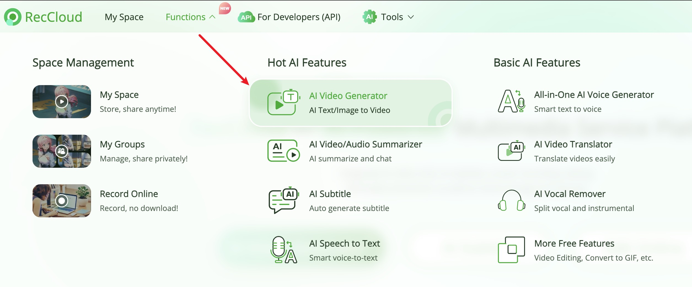

<div align="center">
<h1 align="center">MoneyPrinterTurbo 💸</h1>

<p align="center">
  <a href="https://github.com/harry0703/MoneyPrinterTurbo/stargazers"></a>
  <a href="https://github.com/harry0703/MoneyPrinterTurbo/issues"></a>
  <a href="https://github.com/harry0703/MoneyPrinterTurbo/network/members"></a>
  <a href="https://github.com/harry0703/MoneyPrinterTurbo/blob/main/LICENSE"></a>
</p>

<h3><a href="README-en.md">English</a> | <a href="README.md">简体中文</a> | Español</h3>

<div align="center">
  <a href="https://trendshift.io/repositories/8731" target="_blank"></a>
</div>

Simplemente proporcione un <b>tema</b> o <b>palabra clave</b> para un video, y automáticamente generará el texto del video,
los materiales, los subtítulos y la música de fondo antes de sintetizar un video corto en alta definición.

### Interfaz Web


### Interfaz API


</div>

## Agradecimientos Especiales 🙏

Debido a la **implementación** y **uso** de este proyecto, existe cierto nivel de dificultad para algunos usuarios principiantes.
Nos gustaría expresar nuestro agradecimiento especial a

**RecCloud (Plataforma de Servicios Multimedia Impulsada por IA)** por proporcionar un servicio gratuito de `Generador de Videos AI`
basado en este proyecto. Permite su uso en línea sin necesidad de implementación, lo cual es muy conveniente.

https://reccloud.com



## Características 🎯

- [x] **Arquitectura MVC** completa, código con **estructura clara**, fácil de mantener, soporta tanto `API` como `interfaz web`
- [x] Soporta texto de video **generado por IA**, así como **texto personalizado**
- [x] Soporta varios tamaños de **video en alta definición**
    - [x] Vertical 9:16, `1080x1920`
    - [x] Horizontal 16:9, `1920x1080`
- [x] Soporta **generación de videos en lote**, permitiendo la creación de múltiples videos a la vez, para luego seleccionar el más satisfactorio
- [x] Soporta la configuración de la **duración de los clips de video**, facilitando ajustes en la frecuencia de cambio de materiales
- [x] Soporta texto de video tanto en **chino** como en **inglés**
- [x] Soporta **múltiples voces** para síntesis
- [x] Soporta **generación de subtítulos**, con ajustes de `fuente`, `posición`, `color`, `tamaño`, y también soporta `contorno de subtítulos`
- [x] Soporta **música de fondo**, ya sea aleatoria o archivos de música específicos, con volumen ajustable de la música de fondo
- [x] Las fuentes de material de video son de **alta definición** y **libres de derechos**
- [x] Soporta integración con varios modelos como **OpenAI**, **moonshot**, **Azure**, **gpt4free**, **one-api**, **qianwen**, **Google Gemini**, **Ollama** y más

❓[¿Cómo usar el modelo gratuito OpenAI GPT-3.5?](https://github.com/harry0703/MoneyPrinterTurbo/blob/main/README-en.md#common-questions-)

### Planes Futuros 📅

- [ ] Introducir soporte para doblaje GPT-SoVITS
- [ ] Mejorar la síntesis de voz con modelos grandes para una salida de voz más natural y emocionalmente resonante
- [ ] Incorporar efectos de transición de video para asegurar una experiencia de visualización más fluida
- [ ] Mejorar la relevancia del contenido del video
- [ ] Añadir opciones de duración del video: corto, medio, largo
- [ ] Empaquetar la aplicación en un paquete de inicio con un clic para Windows y macOS para facilitar su uso
- [ ] Habilitar el uso de materiales personalizados
- [ ] Ofrecer opciones de voz en off y música de fondo con vista previa en tiempo real
- [ ] Soportar una gama más amplia de proveedores de síntesis de voz, como OpenAI TTS, Azure TTS
- [ ] Automatizar el proceso de carga a la plataforma YouTube

## Demos de Video 📺

### Vertical 9:16

<table>
<thead>
<tr>
<th align="center"><g-emoji class="g-emoji" alias="arrow_forward">▶️</g-emoji> Cómo Añadir Diversión a Tu Vida</th>
<th align="center"><g-emoji class="g-emoji" alias="arrow_forward">▶️</g-emoji> Cuál es el Significado de la Vida</th>
</tr>
</thead>
<tbody>
<tr>
<td align="center"><video src="https://github.com/harry0703/MoneyPrinterTurbo/assets/4928832/a84d33d5-27a2-4aba-8fd0-9fb2bd91c6a6"></video></td>
<td align="center"><video src="https://github.com/harry0703/MoneyPrinterTurbo/assets/4928832/112c9564-d52b-4472-99ad-970b75f66476"></video></td>
</tr>
</tbody>
</table>

### Horizontal 16:9

<table>
<thead>
<tr>
<th align="center"><g-emoji class="g-emoji" alias="arrow_forward">▶️</g-emoji> Cuál es el Significado de la Vida</th>
<th align="center"><g-emoji class="g-emoji" alias="arrow_forward">▶️</g-emoji> Por Qué Hacer Ejercicio</th>
</tr>
</thead>
<tbody>
<tr>
<td align="center"><video src="https://github.com/harry0703/MoneyPrinterTurbo/assets/4928832/346ebb15-c55f-47a9-a653-114f08bb8073"></video></td>
<td align="center"><video src="https://github.com/harry0703/MoneyPrinterTurbo/assets/4928832/271f2fae-8283-44a0-8aa0-0ed8f9a6fa87"></video></td>
</tr>
</tbody>
</table>

## Requisitos del Sistema 📦

- Se recomienda mínimo 4 núcleos de CPU o más, 8G de memoria o más, no se requiere GPU
- Windows 10 o MacOS 11.0, y sus versiones posteriores

## Instalación y Despliegue 📥

- Trate de evitar usar **rutas en chino** para prevenir problemas impredecibles
- Asegúrese de que su **red** sea estable, lo que significa que puede acceder a sitios web extranjeros normalmente

#### ① Clonar el Proyecto

```shell
git clone https://github.com/harry0703/MoneyPrinterTurbo.git
```

#### ② Modificar el Archivo de Configuración

- Copie el archivo `config.example.toml` y renómbrelo a `config.toml`
- Siga las instrucciones en el archivo `config.toml` para configurar `pexels_api_keys` y `llm_provider`, y según
  el proveedor de servicios llm, configure la API Key correspondiente

#### ③ Configurar Modelos de Lenguaje Grande (LLM)

- Para usar `GPT-4.0` o `GPT-3.5`, necesita una `API Key` de `OpenAI`. Si no tiene una, puede configurar `llm_provider`
  a `g4f` (una biblioteca GPT de uso gratuito https://github.com/xtekky/gpt4free)

### Despliegue con Docker 🐳

#### ① Lanzar el Contenedor Docker

Si no ha instalado Docker, por favor instálelo primero https://www.docker.com/products/docker-desktop/
Si está usando un sistema Windows, por favor consulte la documentación de Microsoft:

1. https://learn.microsoft.com/en-us/windows/wsl/install
2. https://learn.microsoft.com/en-us/windows/wsl/tutorials/wsl-containers

```shell
cd MoneyPrinterTurbo
docker-compose up
```

> Nota: La última versión de docker instalará automáticamente docker compose en forma de plugin, y el comando de inicio se ajusta a `docker compose up`

#### ② Acceder a la Interfaz Web

Abra su navegador y visite http://0.0.0.0:8501

#### ③ Acceder a la Interfaz API

Abra su navegador y visite http://0.0.0.0:8080/docs O http://0.0.0.0:8080/redoc

### Despliegue Manual 📦

#### ① Crear un Entorno Virtual Python

Se recomienda crear un entorno virtual Python usando [conda](https://conda.io/projects/conda/en/latest/user-guide/install/index.html)

```shell
git clone https://github.com/harry0703/MoneyPrinterTurbo.git
cd MoneyPrinterTurbo
conda create -n MoneyPrinterTurbo python=3.11
conda activate MoneyPrinterTurbo
pip install -r requirements.txt
```

#### ② Instalar ImageMagick

###### Windows:

- Descargar https://imagemagick.org/archive/binaries/ImageMagick-7.1.1-29-Q16-x64-static.exe
- Instalar el ImageMagick descargado, **no cambiar la ruta de instalación**
- Modificar el archivo de configuración `config.toml`, establecer `imagemagick_path` a su ruta de instalación real (si no
  cambió la ruta durante la instalación, solo descomente)

###### MacOS:

```shell
brew install imagemagick
```

###### Ubuntu

```shell
sudo apt-get install imagemagick
```

###### CentOS

```shell
sudo yum install ImageMagick
```

#### ③ Lanzar la Interfaz Web 🌐

Note que necesita ejecutar los siguientes comandos en el `directorio raíz` del proyecto MoneyPrinterTurbo

###### Windows

```bat
conda activate MoneyPrinterTurbo
webui.bat
```

###### MacOS o Linux

```shell
conda activate MoneyPrinterTurbo
sh webui.sh
```

Después de lanzar, el navegador se abrirá automáticamente

#### ④ Lanzar el Servicio API 🚀

```shell
python main.py
```

Después de lanzar, puede ver la `documentación API` en http://127.0.0.1:8080/docs y probar directamente la interfaz
en línea para una experiencia rápida.

## Síntesis de Voz 🗣

Puede ver una lista de todas las voces soportadas aquí: [Lista de Voces](./docs/voice-list.txt)

## Generación de Subtítulos 📜

Actualmente, hay 2 formas de generar subtítulos:

- edge: Velocidad de generación más rápida, mejor rendimiento, sin requisitos específicos de configuración de computadora, pero
  la calidad puede ser inestable
- whisper: Velocidad de generación más lenta, peor rendimiento, requisitos específicos de configuración de computadora, pero
  calidad más confiable

Puede cambiar entre ellos modificando `subtitle_provider` en el archivo de configuración `config.toml`

Se recomienda usar el modo `edge`, y cambiar al modo `whisper` si la calidad de los subtítulos generados no es
satisfactoria.

> Nota:
> Si se deja en blanco, significa que no se generarán subtítulos.

**Descargar whisper**
- Por favor asegure una buena conectividad a internet
- El modelo `whisper` se puede descargar desde HuggingFace: https://huggingface.co/openai/whisper-large-v3/tree/main

Después de descargar el modelo a la máquina local, copie toda la carpeta y colóquela en la siguiente ruta: `.\MoneyPrinterTurbo\models`

Así es como debería verse la ruta final: `.\MoneyPrinterTurbo\models\whisper-large-v3`

```
MoneyPrinterTurbo  
  ├─models
  │   └─whisper-large-v3
  │          config.json
  │          model.bin
  │          preprocessor_config.json
  │          tokenizer.json
  │          vocabulary.json
```

## Música de Fondo 🎵

La música de fondo para videos se encuentra en el directorio `resource/songs` del proyecto.
> El proyecto actual incluye algo de música por defecto de videos de YouTube. Si hay problemas de derechos de autor, por favor
> elimínelos.

## Fuentes de Subtítulos 🅰

Las fuentes para renderizar subtítulos de video se encuentran en el directorio `resource/fonts` del proyecto, y también puede agregar sus
propias fuentes.

## Preguntas Comunes 🤔

### ❓¿Cómo Usar el Modelo Gratuito OpenAI GPT-3.5?

[OpenAI ha anunciado que ChatGPT con 3.5 ahora es gratuito](https://openai.com/blog/start-using-chatgpt-instantly), y
los desarrolladores lo han envuelto en una API para uso directo.

**Asegúrese de tener Docker instalado y en ejecución**. Ejecute el siguiente comando para iniciar el servicio Docker:

```shell
docker run -p 3040:3040 missuo/freegpt35
```

Una vez iniciado exitosamente, modifique la configuración `config.toml` como sigue:

- Configure `llm_provider` a `openai`
- Complete `openai_api_key` con cualquier valor, por ejemplo, '123456'
- Cambie `openai_base_url` a `http://localhost:3040/v1/`
- Configure `openai_model_name` a `gpt-3.5-turbo`

### ❓RuntimeError: No se pudo encontrar el ejecutable de ffmpeg

Normalmente, ffmpeg se descargará y detectará automáticamente.
Sin embargo, si su entorno tiene problemas que impiden las descargas automáticas, puede encontrar el siguiente error:

```
RuntimeError: No ffmpeg exe could be found.
Install ffmpeg on your system, or set the IMAGEIO_FFMPEG_EXE environment variable.
```

En este caso, puede descargar ffmpeg desde https://www.gyan.dev/ffmpeg/builds/, descomprimirlo, y establecer `ffmpeg_path` a su
ruta de instalación real.

```toml
[app]
# Por favor configure según su ruta real, note que los separadores de ruta en Windows son \\
ffmpeg_path = "C:\\Users\\harry\\Downloads\\ffmpeg.exe"
```

### ❓Error al generar audio o descargar videos

[issue 56](https://github.com/harry0703/MoneyPrinterTurbo/issues/56)

```
failed to generate audio, maybe the network is not available. 
if you are in China, please use a VPN.
```

[issue 44](https://github.com/harry0703/MoneyPrinterTurbo/issues/44)

```
failed to download videos, maybe the network is not available. 
if you are in China, please use a VPN.
```

Esto probablemente se debe a problemas de red que impiden el acceso a servicios extranjeros. Por favor use una VPN para resolverlo.

### ❓ImageMagick no está instalado en su computadora

[issue 33](https://github.com/harry0703/MoneyPrinterTurbo/issues/33)

1. Siga la `configuración de ejemplo` proporcionada `dirección de descarga` para
   instalar https://imagemagick.org/archive/binaries/ImageMagick-7.1.1-30-Q16-x64-static.exe, usando la biblioteca estática
2. No instalar en una ruta con caracteres chinos para evitar problemas impredecibles

[issue 54](https://github.com/harry0703/MoneyPrinterTurbo/issues/54#issuecomment-2017842022)

Para sistemas Linux, puede instalarlo manualmente, consulte https://cn.linux-console.net/?p=16978

Gracias a [@wangwenqiao666](https://github.com/wangwenqiao666) por su investigación y exploración

## Comentarios y Sugerencias 📢

- Puede enviar un [issue](https://github.com/harry0703/MoneyPrinterTurbo/issues) o
  un [pull request](https://github.com/harry0703/MoneyPrinterTurbo/pulls).

## Proyectos de Referencia 📚

Este proyecto está basado en https://github.com/FujiwaraChoki/MoneyPrinter y ha sido refactorizado con muchas
optimizaciones y funcionalidades añadidas. Gracias al autor original por su espíritu de código abierto.

## Licencia 📝

Haga clic para ver el archivo [`LICENSE`](LICENSE)

## Historial de Estrellas

[](https://star-history.com/#harry0703/MoneyPrinterTurbo&Date)
