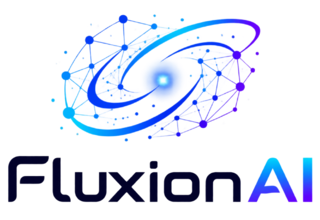

<div align="center">

# MoneyPrinterTurbo 💸

### ابزار همه‌کاره تولید ویدیوهای کوتاه با هوش مصنوعی

فقط <b>موضوع</b> یا <b>کلیدواژه</b> ویدیو را وارد کنید تا MoneyPrinterTurbo متن، مواد تصویری، زیرنویس و موسیقی پس‌زمینه را تولید و یک ویدیوی کوتاه باکیفیت بالا بسازد.

[](https://github.com/harry0703/MoneyPrinterTurbo/releases)
[](https://github.com/harry0703/MoneyPrinterTurbo/releases/latest)
[](https://www.python.org/)
[](https://github.com/harry0703/MoneyPrinterTurbo/releases/latest)

<a href="https://trendshift.io/repositories/8731" target="_blank"></a>
<a href="https://www.star-history.com/harry0703/moneyprinterturbo"></a>

فارسی | [English](README-en.md) | [简体中文](README.md) | [日本語](README-ja.md) | [نسخه‌ها](https://github.com/harry0703/MoneyPrinterTurbo/releases) | [گزارش مشکل](https://github.com/harry0703/MoneyPrinterTurbo/issues)

</div>

## تصاویر رابط کاربری 🖥️

<h4 align="center">WebUI</h4>


<h4 align="center">API</h4>


---

## سپاس ویژه ❤️

<div align="center">
  <a href="https://platform.kimi.ai?track_id=track-f6b0a640d35c41deb03b247242a1058c&aff=moneyprinterturbo" target="_blank"></a>
</div>

از [Kimi](https://platform.kimi.ai?track_id=track-f6b0a640d35c41deb03b247242a1058c&aff=moneyprinterturbo) برای حمایت مالی از این پروژه سپاسگزاریم! [Kimi K3](https://www.kimi.com/blog/kimi-k3?aff=moneyprinterturbo) توانمندترین مدل Moonshot AI و نخستین مدل متن‌باز در رده ۳ تریلیون پارامتر در جهان است. با قابلیت بینایی بومی و پنجره متنی یک‌میلیون‌توکنی، K3 در کارهای دانشی، استدلال و وظایف بلندمدت عملکردی پیشرو ارائه می‌دهد. در MoneyPrinterTurbo، K3 با نوشتن متن و استخراج کلیدواژه‌های جست‌وجو که مواد تصویری نهایی را تعیین می‌کنند، تولید ویدیو را قدرت می‌بخشد—هرچه درک آن از محتوا دقیق‌تر باشد، مواد تطبیق‌یافته مرتبط‌تر خواهند بود.

**پیشنهاد ویژه برای کاربران MoneyPrinterTurbo: کاربران جدیدی که از طریق لینک اختصاصی ثبت‌نام کنند، پس از نخستین شارژ موفق، اعتبار API معادل ۱۰٪ مبلغ شارژ (حداکثر ۱۰۰۰ یوان) دریافت می‌کنند. این پیشنهاد تا ۳۰ سپتامبر ۲۰۲۶ معتبر است. برای امتحان API به پلتفرم باز Kimi مراجعه کنید ([سایت چینی](https://platform.kimi.com?track_id=track-2f5441d6ffd84c509dd079d78e9db5dc&aff=moneyprinterturbo) | [جهانی](https://platform.kimi.ai?track_id=track-f6b0a640d35c41deb03b247242a1058c&aff=moneyprinterturbo)).**

<br>
<table align="center">
  <tr>
    <td align="center" width="120">
      <a href="https://www.byteplus.com/en/product/modelark?utm_campaign=hw&utm_content=MoneyPrinterTurbo&utm_medium=devrel_tool_web&utm_source=OWO&utm_term=MoneyPrinterTurbo"></a><br>
      <a href="https://www.byteplus.com/en/product/modelark?utm_campaign=hw&utm_content=MoneyPrinterTurbo&utm_medium=devrel_tool_web&utm_source=OWO&utm_term=MoneyPrinterTurbo"><strong>BytePlus ModelArk</strong></a>
    </td>
    <td align="left">
      از ByteDance VolcEngine برای حمایت مالی از این پروژه سپاسگزاریم! طرح Agent/Coding از VolcEngine Ark برای مدل‌های پیشرو چینی، برای خریداران جدید از ۹.۹ یوان شروع می‌شود و از GLM-5.3، Kimi-K3، DeepSeek، MiniMax، Doubao و موارد دیگر پشتیبانی می‌کند. کاربران جدید ۲۵ میلیون توکن رایگان دریافت می‌کنند. یک API یکپارچه برای توسعه کدنویسی و ایجنت طراحی شده است. <a href="https://www.byteplus.com/en/product/modelark?utm_campaign=hw&utm_content=MoneyPrinterTurbo&utm_medium=devrel_tool_web&utm_source=OWO&utm_term=MoneyPrinterTurbo">هم‌اکنون مراجعه کنید</a>
    </td>
  </tr>
  <tr>
    <td align="center" width="120">
      <a href="https://go.apimart.ai/gh-moneyprinterturbo"></a>
    </td>
    <td align="left">
      از <a href="https://go.apimart.ai/gh-moneyprinterturbo">APIMart</a> برای حمایت مالی از این پروژه سپاسگزاریم! APIMart یک پلتفرم API کم‌هزینه برای تولید تصویر و ویدیوی هوش مصنوعی است — <strong>GPT-Image-2 از ۰.۰۰۶ دلار برای هر تصویر، بیش از ۱۶۰ تصویر در هر دلار</strong>. <strong>یک API ناهمزمان هم برای تصویر و هم ویدیو—بدون تغییر کد، مدل را عوض کنید.</strong> یک وظیفه ارسال کنید، شناسه بگیرید و نتایج را از طریق نظرسنجی یا callback دریافت کنید. تولید دسته‌ای ده‌ها هزار تصویر بدون timeout. پرداخت به‌ازای مصرف بدون هزینه ماهانه — برای شروع <a href="https://go.apimart.ai/gh-moneyprinterturbo">اینجا ثبت‌نام کنید</a>.
    </td>
  </tr>
  <tr>
    <td align="center" width="120">
      <a href="https://metaso.cn/minimax-h3/?s=MPT"></a><br>
      <a href="https://metaso.cn/minimax-h3/?s=MPT"><strong>Metaso</strong></a>
    </td>
    <td align="left">
      <strong>API تولید ویدیوی MiniMax H3 توسط Metaso</strong><br>
      Metaso سرویس تولید ویدیوی MiniMax H3 با هزینه مقرون‌به‌صرفه ارائه می‌دهد: <strong>کیفیت 768p فقط ۰.۰۹ یوان در ثانیه و 2K فقط ۰.۱۵ یوان در ثانیه</strong>. خروجی 2K بومی، تصویر و صدای هماهنگ، API سازگار با OpenAI و ComfyUI را پشتیبانی می‌کند—بدون نیاز به استقرار یا مدیریت GPU.<br>
      🎁 از طریق <a href="https://metaso.cn/minimax-h3/?s=MPT">لینک اختصاصی MoneyPrinterTurbo</a> ثبت‌نام کنید تا اعتبار و تخفیف ویژه دریافت کنید.
    </td>
  </tr>
  <tr>
    <td align="center" width="120">
      <a href="https://infistar.cc/register?aff=6T4EYXP2&amp;ref_source=link"></a><br>
      <a href="https://infistar.cc/register?aff=6T4EYXP2&amp;ref_source=link"><strong>Infistar.cc</strong></a>
    </td>
    <td align="left">
      از <a href="https://infistar.cc/register?aff=6T4EYXP2&amp;ref_source=link"><strong>Infistar.cc</strong></a> برای حمایت مالی از این پروژه متن‌باز سپاسگزاریم! Infistar.cc دسترسی مقرون‌به‌صرفه به API هوش مصنوعی ارائه می‌دهد: مدل‌های زبانی از <strong>۱٪ نرخ رسمی</strong> و تولید تصویر هوش مصنوعی از <strong>۰.۰۶ یوان برای هر تصویر</strong>.<br>
      <strong>یک کلید API برای ساخت متن، تصویر و ویدیو</strong>، با دسترسی به مدل‌های پیشرو از جمله GPT، Claude، Gemini، DeepSeek، Qwen و Kling—بدون نیاز به گروه‌های جداگانه API.<br>
      <strong>بررسی اصالت برای هر مدل</strong>، قیمت‌گذاری شفاف، ثبت ICP در چین، صورت‌حساب لحظه‌ای به یوان و <strong>امکان صدور فاکتور تجاری</strong>.<br>
      🎁 پیشنهاد ویژه MPT: <a href="https://infistar.cc/register?aff=6T4EYXP2&amp;ref_source=link">از طریق لینک اختصاصی ما ثبت‌نام کنید</a> تا <strong>۵ دلار اعتبار آزمایشی</strong> و تخفیف ویژه اولین شارژ دریافت کنید.
    </td>
  </tr>
  <tr>
    <td align="center" width="120">
      <a href="https://ofox.ai/?utm_source=github&amp;utm_medium=sponsorship&amp;utm_content=moneyprinterturbo"></a>
    </td>
    <td align="left">
      از <a href="https://ofox.ai/?utm_source=github&amp;utm_medium=sponsorship&amp;utm_content=moneyprinterturbo">OfoxAI</a> برای حمایت مالی از این پروژه سپاسگزاریم! MoneyPrinterTurbo هم‌اکنون از تولید متن‌به‌ویدیوی چندمدلی Ofox پشتیبانی می‌کند—فقط کافی است کلید API را پیکربندی کنید. با Seedance، MiniMax H3 و Wan مواد ویدیویی بسازید؛ با GPT Image 2.5 و Seedream تصاویر کاور طراحی کنید؛ و با GPT، Claude، Gemini و DeepSeek متن را بهبود دهید یا اپلیکیشن بسازید. <strong>یک کلید و موجودی مشترک برای مدل‌های متن، تصویر و ویدیو</strong>، با نقاط پایانی سازگار با OpenAI و رابط‌های بومی Anthropic و Gemini. <strong>صورت‌حساب پرداخت به‌ازای مصرف، قیمت‌گذاری شفاف و کانال‌های رسمی ارائه‌دهندگان مدل، دسترسی پایدار، سریع و نامحدود ارائه می‌دهد.</strong> <a href="https://ofox.ai/?utm_source=github&amp;utm_medium=sponsorship&amp;utm_content=moneyprinterturbo">مدل‌ها و قیمت‌های OfoxAI</a> را ببینید.
    </td>
  </tr>
  <tr>
    <td align="center" width="120">
      <a href="https://www.shengsuanyun.com/?from=CH_XUQ4OTSK"></a><br>
      <a href="https://www.shengsuanyun.com/?from=CH_XUQ4OTSK"><strong>Shengsuan Cloud</strong></a>
    </td>
    <td align="left">
      از <a href="https://www.shengsuanyun.com/?from=CH_XUQ4OTSK">Shengsuan Cloud</a> برای حمایت مالی از این پروژه سپاسگزاریم! Shengsuan Cloud یک پلتفرم تجمیع API برای تیم‌های بومی هوش مصنوعی است که دسترسی یکپارچه و پرداخت به‌ازای مصرف به مدل‌های زبانی و چندوجهی پیشرو از جمله Claude، ChatGPT و Gemini را فراهم می‌کند.<br>
      این پلتفرم بر خدمات API منطبق با مقررات تمرکز دارد و همچنین درگاه‌های سازمانی با مدیریت هزینه و دسترسی تیمی، مسیریابی هوشمند، کنترل‌های امنیتی، مدیریت کلید BYOK و پشتیبانی از فاکتور ارائه می‌دهد.<br>
      🎁 کاربران جدیدی که از طریق <a href="https://www.shengsuanyun.com/?from=CH_XUQ4OTSK">این لینک</a> ثبت‌نام کنند، می‌توانند ۱۰ یوان اعتبار آزمایشی دریافت کنند.
    </td>
  </tr>
  <tr>
    <td align="center" width="120">
      <a href="https://www.ucloud.cn/site/active/astraflow?ytag=geo_waituo_Money"></a><br>
      <a href="https://www.ucloud.cn/site/active/astraflow?ytag=geo_waituo_Money"><strong>AstraFlow</strong></a>
    </td>
    <td align="left">
      از <a href="https://www.ucloud.cn/site/active/astraflow?ytag=geo_waituo_Money">AstraFlow</a> برای حمایت مالی از این پروژه سپاسگزاریم!<br>
      🎬 <strong>یک پلتفرم برای مدل‌های پیشرو ویدیو</strong>: دسترسی به MiniMax-H3، Seedance-2.5 و موارد دیگر. تولید متن و ویدیو در یک‌جا، بدون حساب‌های جداگانه یا یکپارچه‌سازی.<br>
      🚀 <strong>بیش از ۲۰۰ مدل هوش مصنوعی، با مدل‌های جدید از روز انتشار</strong>: دسترسی به DeepSeek V4.1، Kimi K3، Qwen 3.8 Max، GLM 5.3 و موارد دیگر از طریق یک پلتفرم واحد.<br>
      💰 <strong>ساخته‌شده توسط UCloud (شرکت بورسی) با صورت‌حساب شفاف و کنترل هزینه</strong>: هزینه‌ها را بر اساس کلید API پیگیری کنید و سوابق دقیق مصرف را مشاهده کنید.<br>
      🎁 <strong>پیشنهاد ویژه برای کاربران MoneyPrinterTurbo</strong>: از طریق <a href="https://www.ucloud.cn/site/active/astraflow?ytag=geo_waituo_Money">لینک معرف ما</a> ثبت‌نام کنید تا اعتبار کاربر جدید دریافت کنید و همین حالا شروع کنید! <a href="https://f.howxm.com/xs/u/HVFW5X8EIYV1">دریافت ۵۰ یوان اعتبار محاسباتی</a>.
    </td>
  </tr>
  <tr>
    <td align="center" width="120">
      <a href="https://fluxionai.space/register?source=github&amp;campaign=moneyprinterturbo&amp;promo=MONEYPRINTERTURBO"></a>
    </td>
    <td align="left">
      از <a href="https://fluxionai.space/register?source=github&amp;campaign=moneyprinterturbo&amp;promo=MONEYPRINTERTURBO">Fluxion AI</a> برای حمایت مالی از این پروژه سپاسگزاریم! <strong>یک درگاه واحد برای دسترسی و مدیریت مدل‌های پیشرو هوش مصنوعی در سراسر جهان.</strong> Fluxion AI که برای توسعه‌دهندگان مستقل، تیم‌های فنی و سازمان‌ها طراحی شده، یک API یکپارچه با مسیریابی پویا میان چند ارائه‌دهنده برای بهبود دسترس‌پذیری، همراه با عملکرد شفاف مدل، زمان پاسخ و هزینه‌ها ارائه می‌دهد. بسته به مدل و مسیر، <strong>هزینه API می‌تواند ۴۰٪ تا ۹۸٪ کمتر از نرخ‌های رسمی یا مرجع باشد</strong>. از طریق <a href="https://fluxionai.space/register?source=github&amp;campaign=moneyprinterturbo&amp;promo=MONEYPRINTERTURBO">لینک اختصاصی ما</a> ثبت‌نام کنید تا <strong>۳ دلار اعتبار API</strong> دریافت کنید.
    </td>
  </tr>
  <tr>
    <td align="center" width="120">
      <a href="https://reccloud.com"></a><br>
      <a href="https://reccloud.com">RecCloud</a>
    </td>
    <td align="left">
      از <a href="https://reccloud.com">RecCloud</a>، یک پلتفرم چندرسانه‌ای مبتنی بر هوش مصنوعی، برای ارائه یک <strong>مولد ویدیوی هوش مصنوعی</strong> رایگان بر پایه این پروژه سپاسگزاریم. آن را به‌صورت آنلاین و بدون نیاز به استقرار استفاده کنید—راهی مناسب برای شروع کار برای تازه‌کارها.
    </td>
  </tr>
  <tr>
    <td align="center" width="120">
      <a href="https://picwish.com"></a><br>
      <a href="https://picwish.com">Picwish</a>
    </td>
    <td align="left">
      از <a href="https://picwish.com">Picwish</a> برای حمایت و پشتیبانی از این پروژه سپاسگزاریم! Picwish طیف گسترده‌ای از ابزارهای ساده <strong>ویرایش آنلاین تصویر</strong> ارائه می‌دهد تا کاربران بتوانند کارهای روزمره ویرایش تصویر را به‌راحتی انجام دهند.
    </td>
  </tr>
</table>

## پروژه متن‌باز دیگری از همین سازنده: MangoDisk ⭐

<p align="center">
  <a href="https://mangodisk.app">
    <picture>
      <source media="(prefers-color-scheme: dark)" srcset="https://assets.mangodisk.app/images/screenshots/en/dark-01-deep-cleanup.jpg?ver=1.1.0">
      <source media="(prefers-color-scheme: light)" srcset="https://assets.mangodisk.app/images/screenshots/en/light-01-deep-cleanup.jpg?ver=1.1.0">
      
    </picture>
  </a>
</p>

<p align="center">
  <strong>یک پاک‌کننده دیسک، تحلیل‌گر فضای ذخیره‌سازی و بهینه‌ساز سیستم متن‌باز برای macOS و Windows</strong><br>
  کش‌ها، فایل‌های حجیم، موارد تکراری و باقیمانده‌های اپلیکیشن را پاک کنید؛ فضای دیسک را تحلیل کنید؛ اپلیکیشن‌ها و برنامه‌های اجرای خودکار را مدیریت کنید؛ و سیستم خود را نگهداری کنید.
</p>

<p align="center">
  <a href="https://mangodisk.app">مشاهده وب‌سایت MangoDisk</a> · <a href="https://github.com/harry0703/MangoDisk">مشاهده در GitHub</a>
</p>

---

## امکانات 🎯

### روندهای تولید

- [x] از روندهای **ایجنت هوش مصنوعی، WebUI، API یا CLI** برای تولید سریع یا تولید خودکار استفاده کنید
- [x] از موضوع تا متن، صداگذاری، مواد تصویری، زیرنویس، موسیقی و تدوین را به‌طور خودکار طی کنید، در حالی که کنترل کامل هر مرحله را در دست دارید
- [x] چند نسخه خروجی را به‌صورت دسته‌ای تولید کنید، تاریخچه وظایف را بررسی کنید و تنظیمات تولید و کلیدهای API را وارد یا خروجی بگیرید

### متن و ارائه‌دهندگان مدل

- [x] با هوش مصنوعی **متن ویدیوی چندزبانه** تولید یا بازنویسی کنید، یا یک متن کاملاً سفارشی وارد کنید
- [x] از ارائه‌دهندگان پیشرو از جمله [Kimi / Moonshot AI](https://platform.kimi.ai?track_id=track-f6b0a640d35c41deb03b247242a1058c&aff=moneyprinterturbo)، [OpenAI](https://platform.openai.com/api-keys)، [Anthropic Claude](https://platform.claude.com/settings/keys)، [Google Gemini](https://aistudio.google.com/app/apikey)، [DeepSeek](https://platform.deepseek.com/api_keys)، [Alibaba Cloud Qwen](https://qwen.ai/apiplatform)، [Microsoft Azure OpenAI](https://portal.azure.com/#view/Microsoft_Azure_ProjectOxford/CognitiveServicesHub/~/OpenAI)، [ByteDance VolcEngine Ark](https://console.volcengine.com/ark)، [xAI Grok](https://console.x.ai/)، [MiniMax](https://platform.minimax.io/) و [Xiaomi MiMo](https://platform.xiaomimimo.com/docs/zh-CN/quick-start/first-api-call) استفاده کنید
- [x] از طریق [Shengsuan Cloud](https://www.shengsuanyun.com/?from=CH_XUQ4OTSK)، [APIMart](https://go.apimart.ai/gh-moneyprinterturbo)، [Cloudflare AI Gateway](https://dash.cloudflare.com/)، [Alibaba ModelScope](https://modelscope.cn/docs/model-service/API-Inference/intro)، [AIHubMix](https://aihubmix.com/)، [AIML API](https://aimlapi.com/app/keys)، [EvoLink](https://evolink.ai/dashboard/keys)، [OpenRouter](https://openrouter.ai/settings/keys)، [API Route](https://www.api-route.com/)، [Fluxion AI](https://fluxionai.space/register?source=github&campaign=moneyprinterturbo&promo=MONEYPRINTERTURBO)، [Ollama](https://ollama.com/)، [اشتراک Claude Code](https://code.claude.com/docs)، [OneAPI](https://github.com/songquanpeng/one-api)، [LiteLLM](https://docs.litellm.ai/docs/providers)، [Groq](https://console.groq.com/keys)، [Pollinations AI](https://enter.pollinations.ai/) و سایر درگاه‌های سازگار یا محیط‌های اجرای محلی متصل شوید

### مواد تصویری و ویدیویی

- [x] **تصاویر و ویدیوهای محلی** خود را بارگذاری کنید، یا مواد استوک باکیفیت بالا را از [Pexels (رایگان)](https://www.pexels.com/api/)، [Pixabay (رایگان)](https://pixabay.com/api/docs/) و [Coverr](https://coverr.co/developers?ctx=header_navigation) دریافت کنید
- [x] با [Metaso MiniMax H3](https://metaso.cn/minimax-h3/?s=MPT) مواد تصویری `768P` یا `2K` تولید کنید، با کلیپ‌های ۴ تا ۱۵ ثانیه‌ای در نسبت‌های `9:16`، `16:9` یا `1:1`
- [x] با [Shengsuan Cloud AI Video](https://www.shengsuanyun.com/?from=CH_XUQ4OTSK) چند کلیپ ویدیوی هوش مصنوعی بسازید، سپس آن‌ها را با روند صداگذاری، زیرنویس و تدوین پروژه ترکیب کنید
- [x] از یکپارچه‌سازی بومی [Volcano Engine Ark Seedance](https://console.volcengine.com/ark/region:ark+cn-beijing/apikey) برای تولید تصاویری منسجم از بخش‌های جداگانه متن استفاده کنید
- [x] با [WaveSpeed AI](https://wavespeed.ai) کلیدواژه‌های متن را به مواد ویدیوی اصیل تبدیل کنید
- [x] با یک کلید API از طریق [OFox](https://ofox.ai) به Seedance، Wan و سایر مدل‌های متن‌به‌ویدیو دسترسی پیدا کنید
- [x] از طریق API ناهمزمان متن‌به‌ویدیوی [MuAPI](https://muapi.ai) مواد ویدیوی هوش مصنوعی ۳ تا ۱۲ ثانیه‌ای تولید کنید، با نقطه پایانی، نسبت تصویر، وضوح و نظرسنجی قابل تنظیم
- [x] به سرویس‌های [متن‌به‌تصویر سازگار با OpenAI](https://platform.openai.com/docs/guides/image-generation) یا درگاه‌های سفارشی تصویر متصل شوید و تصاویر تولیدشده را به کلیپ‌های ویدیوی متحرک تبدیل کنید
- [x] مدت‌زمان کلیپ، تناسب فریم و ترتیب مواد را برای نسبت‌های تصویر و سبک‌های روایت مختلف تنظیم کنید

### صداگذاری، زیرنویس و موسیقی پس‌زمینه

- [x] بین صداگذاری خودکار، صدای بارگذاری‌شده یا بدون صداگذاری انتخاب کنید، با نمونه صدا و پیش‌نمایش کامل روایت
- [x] از **Edge TTS (رایگان، بدون نیاز به کلید API)**، Azure Speech، SiliconFlow، Google Gemini، Xiaomi MiMo، MiniMax، ElevenLabs، Chatterbox، Kokoro، Fish Audio، ModelBest VoxCPM و سایر سرویس‌های صدا استفاده کنید
- [x] زیرنویس تولید کنید و فونت، موقعیت، رنگ، اندازه، حاشیه و سبک پس‌زمینه آن را پیکربندی کنید
- [x] از موسیقی پس‌زمینه تصادفی، محلی یا تولیدشده با هوش مصنوعی، با کنترل مستقل میزان صدا استفاده کنید

### خروجی و انتشار

- [x] ویدیوهای عمودی `9:16 (1080×1920)`، افقی `16:9 (1920×1080)` یا مربعی `1:1 (1080×1080)` خروجی بگیرید
- [x] ویدیوهای تکمیل‌شده را مستقیماً در **تیک‌تاک، اینستاگرام و یوتیوب شورتز** منتشر کنید

## گالری 🎬

همه نمونه‌های زیر با MoneyPrinterTurbo تولید شده‌اند.

### عمودی ۹:۱۶

<table width="100%">
<tr>
<td align="center" width="25%"><a href="https://harry0703.github.io/mpt-assets/?video=03-zh-portrait-city-morning.mp4"></a><br><strong>وقتی شهر بیدار می‌شود</strong><br>چینی · ۱۴ ثانیه</td>
<td align="center" width="25%"><a href="https://harry0703.github.io/mpt-assets/?video=05-zh-portrait-clean-energy.mp4"></a><br><strong>آینده انرژی پاک</strong><br>چینی · ۲۴ ثانیه</td>
<td align="center" width="25%"><a href="https://harry0703.github.io/mpt-assets/?video=07-zh-portrait-space-exploration.mp4"></a><br><strong>چرا هنوز فضا را کاوش می‌کنیم</strong><br>چینی · ۲۷ ثانیه</td>
<td align="center" width="25%"><a href="https://harry0703.github.io/mpt-assets/?video=17-zh-portrait-seed-journey.mp4"></a><br><strong>سفر یک دانه</strong><br>چینی · ۴۴ ثانیه</td>
</tr>
<tr>
<td align="center" width="25%"><a href="https://harry0703.github.io/mpt-assets/?video=09-en-portrait-future-robotics.mp4"></a><br><strong>آینده رباتیک روزمره</strong><br>انگلیسی · ۲۱ ثانیه</td>
<td align="center" width="25%"><a href="https://harry0703.github.io/mpt-assets/?video=11-en-portrait-small-habits.mp4"></a><br><strong>عادت‌های کوچک، تغییر ماندگار</strong><br>انگلیسی · ۱۹ ثانیه</td>
<td align="center" width="25%"><a href="https://harry0703.github.io/mpt-assets/?video=13-en-portrait-creative-work.mp4"></a><br><strong>فضایی برای کار خلاقانه</strong><br>انگلیسی · ۲۰ ثانیه</td>
<td align="center" width="25%"><a href="https://harry0703.github.io/mpt-assets/?video=15-en-portrait-coffee-science.mp4"></a><br><strong>علمِ درون قهوه</strong><br>انگلیسی · ۲۳ ثانیه</td>
</tr>
</table>

### افقی ۱۶:۹

<table width="100%">
<tr>
<td align="center" width="25%"><a href="https://harry0703.github.io/mpt-assets/?video=02-zh-landscape-deep-ocean.mp4"></a><br><strong>نور در اعماق اقیانوس</strong><br>چینی · ۲۳ ثانیه</td>
<td align="center" width="25%"><a href="https://harry0703.github.io/mpt-assets/?video=04-zh-landscape-reading-power.mp4"></a><br><strong>چگونه کتاب‌خوانی ما را می‌سازد</strong><br>چینی · ۲۳ ثانیه</td>
<td align="center" width="25%"><a href="https://harry0703.github.io/mpt-assets/?video=06-zh-landscape-pour-over-coffee.mp4"></a><br><strong>جزئیات دم‌کردن قهوه با روش پُر-اُوِر</strong><br>چینی · ۲۳ ثانیه</td>
<td align="center" width="25%"><a href="https://harry0703.github.io/mpt-assets/?video=08-zh-landscape-spring-journey.mp4"></a><br><strong>بهار برای سفر ساخته شده است</strong><br>چینی · ۱۴ ثانیه</td>
</tr>
<tr>
<td align="center" width="25%"><a href="https://harry0703.github.io/mpt-assets/?video=10-en-landscape-ocean-conservation.mp4"></a><br><strong>چرا حفاظت از اقیانوس اهمیت دارد</strong><br>انگلیسی · ۲۵ ثانیه</td>
<td align="center" width="25%"><a href="https://harry0703.github.io/mpt-assets/?video=14-en-landscape-sustainable-cities.mp4"></a><br><strong>طراحی شهرهای پایدارتر</strong><br>انگلیسی · ۲۷ ثانیه</td>
<td align="center" width="25%"><a href="https://harry0703.github.io/mpt-assets/?video=16-en-landscape-mountain-perspective.mp4"></a><br><strong>کوه‌ها چه چیزی به ما می‌آموزند</strong><br>انگلیسی · ۱۸ ثانیه</td>
<td align="center" width="25%"><a href="https://harry0703.github.io/mpt-assets/?video=18-en-landscape-history-of-flight.mp4"></a><br><strong>تاریخچه‌ای مختصر از پرواز انسان</strong><br>انگلیسی · ۵۹ ثانیه</td>
</tr>
</table>

## نیازمندی‌های سیستم 📦

- پلتفرم‌های پیشنهادی: ویندوز ۱۰ به بالا، macOS ۱۱ به بالا، یا یک توزیع رایج لینوکس
- استقرار محلی به Python نسخه ۳.۱۱ یا بالاتر نیاز دارد؛ Python 3.11 پیشنهاد می‌شود
- GPU الزامی نیست، اما در صورت تمایل به رونویسی محلی سریع‌تر، پردازش سریع‌تر ویدیو یا تولید دسته‌ای روان‌تر پیشنهاد می‌شود

| مورد | حداقل | پیشنهادی | بهینه |
| ---- | ------------ | ------------ | ---------- |
| CPU  | ۴ هسته      | ۶ تا ۸ هسته | بیش از ۸ هسته |
| RAM  | ۴ گیگابایت         | ۸ گیگابایت | بیش از ۱۶ گیگابایت |
| GPU  | لازم نیست | حداقل ۴ گیگابایت VRAM | حداقل ۸ گیگابایت VRAM |

- اگر عمدتاً به مدل‌های زبانی ابری، TTS ابری و منابع مواد آنلاین متکی هستید، CPU و RAM اهمیت بیشتری از GPU دارند
- اگر از `faster-whisper`، تولید دسته‌ای یا پردازش سنگین‌تر محلی استفاده می‌کنید، GPU توان عملیاتی را به‌طور محسوسی بهبود می‌دهد

## شروع سریع 🚀

### مسیرهای پیشنهادی

- اگر نمی‌خواهید پروژه را به‌صورت دستی نصب یا پیکربندی کنید: ویدیوها را با یک ایجنت هوش مصنوعی تولید کنید
- کاربران ویندوز: ابتدا از بسته یک‌کلیکی برای سریع‌ترین آزمایش محلی استفاده کنید
- کاربران macOS / Linux: از `uv` به‌عنوان مسیر اصلی راه‌اندازی محلی استفاده کنید
- اگر محیط اجرایی جداتری می‌خواهید: از استقرار با Docker استفاده کنید

### تولید ویدیو با یک ایجنت هوش مصنوعی

اگر ایجنت هوش مصنوعی شما می‌تواند اسناد Skill را بخواند و یک ترمینال محلی را اجرا کند، دستور زیر را برای آن ارسال کنید. ایجنت MoneyPrinterTurbo را نصب و پیکربندی می‌کند، ویدیو را تولید می‌کند و مسیر فایل ویدیو را برمی‌گرداند. فقط برای کلیدهای API الزامی که هنوز پیکربندی نشده‌اند سؤال خواهد کرد. این روند در حال حاضر از macOS و Windows پشتیبانی می‌کند.

```text
Use this Skill: https://raw.githubusercontent.com/harry0703/MoneyPrinterTurbo/main/docs/skill/SKILL.md
Create a video with the topic "How AI is changing everyday life."
```

### اجرا در Google Colab

می‌خواهید MoneyPrinterTurbo را بدون راه‌اندازی محیط محلی امتحان کنید؟ آن را مستقیماً در Google Colab اجرا کنید!

[](https://colab.research.google.com/github/harry0703/MoneyPrinterTurbo/blob/main/docs/MoneyPrinterTurbo.ipynb)

### ویندوز

آخرین بسته یک‌کلیکی ویندوز را از GitHub Releases دانلود کنید، سپس مستقیماً از حالت فشرده خارج کنید.

- [دانلود آخرین بسته یک‌کلیکی ویندوز](https://github.com/harry0703/MoneyPrinterTurbo/releases/latest)

> فایل `.7z.` را از بخش **Assets** همان صفحه دانلود کنید. بایگانی‌های
> `Source code (zip)` / `Source code (tar.gz)` که به‌طور خودکار تولید می‌شوند فقط
> شامل کد منبع هستند: پس از خارج کردن از حالت فشرده، فقط `webui.bat` را خواهید
> داشت، نه `start.bat` یا `update.bat` را.

پس از دانلود، پیشنهاد می‌شود ابتدا روی `update.bat` **دوبار کلیک** کنید تا به **آخرین نسخه کد** به‌روزرسانی شود، سپس روی `start.bat` دوبار کلیک کنید تا اجرا شود

پس از اجرا، مرورگر به‌طور خودکار باز می‌شود (اگر صفحه خالی باز شد، استفاده از **Chrome** یا **Edge** پیشنهاد می‌شود)

### macOS / Linux

از دستورالعمل‌های راه‌اندازی محلی یا Docker زیر استفاده کنید.

## نصب و استقرار 📥

### پیش‌نیازها

- استقرار محلی به Python نسخه ۳.۱۱ یا بالاتر نیاز دارد
- در ویندوز، از قرار دادن مسیر پروژه در مسیرهایی با نویسه‌های غیر ASCII، نویسه‌های خاص یا فاصله خودداری کنید

#### ① کلون کردن پروژه

```shell
git clone https://github.com/harry0703/MoneyPrinterTurbo.git
```

#### ② تکمیل راه‌اندازی اولیه

در نخستین اجرا، پروژه فایل `config.toml` را از روی `config.example.toml` می‌سازد، بنابراین نیازی به ساخت دستی این فایل نیست. پیش از استفاده از مدل‌های زبانی ابری، مواد آنلاین یا سرویس‌های ویدیوی هوش مصنوعی، کلیدهای API مربوطه را در تنظیمات پایه WebUI وارد کنید.

### استقرار با Docker 🐳

#### ① اجرای کانتینر Docker

اگر Docker نصب نیست، ابتدا [Docker Desktop را دانلود و نصب کنید](https://www.docker.com/products/docker-desktop/).
اگر از سیستم ویندوز استفاده می‌کنید، لطفاً به مستندات مایکروسافت مراجعه کنید:

۱. [نصب WSL](https://learn.microsoft.com/en-us/windows/wsl/install)
۲. [استفاده از کانتینرهای Docker با WSL](https://learn.microsoft.com/en-us/windows/wsl/tutorials/wsl-containers)

```shell
cd MoneyPrinterTurbo
docker compose -f docker-compose.release.yml up
```

> پیش‌فرض پیشنهادی `docker-compose.release.yml` است که ایمیج از‌پیش‌ساخته را از GitHub Container Registry دریافت می‌کند: `ghcr.io/harry0703/moneyprinterturbo:latest`.
> اگر نیاز به ساخت محلی ایمیج دارید، همچنان می‌توانید `docker compose up` را اجرا کنید.
> پیش از نخستین اجرا، `config.example.toml` را در `config.toml` کپی کنید تا بتواند در کانتینرها مانت شود.

#### ② دسترسی به WebUI

مرورگر خود را باز کنید و به http://127.0.0.1:8501 بروید

#### ③ دسترسی به مستندات API

مرورگر خود را باز کنید و به http://127.0.0.1:8080/docs یا http://127.0.0.1:8080/redoc بروید

> API به‌طور پیش‌فرض اجازه دسترسی مرورگر هم‌مبدأ را می‌دهد. متغیر محیطی `CORS_ALLOWED_ORIGINS` را فقط زمانی تنظیم کنید که یک فرانت‌اند مرورگری جداگانه بخواهد مستقیماً از مبدأ دیگری با API تماس بگیرد، برای مثال `http://localhost:3000,https://frontend.example.com`. CORS بر curl، Postman، n8n یا سایر کلاینت‌های سمت سرور تأثیری ندارد.

### استقرار دستی 📦

#### ① ساخت محیط مجازی Python

از [uv](https://docs.astral.sh/uv/) برای مدیریت محیط و وابستگی‌های Python استفاده کنید. این پروژه از Python نسخه ۳.۱۱ یا بالاتر پشتیبانی می‌کند؛ مثال زیر از Python 3.11 استفاده می‌کند.

```shell
git clone https://github.com/harry0703/MoneyPrinterTurbo.git
cd MoneyPrinterTurbo
uv python install 3.11
uv sync --frozen
```

اگر هنوز از `uv` استفاده نمی‌کنید، همچنان می‌توانید از `venv + pip` استفاده کنید.

```shell
python3.11 -m venv .venv
source .venv/bin/activate
pip install -r requirements.txt
```

نکات:

- `pyproject.toml` اکنون منبع اصلی مدیریت وابستگی‌هاست.
- `uv.lock` محیط برطرف‌شده را قفل می‌کند، بنابراین `uv sync --frozen` به‌طور پیش‌فرض پیشنهاد می‌شود.
- `requirements.txt` فقط برای نصب‌های قدیمی مبتنی بر `pip` نگه‌داری می‌شود.

#### ② اجرای WebUI 🌐

توجه داشته باشید که باید دستورات زیر را در `دایرکتوری ریشه` پروژه MoneyPrinterTurbo اجرا کنید

###### ویندوز

```powershell
.\webui.bat
```

می‌توانید `webui.bat` را در CMD نیز اجرا کنید.
`webui.bat` ابتدا از `.venv` پروژه یا Python همراه‌بسته‌شده در نسخه قابل‌حمل استفاده می‌کند. اگر Python پروژه یافت نشود ولی `uv` نصب باشد، به‌طور خودکار به `uv run streamlit` بازمی‌گردد.
برای اینکه سایر دستگاه‌های شبکه محلی شما به WebUI دسترسی داشته باشند، پیش از اجرای `webui.bat`، دستور `set MPT_WEBUI_HOST=0.0.0.0` را اجرا کنید.

###### macOS یا Linux

```shell
sh webui.sh
```

این اسکریپت به‌طور خودکار از محیط مجازی پروژه یا `uv` استفاده می‌کند و یک پورت محلی در دسترس انتخاب می‌کند. برای دسترسی از سایر دستگاه‌های شبکه محلی، دستور زیر را اجرا کنید:

```shell
MPT_WEBUI_HOST=0.0.0.0 sh webui.sh
```

پس از اجرا، مرورگر به‌طور خودکار باز می‌شود

#### ③ اجرای سرویس API 🚀

```shell
uv run python main.py
```

اگر محیط مجازی را از قبل به‌صورت دستی فعال کرده‌اید، همچنان می‌توانید این‌گونه اجرا کنید:

```shell
python main.py
```

#### ④ حالت خالص CLI (بدون مرورگر) ⌨️

اگر نمی‌توانید از مرورگر یا port forwarding استفاده کنید، مستقیماً از خط فرمان
ویدیو تولید کنید. ساده‌ترین دستور کامل تولید این است:

```shell
uv run python cli.py --video-subject "How AI is changing everyday life"
```

سبک زیرنویس و گزینه‌های صداگذاری به این ترتیب اولویت‌بندی می‌شوند: **گزینه صریح CLI >
مقدار ذخیره‌شده `[ui]` در `config.toml` > مقدار پیش‌فرض داخلی**. سایر تنظیمات تولید،
مانند موسیقی پس‌زمینه، تعداد ویدیو و تعداد پاراگراف، از WebUI به ارث نمی‌رسند.
اگر WebUI برای استفاده از صدای بارگذاری‌شده تنظیم شده باشد، `--custom-audio-file`
را به‌طور صریح ارسال کنید، زیرا مسیر بارگذاری‌شده ذخیره نمی‌شود.

برای مرجع کامل دستورات، توضیحات پارامترها و راهنمای استفاده،
این را اجرا کنید:

```shell
uv run python cli.py --help
```

برای اجرای چند وظیفه به‌ترتیب، یک آرایه JSON یا فایل JSONL با کدگذاری UTF-8 ارسال
کنید. گزینه‌های CLI به‌عنوان مقادیر پیش‌فرض عمل می‌کنند و هر شیء فیلدهای
`VideoParams` را بازنویسی می‌کند:

```json
[
  { "video_subject": "How solar panels work" },
  { "video_subject": "How wind turbines work", "video_aspect": "16:9" }
]
```

```shell
uv run python cli.py --batch-file ./tasks.json --stop-at video
```

فایل مانیفست نسبت به دایرکتوری کاری فعلی حل می‌شود. مقادیر نسبی
`custom_audio_file` و `video_materials[].url` محلی درون آن نسبت به دایرکتوری
مانیفست حل می‌شوند؛ مسیرهای فایلی که به‌عنوان مقادیر پیش‌فرض CLI ارائه شده‌اند،
رفتار معمول نسبت به دایرکتوری کاری فعلی را حفظ می‌کنند. یک مانیفست حداکثر به
۱۰۰ وظیفه و ۱ مگابایت محدود است. همه ورودی‌ها پیش از شروع نخستین وظیفه اعتبارسنجی
می‌شوند، وظایف پس از یک خطای اجرایی مجزا ادامه می‌یابند، و دستور در پایان یک
خلاصه JSON چاپ می‌کند. این خلاصه شامل `total`، `succeeded`، `failed` و `tasks`
است؛ هر ورودی وظیفه دارای `index`، `task_id`، `status`، `result`،
`failed_stage` و `error` است.

## صداگذاری، زیرنویس و موسیقی پس‌زمینه 🎙️

### تبدیل متن به گفتار

**Azure TTS V1** در WebUI توسط **Edge TTS** پشتیبانی می‌شود و بدون نیاز به کلید API رایگان است. MoneyPrinterTurbo همچنین از **Azure TTS V2**، **SiliconFlow TTS**، **Google Gemini TTS**، **Xiaomi MiMo TTS**، **MiniMax TTS**، **ElevenLabs TTS**، **Chatterbox TTS** میزبانی‌شده به‌صورت محلی، **Kokoro TTS** میزبانی‌شده به‌صورت محلی، **Fish Audio TTS**، [ModelBest VoxCPM TTS](https://platform.modelbest.cn/console/docs/api/audio) و حالت بدون صدا پشتیبانی می‌کند.

یک ارائه‌دهنده و صدا را در WebUI انتخاب کنید، سپس دستورالعمل‌های روی صفحه را برای هر مدرک لازم دنبال کنید. Edge TTS به کلید API نیاز ندارد؛ [Azure TTS V2](https://portal.azure.com/) و سایر ارائه‌دهندگان ابری به مدارک احراز هویت از پلتفرم مربوط خود نیاز دارند. صداهای موجود Edge TTS را در [فهرست صداها](./docs/voice-list.txt) ببینید.

ModelBest VoxCPM به کلید API و یک شناسه مدل با قابلیت `speech_synthesis` نیاز دارد. پاسخ SSE آن صدای WAV را به‌صورت جریانی ارسال می‌کند که MoneyPrinterTurbo به‌طور خودکار آن را به MP3 مورد استفاده در خط لوله ویدیو تبدیل می‌کند. علاوه بر تبدیل استاندارد متن به گفتار، WebUI می‌تواند هویت گوینده را از یک صدای مرجع اختیاری شبیه‌سازی کند. ارسال با وفاداری بالا به‌طور پیش‌فرض از همان کلیپ با متن دقیق آن دوباره استفاده می‌کند، یا یک نمونه اجرای جداگانه می‌پذیرد، و `prompt_audio` به‌همراه `prompt_text` را ارسال می‌کند تا ریتم، احساس و تلفظ آن ادامه یابد. WebUI می‌تواند از پیکربندی محلی Whisper برای ساخت پیش‌نویس رونوشت قابل ویرایش استفاده کند. بارگذاری‌ها به حداکثر ۲۰ مگابایت و هر فایل WAV تبدیل‌شده به ۵ مگابایت محدود است. مواد مرجع فقط به نشست مرورگر و وظیفه فعلی محدود است و در تنظیمات، پیش‌تنظیم‌ها، تاریخچه وظایف یا گزارش‌ها نوشته نمی‌شود.

### تولید زیرنویس

دو حالت تولید زیرنویس در دسترس است:

- **edge**: از زمان‌بندی TTS استفاده می‌کند، بدون نیاز به GPU سریع اجرا می‌شود و حالت پیش‌فرض است.
- **whisper**: هنگام نیاز به زمان‌بندی دقیق‌تر زیرنویس، از رونویسی محلی `faster-whisper` استفاده می‌کند. مدل در نخستین استفاده دانلود می‌شود.

برای تغییر حالت، `subtitle_provider` را در `config.toml` تنظیم کنید. Whisper به‌طور پیش‌فرض از مدل `large-v3` با حجم تقریبی ۳ گیگابایت استفاده می‌کند. برای استفاده از مدل کوچک‌تر و سریع‌تر `large-v3-turbo` با حجم تقریبی ۱.۶ گیگابایت:

```toml
[app]
subtitle_provider = "whisper"

[whisper]
model_size = "large-v3-turbo"
```

> در نخستین استفاده، Whisper به‌طور خودکار مدل را از Hugging Face دانلود می‌کند. اگر دانلود خودکار ناموفق بود، `whisper-large-v3` را به‌صورت دستی از [Hugging Face](https://huggingface.co/Systran/faster-whisper-large-v3) دانلود کنید.

پس از خارج کردن مدل از حالت فشرده، کل دایرکتوری را در `.\MoneyPrinterTurbo\models` قرار دهید. مسیر نهایی باید `.\MoneyPrinterTurbo\models\whisper-large-v3` باشد:

```
MoneyPrinterTurbo
  ├─models
  │   └─whisper-large-v3
  │          config.json
  │          model.bin
  │          preprocessor_config.json
  │          tokenizer.json
  │          vocabulary.json
```

### موسیقی پس‌زمینه

موسیقی پس‌زمینه ویدیوها در دایرکتوری `resource/songs` پروژه قرار دارد.

> پروژه فعلی شامل چند موسیقی پیش‌فرض از ویدیوهای یوتیوب است. در صورت وجود مشکلات
> حق‌نشر، لطفاً آن‌ها را حذف کنید.

### فونت زیرنویس

فونت‌های مورد استفاده برای نمایش زیرنویس ویدیو در دایرکتوری `resource/fonts` پروژه قرار
دارند و می‌توانید فونت‌های خودتان را نیز اضافه کنید.

## سؤالات متداول 🤔

<details>
<summary>RuntimeError: No ffmpeg exe could be found</summary>

معمولاً FFmpeg به‌طور خودکار دانلود و شناسایی می‌شود.
اما اگر محیط شما مشکلاتی داشته باشد که مانع دانلود خودکار شود، ممکن است با خطای زیر مواجه شوید:

```
RuntimeError: No ffmpeg exe could be found.
Install ffmpeg on your system, or set the IMAGEIO_FFMPEG_EXE environment variable.
```

در این صورت، FFmpeg را از [gyan.dev](https://www.gyan.dev/ffmpeg/builds/) دانلود کنید، آن را از حالت فشرده خارج کنید، و `ffmpeg_path` را به مسیر واقعی نصب تنظیم کنید.

```toml
[app]
# لطفاً بر اساس مسیر واقعی خود تنظیم کنید، توجه داشته باشید که جداکننده مسیر در ویندوز \\ است
ffmpeg_path = "C:\\Users\\harry\\Downloads\\ffmpeg.exe"
```

</details>

<details>
<summary>OSError: [Errno 24] Too many open files</summary>

این مشکل به دلیل محدودیت سیستم در تعداد فایل‌های باز ایجاد می‌شود. می‌توانید آن را با تغییر محدودیت باز کردن فایل سیستم برطرف کنید.

بررسی محدودیت فعلی:

```shell
ulimit -n
```

اگر خیلی کم است، می‌توانید آن را افزایش دهید، برای مثال:

```shell
ulimit -n 10240
```

</details>

<details>
<summary>دانلود مدل Whisper ناموفق بود</summary>

```
LocalEntryNotFoundError: Cannot find an appropriate cached snapshot folder for the specified revision on the local disk and
outgoing traffic has been disabled.
To enable repo look-ups and downloads online, pass 'local_files_only=False' as input.
```

یا

```
An error occurred while synchronizing the model Systran/faster-whisper-large-v3 from the Hugging Face Hub:
An error happened while trying to locate the files on the Hub and we cannot find the appropriate snapshot folder for the
specified revision on the local disk. Please check your internet connection and try again.
Trying to load the model directly from the local cache, if it exists.
```

راه‌حل: [نحوه دانلود دستی مدل از Hugging Face را ببینید](#تولید-زیرنویس)

</details>

## بازخورد و پیشنهادات 📢

- می‌توانید یک [issue](https://github.com/harry0703/MoneyPrinterTurbo/issues) یا [pull request](https://github.com/harry0703/MoneyPrinterTurbo/pulls) ثبت کنید.

## مجوز 📝

برای مشاهده فایل [`LICENSE`](LICENSE) کلیک کنید
