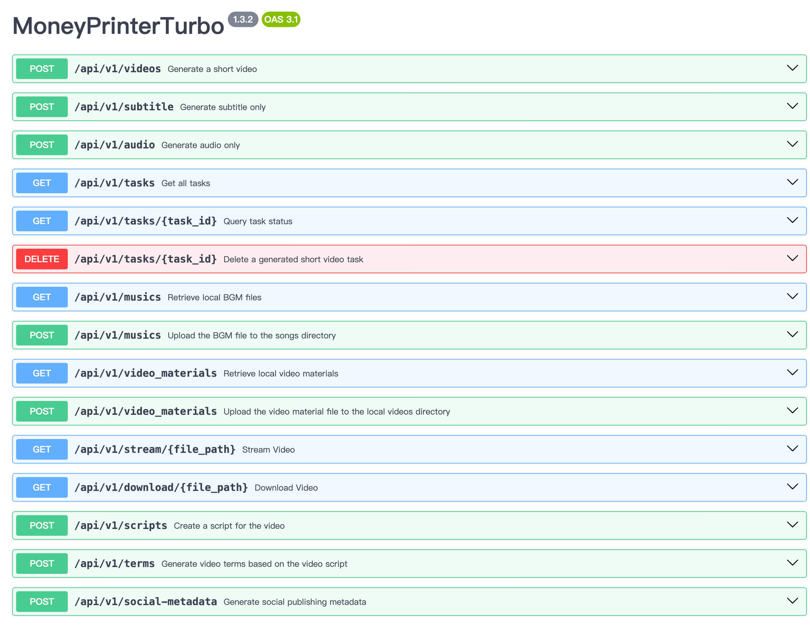
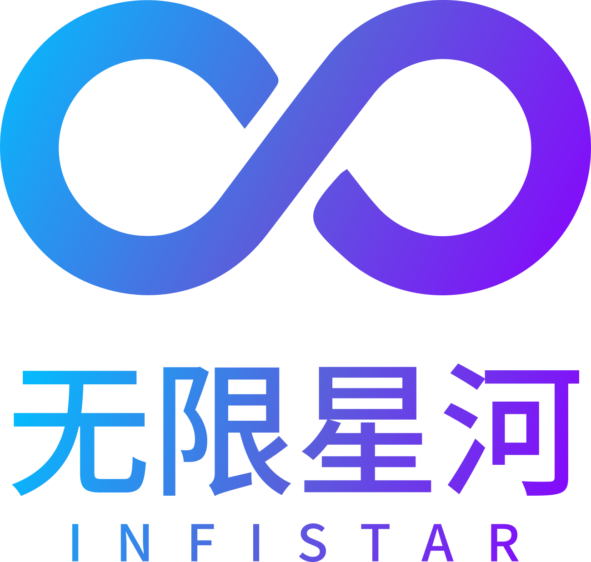

<div align="center">

# MoneyPrinterTurbo 💸

### オールインワン AI ショート動画生成ツール

動画の<b>テーマ</b>または<b>キーワード</b>を指定するだけで、MoneyPrinterTurbo が台本の生成、素材のマッチング、字幕と BGM の作成を行い、高画質のショート動画を出力します。

[](https://github.com/harry0703/MoneyPrinterTurbo/releases)
[](https://github.com/harry0703/MoneyPrinterTurbo/releases/latest)
[](https://www.python.org/)
[](https://github.com/harry0703/MoneyPrinterTurbo/releases/latest)

<a href="https://trendshift.io/repositories/8731" target="_blank"></a>
<a href="https://www.star-history.com/harry0703/moneyprinterturbo"></a>

日本語 | [English](README-en.md) | [简体中文](README.md) | [リリース](https://github.com/harry0703/MoneyPrinterTurbo/releases) | [Issues](https://github.com/harry0703/MoneyPrinterTurbo/issues)

</div>

## スクリーンショット 🖥️

<h4 align="center">WebUI</h4>


<h4 align="center">API</h4>



---

## スペシャルサンクス ❤️

<div align="center">
  <a href="https://platform.kimi.ai?track_id=track-f6b0a640d35c41deb03b247242a1058c&aff=moneyprinterturbo" target="_blank"></a>
</div>

本プロジェクトをスポンサードしてくださっている [Kimi](https://platform.kimi.ai?track_id=track-f6b0a640d35c41deb03b247242a1058c&aff=moneyprinterturbo) に感謝します！ [Kimi K3](https://www.kimi.com/blog/kimi-k3?aff=moneyprinterturbo) は Moonshot AI の最も高性能なモデルであり、世界初の 3T クラスのオープンモデルです。ネイティブの視覚能力と 100 万トークンのコンテキストウィンドウを備えた K3 は、ナレッジワーク、推論、長期にわたるタスクにおいて最先端の性能を発揮します。MoneyPrinterTurbo では、K3 が台本の作成と、最終的な映像素材を左右する検索キーワードの抽出を担い、動画制作を支えています。内容をより深く理解するほど、より適切な素材が得られます。

**MoneyPrinterTurbo ユーザー限定特典: 専用リンクから新規登録すると、初回のチャージ成功額の 10% 相当（上限 1,000 元）の API クレジットがボーナスとして付与されます。特典の終了は 2026 年 9 月 30 日です。Kimi オープンプラットフォーム（[中国語サイト](https://platform.kimi.com?track_id=track-2f5441d6ffd84c509dd079d78e9db5dc&aff=moneyprinterturbo) | [グローバル](https://platform.kimi.ai?track_id=track-f6b0a640d35c41deb03b247242a1058c&aff=moneyprinterturbo)）から API をお試しください。**

<br>
<table align="center">
  <tr>
    <td align="center" width="120">
      <a href="https://www.byteplus.com/en/product/modelark?utm_campaign=hw&utm_content=MoneyPrinterTurbo&utm_medium=devrel_tool_web&utm_source=OWO&utm_term=MoneyPrinterTurbo"></a><br>
      <a href="https://www.byteplus.com/en/product/modelark?utm_campaign=hw&utm_content=MoneyPrinterTurbo&utm_medium=devrel_tool_web&utm_source=OWO&utm_term=MoneyPrinterTurbo"><strong>BytePlus ModelArk</strong></a>
    </td>
    <td align="left">
      本プロジェクトをスポンサードしてくださっている Dola Seed に感謝します！ <a href="https://www.byteplus.com/en/product/modelark?utm_campaign=hw&utm_content=MoneyPrinterTurbo&utm_medium=devrel_tool_web&utm_source=OWO&utm_term=MoneyPrinterTurbo">Dola Seed 2.0</a> は、ByteDance がグローバル市場向けに独自開発した全モーダル対応の汎用大規模モデルです。統合マルチモーダルアーキテクチャを基盤とし、テキスト・画像・音声・動画の統合的な理解と生成をサポートします。エージェント連携をネイティブに実現し、推論、長時間タスクの遂行、ツール連携、コーディングにおいて優れた能力を発揮します。こちらのリンクから登録すると、モデルごとに 50 万トークンの無料推論枠が付与されます。
    </td>
  </tr>
  <tr>
    <td align="center" width="120">
      <a href="https://www.ccsub.net/register?ref=VCVDAWWY"></a><br>
      <a href="https://www.ccsub.net/register?ref=VCVDAWWY"><strong>CCSub</strong></a>
    </td>
    <td align="left">
      本プロジェクトをスポンサードしてくださっている <a href="https://www.ccsub.net/register?ref=VCVDAWWY">CCSub</a> に感謝します！ CCSub は安定的で手頃な AI API 中継プラットフォームであり、Claude.ai のサブスクリプションをそのまま置き換えられます。API キー 1 つで Claude Opus 4.8、Sonnet、Haiku、GPT-5、Gemini を直接 API のおよそ 30% のコストで利用でき、世界中どこからでも VPN は不要です。Claude Code、Codex、Cursor、Cline、Continue、Windsurf をはじめとする主要な AI コーディングツールに対応しています。<a href="https://www.ccsub.net/register?ref=VCVDAWWY">www.ccsub.net</a> から登録すると、初回登録時に 5 ドル分の無料クレジットがもらえます。
    </td>
  </tr>
  <tr>
    <td align="center" width="120">
      <a href="https://infistar.ai/register?aff=6T4EYXP2&amp;ref_source=link"></a><br>
      <a href="https://infistar.ai/register?aff=6T4EYXP2&amp;ref_source=link"><strong>Infistar.ai</strong></a>
    </td>
    <td align="left">
      本プロジェクトをスポンサードしてくださっている <a href="https://infistar.ai/register?aff=6T4EYXP2&amp;ref_source=link">Infistar.ai</a> に感謝します！<br>
      ⚡ 低コストで信頼性の高いアクセス: 価格は公式レートのわずか 10% から。モデル倍率は透明で、詳細な利用履歴も確認できます。複数プロバイダーへの動的ルーティングにより、レート制限や予期しないサービス中断を回避できます。<br>
      🧠 台本作成に最適な最先端 LLM: OpenAI、Claude、Google Gemini、DeepSeek、Qwen などの主要モデルを OpenAI 互換 API 経由で利用できます。Infistar.ai は MoneyPrinterTurbo の台本生成と素材キーワード抽出のワークフローに、低レイテンシかつ高並列なサポートを提供します。<br>
      🎨 最先端のマルチモーダルエコシステム: FLUX、Midjourney、Seedance、Kling、Sora、Luma といった主要な画像・動画生成モデルを利用でき、次世代の AI 動画制作にすぐ活用できます。<br>
      🎁 MoneyPrinterTurbo ユーザー限定特典: <a href="https://infistar.ai/register?aff=6T4EYXP2&amp;ref_source=link">専用の紹介リンク</a>から登録すると、[限定ボーナスクレジット / 初回チャージ特典] を受け取ってすぐに制作を始められます！
    </td>
  </tr>
  <tr>
    <td align="center" width="120">
      <a href="https://reccloud.com"></a><br>
      <a href="https://reccloud.com"><strong>RecCloud</strong></a>
    </td>
    <td align="left">
      本プロジェクトは<strong>デプロイ</strong>と<strong>利用</strong>にあたって、初心者の方にはややハードルがあります。本プロジェクトをベースにした <code>AI Video Generator</code> サービスを無料で提供してくださっている <a href="https://reccloud.com">RecCloud（AI を活用したマルチメディアサービスプラットフォーム）</a>に、特に感謝いたします。デプロイ不要でオンラインから利用でき、とても便利です。
    </td>
  </tr>
  <tr>
    <td align="center" width="120">
      <a href="https://picwish.com"></a><br>
      <a href="https://picwish.com"><strong>Picwish</strong></a>
    </td>
    <td align="left">
      本プロジェクトを支援・スポンサードし、継続的な更新とメンテナンスを可能にしてくださっている <a href="https://picwish.com">Picwish</a> に感謝します。Picwish は<strong>画像処理分野</strong>に注力し、複雑な操作を極限まで簡素化する豊富な<strong>画像処理ツール</strong>を提供しており、画像処理を本当に手軽なものにしています。
    </td>
  </tr>
</table>

## 作者によるもう 1 つのオープンソースプロジェクト: MangoDisk ⭐

<p align="center">
  <a href="https://github.com/harry0703/MangoDisk">
    <picture>
      <source media="(prefers-color-scheme: dark)" srcset="https://assets.mangodisk.app/images/readme/en-dark.jpg">
      <source media="(prefers-color-scheme: light)" srcset="https://assets.mangodisk.app/images/readme/en-light.jpg">
      
    </picture>
  </a>
</p>

<p align="center">
  <strong>安全性を最優先に設計された、macOS と Windows 向けのオープンソースのディスククリーナー兼ディスク容量アナライザー</strong><br>
  大きなファイルや重複ファイルを見つけ、キャッシュやアプリの残骸を削除して、安全にディスク容量を取り戻せます。
</p>

<p align="center">
  <a href="https://github.com/harry0703/MangoDisk">オープンソースプロジェクトを見る</a>
</p>

---

## 機能 🎯

- [x] **AI エージェント**、**WebUI**、**API**、**CLI** の各ワークフローを提供。コードはコントローラー、サービス、モデルの責務ごとに整理されています
- [x] **AI による動画台本の生成**とカスタム台本に対応
- [x] さまざまな**高画質動画**サイズに対応
  - [x] 縦型 9:16、`1080x1920`
  - [x] 横型 16:9、`1920x1080`
- [x] **動画の一括生成**に対応。一度に複数の動画を作成し、最も満足のいくものを選べます
- [x] **動画クリップの長さ**の設定に対応。素材の切り替え頻度を調整しやすくなります
- [x] **多言語の動画台本**生成に対応
- [x] **Edge TTS**、**Azure Speech**、**SiliconFlow**、**Google Gemini**、**Xiaomi MiMo**、**ElevenLabs**、**Chatterbox**、**Fish Audio** による音声合成とリアルタイムプレビューに対応
- [x] **字幕生成**に対応。フォント、位置、色、サイズ、縁取り、背景スタイルを設定できます
- [x] ランダムまたはカスタムの **BGM** に対応し、音量も調整できます
- [x] 手持ちの**ローカル素材**に加え、**Pexels**、**Pixabay**、**Coverr** の無料で使える高画質素材に対応
- [x] **Kimi / Moonshot AI**、**OpenAI**、**Google Gemini**、**DeepSeek**、**Alibaba Cloud Qwen**、**Microsoft Azure OpenAI**、**ByteDance VolcEngine Ark**、**xAI Grok**、**MiniMax**、**Xiaomi MiMo** といった主要なモデルプロバイダーに加え、**Cloudflare AI Gateway**、**Alibaba ModelScope**、**AIHubMix**、**AIML API**、**EvoLink**、**Ollama**、**OneAPI**、**LiteLLM**、**Groq**、**Pollinations AI** などの統合ゲートウェイ、アグリゲーター、ローカルランタイムに対応
- [x] 動画生成後、**TikTok**、**Instagram**、**YouTube Shorts** へワンクリックで**クロスプラットフォーム投稿**が可能
- [x] 生成設定をプリセットファイルとして**エクスポート／インポート**でき、設定画面から **API キー**のバックアップと復元も可能

## ギャラリー 🎬

以下の例はすべて MoneyPrinterTurbo で生成されたものです。

### 縦型 9:16

<table width="100%">
<tr>
<td align="center" width="25%"><a href="https://harry0703.github.io/mpt-assets/?video=03-zh-portrait-city-morning.mp4"></a><br><strong>When the City Wakes</strong><br>中国語 · 14 秒</td>
<td align="center" width="25%"><a href="https://harry0703.github.io/mpt-assets/?video=05-zh-portrait-clean-energy.mp4"></a><br><strong>The Future of Clean Energy</strong><br>中国語 · 24 秒</td>
<td align="center" width="25%"><a href="https://harry0703.github.io/mpt-assets/?video=07-zh-portrait-space-exploration.mp4"></a><br><strong>Why We Still Explore Space</strong><br>中国語 · 27 秒</td>
<td align="center" width="25%"><a href="https://harry0703.github.io/mpt-assets/?video=17-zh-portrait-seed-journey.mp4"></a><br><strong>A Seed's Journey</strong><br>中国語 · 44 秒</td>
</tr>
<tr>
<td align="center" width="25%"><a href="https://harry0703.github.io/mpt-assets/?video=09-en-portrait-future-robotics.mp4"></a><br><strong>The Future of Everyday Robotics</strong><br>英語 · 21 秒</td>
<td align="center" width="25%"><a href="https://harry0703.github.io/mpt-assets/?video=11-en-portrait-small-habits.mp4"></a><br><strong>Small Habits, Lasting Change</strong><br>英語 · 19 秒</td>
<td align="center" width="25%"><a href="https://harry0703.github.io/mpt-assets/?video=13-en-portrait-creative-work.mp4"></a><br><strong>Making Space for Creative Work</strong><br>英語 · 20 秒</td>
<td align="center" width="25%"><a href="https://harry0703.github.io/mpt-assets/?video=15-en-portrait-coffee-science.mp4"></a><br><strong>The Science Inside Coffee</strong><br>英語 · 23 秒</td>
</tr>
</table>

### 横型 16:9

<table width="100%">
<tr>
<td align="center" width="25%"><a href="https://harry0703.github.io/mpt-assets/?video=02-zh-landscape-deep-ocean.mp4"></a><br><strong>Light in the Deep Ocean</strong><br>中国語 · 23 秒</td>
<td align="center" width="25%"><a href="https://harry0703.github.io/mpt-assets/?video=04-zh-landscape-reading-power.mp4"></a><br><strong>How Reading Shapes Us</strong><br>中国語 · 23 秒</td>
<td align="center" width="25%"><a href="https://harry0703.github.io/mpt-assets/?video=06-zh-landscape-pour-over-coffee.mp4"></a><br><strong>The Details of Pour-Over Coffee</strong><br>中国語 · 23 秒</td>
<td align="center" width="25%"><a href="https://harry0703.github.io/mpt-assets/?video=08-zh-landscape-spring-journey.mp4"></a><br><strong>Spring Is Made for Travel</strong><br>中国語 · 14 秒</td>
</tr>
<tr>
<td align="center" width="25%"><a href="https://harry0703.github.io/mpt-assets/?video=10-en-landscape-ocean-conservation.mp4"></a><br><strong>Why Ocean Conservation Matters</strong><br>英語 · 25 秒</td>
<td align="center" width="25%"><a href="https://harry0703.github.io/mpt-assets/?video=14-en-landscape-sustainable-cities.mp4"></a><br><strong>Designing More Sustainable Cities</strong><br>英語 · 27 秒</td>
<td align="center" width="25%"><a href="https://harry0703.github.io/mpt-assets/?video=16-en-landscape-mountain-perspective.mp4"></a><br><strong>What Mountains Teach Us</strong><br>英語 · 18 秒</td>
<td align="center" width="25%"><a href="https://harry0703.github.io/mpt-assets/?video=18-en-landscape-history-of-flight.mp4"></a><br><strong>A Brief History of Human Flight</strong><br>英語 · 59 秒</td>
</tr>
</table>

## 動作環境 📦

- 推奨プラットフォーム: Windows 10 以降、macOS 11 以降、または主要な Linux ディストリビューション
- ローカル環境へのデプロイには Python 3.11 以降が必要です。Python 3.11 を推奨します
- GPU は必須ではありませんが、ローカルでの文字起こしや動画処理を高速化したい場合、一括生成をより快適に行いたい場合には推奨されます

| 項目 | 最低         | 推奨         | 最適           |
| ---- | ------------ | ------------ | -------------- |
| CPU  | 4 コア       | 6〜8 コア    | 8 コア以上     |
| メモリ | 4 GB       | 8 GB         | 16 GB 以上     |
| GPU  | 不要         | VRAM 4 GB 以上 | VRAM 8 GB 以上 |

- 主にクラウド LLM、クラウド TTS、オンライン素材ソースを利用する場合は、GPU よりも CPU とメモリのほうが重要です
- `faster-whisper`、一括生成、負荷の高いローカル処理を利用する場合は、GPU によってスループットが目に見えて向上します

## クイックスタート 🚀

### おすすめの手順

- 手動でのインストールや設定をしたくない場合: AI エージェントで動画を生成する
- Windows ユーザー: まずはワンクリックパッケージを使うのが最短で試せます
- macOS / Linux ユーザー: ローカル環境の主要な手順として `uv` を使用します
- より独立した実行環境が欲しい場合: Docker でデプロイします

### AI エージェントで動画を生成する

お使いの AI エージェントが Skill ドキュメントを読み、ローカルのターミナルを操作できるなら、以下のプロンプトを送ってください。エージェントが MoneyPrinterTurbo のインストールと設定を行い、動画を生成して、動画ファイルのパスを返します。未設定の必須 API キーだけを尋ねてきます。このワークフローは現在 macOS と Windows に対応しています。

```text
Use this Skill: https://raw.githubusercontent.com/harry0703/MoneyPrinterTurbo/main/docs/skill/SKILL.md
Create a video with the topic "How AI is changing everyday life."
```

### Google Colab で実行する

ローカル環境を用意せずに MoneyPrinterTurbo を試したいですか？ Google Colab で直接実行できます！

[](https://colab.research.google.com/github/harry0703/MoneyPrinterTurbo/blob/main/docs/MoneyPrinterTurbo.ipynb)

### Windows

GitHub Releases から最新の Windows 用ワンクリックパッケージをダウンロードし、そのまま展開してください。

- GitHub Release: https://github.com/harry0703/MoneyPrinterTurbo/releases/latest

ダウンロード後は、まず `update.bat` を**ダブルクリック**して**最新のコード**に更新し、その後 `start.bat` をダブルクリックして起動することを推奨します

起動するとブラウザーが自動的に開きます（真っ白な画面になる場合は **Chrome** または **Edge** の利用を推奨します）

### macOS / Linux

以下のローカルセットアップまたは Docker の手順を参照してください。

## インストールとデプロイ 📥

### 前提条件

- ローカル環境へのデプロイには Python 3.11 以降が必要です
- Windows では、プロジェクトのパスに非 ASCII 文字、特殊文字、スペースを含めないでください
- アラビア語など右から左に書く字幕には、Pillow の Raqm 組版エンジンが必要です。無い場合は文字が連結されず語順も逆になります:
    - Docker: イメージに同梱済みで、追加作業は不要です
    - Linux: `apt install libraqm0`
    - macOS: `brew install libraqm`。Homebrew のライブラリは既定の検索パスに無いため、`webui.sh` が `DYLD_LIBRARY_PATH` を自動で追加します。Streamlit を手動で起動する場合は `export DYLD_LIBRARY_PATH="$(brew --prefix)/lib:$DYLD_LIBRARY_PATH"` を先に実行してください
    - Windows: 公式の Pillow wheel は PATH 上に別途 FriBiDi DLL を必要としますが、ワンクリックパッケージには同梱されていません。同梱されるまで Windows のローカル環境では右から左の字幕を正しく描画できないため、Docker の利用を推奨します

#### ① プロジェクトをクローンする

```shell
git clone https://github.com/harry0703/MoneyPrinterTurbo.git
```

#### ② プロジェクトを設定する（任意）

初回起動時に、`config.example.toml` から `config.toml` が作成されます。LLM プロバイダー、素材ソース、関連する API キーは WebUI の基本設定から直接設定できます。

### Docker でデプロイ 🐳

#### ① Docker コンテナを起動する

Docker をまだインストールしていない場合は、先にインストールしてください https://www.docker.com/products/docker-desktop/
Windows をお使いの場合は、Microsoft のドキュメントを参照してください:

1. https://learn.microsoft.com/en-us/windows/wsl/install
2. https://learn.microsoft.com/en-us/windows/wsl/tutorials/wsl-containers

```shell
cd MoneyPrinterTurbo
docker compose -f docker-compose.release.yml up
```

> 既定では `docker-compose.release.yml` を推奨します。GitHub Container Registry からビルド済みイメージ `ghcr.io/harry0703/moneyprinterturbo:latest` を取得します。
> ローカルでイメージをビルドする必要がある場合は、これまでどおり `docker compose up` を実行できます。
> 初回起動の前に、`config.example.toml` を `config.toml` にコピーしておくと、コンテナにマウントされます。

#### ② WebUI にアクセスする

ブラウザーで http://127.0.0.1:8501 を開きます

#### ③ API ドキュメントにアクセスする

ブラウザーで http://127.0.0.1:8080/docs または http://127.0.0.1:8080/redoc を開きます

### 手動でデプロイ 📦

#### ① Python の仮想環境を作成する

[uv](https://docs.astral.sh/uv/) を使って Python 環境と依存関係を管理します。本プロジェクトは Python 3.11 以降に対応しており、以下の例では Python 3.11 を使用します。

```shell
git clone https://github.com/harry0703/MoneyPrinterTurbo.git
cd MoneyPrinterTurbo
uv python install 3.11
uv sync --frozen
```

`uv` をまだ使っていない場合は、これまでどおり `venv + pip` も利用できます。

```shell
python3.11 -m venv .venv
source .venv/bin/activate
pip install -r requirements.txt
```

補足:

- 現在は `pyproject.toml` が主要な依存関係の定義ファイルです。
- `uv.lock` が解決済みの環境を固定するため、既定では `uv sync --frozen` を推奨します。
- `requirements.txt` は従来の `pip` によるインストールのためだけに残されています。

#### ② WebUI を起動する 🌐

以下のコマンドは MoneyPrinterTurbo プロジェクトの`ルートディレクトリ`で実行する必要がある点に注意してください

###### Windows

```powershell
.\webui.bat
```

`webui.bat` は CMD から実行することもできます。
`webui.bat` は、プロジェクトの `.venv` またはポータブルパッケージに同梱された Python を優先して使用します。プロジェクトの Python が見つからず、`uv` がインストールされている場合は、自動的に `uv run streamlit` にフォールバックします。
同じ LAN 内の別の端末から WebUI にアクセスできるようにするには、`webui.bat` を実行する前に `set MPT_WEBUI_HOST=0.0.0.0` を実行してください。

###### macOS または Linux

```shell
sh webui.sh
```

このスクリプトは、プロジェクトの仮想環境または `uv` を自動的に使用し、利用可能なローカルポートを選択します。同じ LAN 内の別の端末からアクセスできるようにするには、次のように実行します:

```shell
MPT_WEBUI_HOST=0.0.0.0 sh webui.sh
```

起動するとブラウザーが自動的に開きます

#### ③ API サービスを起動する 🚀

```shell
uv run python main.py
```

仮想環境を手動で有効化済みの場合は、これまでどおり次のように実行できます:

```shell
python main.py
```

#### ④ CLI のみのモード（ブラウザー不要） ⌨️

ブラウザーやポートフォワーディングが利用できない場合は、コマンドラインから直接動画を生成できます。最もシンプルな生成コマンドは次のとおりです:

```shell
uv run python cli.py --video-subject "How AI is changing everyday life"
```

コマンドの完全なリファレンス、パラメーターの説明、使い方については、次を実行してください:

```shell
uv run python cli.py --help
```

## 音声合成 🗣

既定のプロバイダーは無料の **Edge TTS** で、WebUI 上では **Azure TTS V1** と表示されます。MoneyPrinterTurbo は **Azure TTS V2**、**SiliconFlow TTS**、**Google Gemini TTS**、**Xiaomi MiMo TTS**、**ElevenLabs TTS**、セルフホストの **Chatterbox TTS**、**Fish Audio TTS**、および音声なしモードにも対応しています。

WebUI でプロバイダーと音声を選択し、必要な認証情報については画面の案内に従ってください。Edge TTS に API キーは不要です。[Azure TTS V2](https://portal.azure.com/) やその他のクラウドプロバイダーでは、それぞれのプラットフォームで発行した認証情報が必要です。利用可能な Edge TTS の音声は[音声リスト](./docs/voice-list.txt)で確認できます。

## 字幕生成 📜

字幕の生成モードは 2 種類あります:

- **edge**: TTS のタイムスタンプを利用します。GPU なしで高速に動作し、既定のモードです。
- **whisper**: より正確な字幕のタイムラインが必要な場合に、ローカルの `faster-whisper` による文字起こしを利用します。モデルは初回利用時にダウンロードされます。

モードを切り替えるには `config.toml` の `subtitle_provider` を設定します。Whisper は既定で約 3 GB の `large-v3` モデルを使用します。より小さく高速な約 1.6 GB の `large-v3-turbo` モデルを使う場合:

```toml
[app]
subtitle_provider = "whisper"

[whisper]
model_size = "large-v3-turbo"
```

> 初回利用時、Whisper は Hugging Face からモデルを自動的にダウンロードします。自動ダウンロードに失敗する場合は、[Hugging Face](https://huggingface.co/Systran/faster-whisper-large-v3) から `whisper-large-v3` を手動でダウンロードしてください。

モデルを展開したら、ディレクトリ全体を `.\MoneyPrinterTurbo\models` に配置します。最終的なパスは `.\MoneyPrinterTurbo\models\whisper-large-v3` になります:

```
MoneyPrinterTurbo
  ├─models
  │   └─whisper-large-v3
  │          config.json
  │          model.bin
  │          preprocessor_config.json
  │          tokenizer.json
  │          vocabulary.json
```

## BGM 🎵

動画の BGM は、プロジェクトの `resource/songs` ディレクトリにあります。

> 現在のプロジェクトには YouTube 動画由来の既定の音楽がいくつか含まれています。著作権上の問題がある場合は削除してください。

## 字幕フォント 🅰

動画の字幕描画に使うフォントは、プロジェクトの `resource/fonts` ディレクトリにあります。独自のフォントを追加することもできます。

## よくある質問 🤔

<details>
<summary>TikTok、Instagram、YouTube Shorts へ投稿するには？</summary>

[Upload-Post](https://upload-post.com/) のアカウントと API キーを作成し、`config.toml` の `[app]` 以下に次の設定を追加します:

```toml
[app]
upload_post_enabled = true
upload_post_api_key = "your-api-key"
upload_post_username = "your-username"
upload_post_platforms = ["tiktok", "instagram", "youtube"]
upload_post_auto_upload = true
upload_post_youtube_privacy_status = "public"
```

保存後にアプリを再起動してください。以降、生成された動画は設定したプラットフォームへ自動的に投稿されます。YouTube の公開範囲は `public`、`unlisted`、`private` から設定できます。

</details>

<details>
<summary>RuntimeError: No ffmpeg exe could be found</summary>

通常、ffmpeg は自動的にダウンロードされ、検出されます。
しかし、環境の問題で自動ダウンロードができない場合は、次のようなエラーが発生することがあります:

```
RuntimeError: No ffmpeg exe could be found.
Install ffmpeg on your system, or set the IMAGEIO_FFMPEG_EXE environment variable.
```

この場合は、https://www.gyan.dev/ffmpeg/builds/ から ffmpeg をダウンロードして展開し、`ffmpeg_path` に実際のインストールパスを設定してください。

```toml
[app]
# 実際のパスに合わせて設定してください。Windows のパス区切り文字は \\ である点に注意してください
ffmpeg_path = "C:\\Users\\harry\\Downloads\\ffmpeg.exe"
```

</details>

<details>
<summary>OSError: [Errno 24] Too many open files</summary>

これはシステムのオープンファイル数の上限が原因です。システムのファイルオープン数の上限を変更することで解決できます。

現在の上限を確認します:

```shell
ulimit -n
```

低すぎる場合は、例えば次のように引き上げます:

```shell
ulimit -n 10240
```

</details>

<details>
<summary>Whisper モデルのダウンロードに失敗する</summary>

```
LocalEntryNotFoundError: Cannot find an appropriate cached snapshot folder for the specified revision on the local disk and
outgoing traffic has been disabled.
To enable repo look-ups and downloads online, pass 'local_files_only=False' as input.
```

または

```
An error occurred while synchronizing the model Systran/faster-whisper-large-v3 from the Hugging Face Hub:
An error happened while trying to locate the files on the Hub and we cannot find the appropriate snapshot folder for the
specified revision on the local disk. Please check your internet connection and try again.
Trying to load the model directly from the local cache, if it exists.
```

解決方法: [Hugging Face からモデルを手動でダウンロードする方法を参照してください](#字幕生成-)

</details>

## フィードバックと提案 📢

- [issue](https://github.com/harry0703/MoneyPrinterTurbo/issues) または [pull request](https://github.com/harry0703/MoneyPrinterTurbo/pulls) を送っていただけます。

## ライセンス 📝

[`LICENSE`](LICENSE) ファイルをクリックしてご覧ください

## Star History

<a href="https://www.star-history.com/?repos=harry0703%2FMoneyPrinterTurbo&type=date&legend=top-left">
 <picture>
   <source media="(prefers-color-scheme: dark)" srcset="https://api.star-history.com/chart?repos=harry0703/MoneyPrinterTurbo&type=date&theme=dark&legend=top-left&sealed_token=AtOR8By6GcNKd46eJLixrnucHF_99GOSBBKfc60pAm2xsDylemaYxDMcvTlPRz-G_onzDrs-hDrM0xdKkn0L6PgDin3fv02ViVtsZvgRYgk0YOzkX2KgLG8wro66VGphii-u6GNpzD8JocrqGGKvsFSpmbRqo5g-2mEDaN7-ESdtF48ZH0rDOCpoc1Mh" />
   <source media="(prefers-color-scheme: light)" srcset="https://api.star-history.com/chart?repos=harry0703/MoneyPrinterTurbo&type=date&legend=top-left&sealed_token=AtOR8By6GcNKd46eJLixrnucHF_99GOSBBKfc60pAm2xsDylemaYxDMcvTlPRz-G_onzDrs-hDrM0xdKkn0L6PgDin3fv02ViVtsZvgRYgk0YOzkX2KgLG8wro66VGphii-u6GNpzD8JocrqGGKvsFSpmbRqo5g-2mEDaN7-ESdtF48ZH0rDOCpoc1Mh" />
   
 </picture>
</a>
