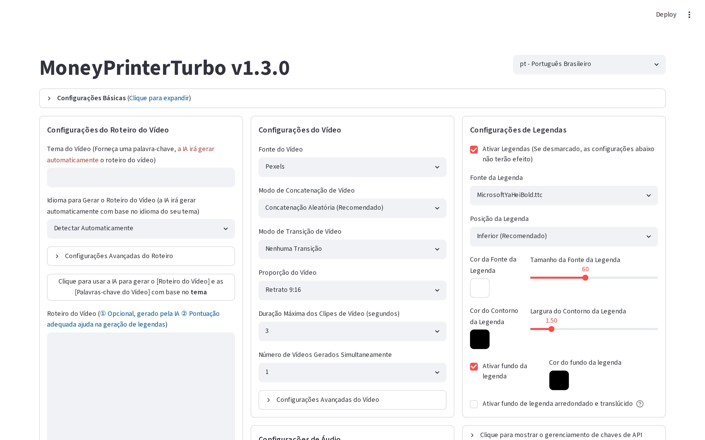
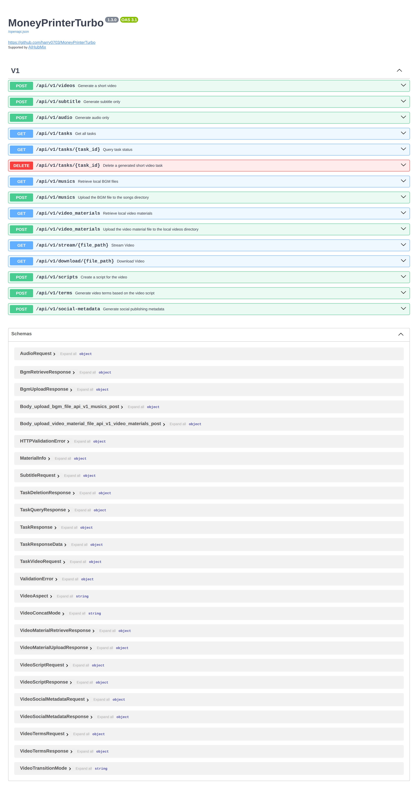

<div align="center">
<h1 align="center">MoneyPrinterTurbo 💸</h1>

<p align="center">
  <a href="https://github.com/harry0703/MoneyPrinterTurbo/stargazers"></a>
  <a href="https://github.com/harry0703/MoneyPrinterTurbo/issues"></a>
  <a href="https://github.com/harry0703/MoneyPrinterTurbo/network/members"></a>
  <a href="https://github.com/harry0703/MoneyPrinterTurbo/blob/main/LICENSE"></a>
</p>

<h3>Português (Brasil) | <a href="README-en.md">English</a> | <a href="README-zh.md">简体中文</a> | <a href="README-ar.md">العربية</a></h3>

É só você dar um <b>assunto</b> ou uma <b>palavra-chave</b> para o vídeo, e ele gera automaticamente o roteiro,
os vídeos de fundo, as legendas sincronizadas e a música — e monta um vídeo curto em alta definição, pronto
para postar.

### Interface (WebUI) em português



### Documentação da API



</div>

## Instalação com um clique (Windows) 🖱️

Este repositório inclui **instaladores tudo-em-um** criados pela **THM TECNOLOGIA**, pensados para quem
não é da área técnica: um download, um duplo clique, e o instalador cuida de tudo — do Python às suas
chaves — terminando com o aplicativo aberto na tela, com ícone na Área de Trabalho e na bandeja do sistema.

| Instalador | O que faz |
|---|---|
| [Instalar-MoneyPrinterTurbo-DEMO.bat](instaladores/Instalar-MoneyPrinterTurbo-DEMO.bat) | **Versão DEMO gratuita** — instalação completa em fluxo único |

A **Ferramenta BR Completa** (todos os provedores de IA, uso pelo iPhone em casa
e via 4G/5G, instalação assistida e suporte) é obtida por contato direto:
💬 Telegram: [t.me/rdllmsu](https://t.me/rdllmsu). Detalhes e
código-fonte auditável: [instaladores/README.md](instaladores/README.md)

## Recursos 🎯

- [x] Arquitetura **MVC completa**, código **bem organizado** e fácil de manter, com suporte a `API` e `interface Web`
- [x] Roteiro do vídeo **gerado por IA** ou **escrito por você**
- [x] Vários tamanhos de **vídeo em alta definição**
  - [x] Vertical 9:16, `1080x1920` (Reels, TikTok, Shorts)
  - [x] Horizontal 16:9, `1920x1080` (YouTube)
- [x] **Geração em lote**: crie várias versões de uma vez e escolha a melhor
- [x] Controle da **duração dos clipes**, para ajustar o ritmo das trocas de cena
- [x] Roteiros em **português, inglês, chinês** e outros idiomas (o roteiro sai no idioma do assunto digitado)
- [x] Síntese de **várias vozes**, incluindo vozes brasileiras (ex.: `pt-BR-FranciscaNeural`), com **prévia em tempo real**
- [x] **Legendas automáticas** sincronizadas com a fala, com `fonte`, `posição`, `cor`, `tamanho` e `contorno` ajustáveis, além de fundo arredondado translúcido
- [x] **Música de fundo** aleatória ou escolhida por você, com volume ajustável
- [x] Vídeos de fundo em **alta definição** e **livres de direitos autorais**, com opção de usar seus **próprios arquivos locais**
- [x] Vários bancos de vídeo: **Pexels**, **Pixabay** e **Coverr**
- [x] Integração com diversos modelos de IA: **OpenAI**, **AIHubMix**, **Moonshot**, **Azure**, **gpt4free**, **one-api**, **Qwen**, **Google Gemini**, **Ollama**, **DeepSeek**, **MiniMax**, **ERNIE**, **Pollinations** (gratuito), **ModelScope** e mais

## Requisitos do sistema 📦

- Plataformas recomendadas: Windows 10+, macOS 11+ ou uma distribuição Linux popular
- **Não precisa de placa de vídeo (GPU)** — mas ela acelera a transcrição local, o processamento de vídeo e a geração em lote

| Item | Mínimo | Recomendado | Ideal |
| ---- | ------ | ----------- | ----- |
| CPU  | 4 núcleos | 6 a 8 núcleos | 8+ núcleos |
| RAM  | 4 GB | 8 GB | 16+ GB |
| GPU  | Não precisa | 4+ GB VRAM | 8+ GB VRAM |

- Se você usa LLM na nuvem, voz na nuvem e bancos de vídeo on-line, CPU e RAM importam mais que GPU
- Se usa `faster-whisper`, geração em lote ou processamento local pesado, a GPU melhora bastante o desempenho

## Começando rápido 🚀

### Caminhos recomendados

- **Windows**: use o [instalador DEMO](#instalação-com-um-clique-windows-️) deste repositório — é o caminho mais fácil
- **macOS / Linux**: use `uv sync --frozen` como caminho principal de instalação local
- Se quiser um ambiente mais isolado: use a implantação com Docker

### Rodar no Google Colab

Quer testar o MoneyPrinterTurbo sem instalar nada? Rode direto no Google Colab — funciona até pelo
navegador do celular:

[](https://colab.research.google.com/github/harry0703/MoneyPrinterTurbo/blob/main/docs/MoneyPrinterTurbo.ipynb)

## Instalação e implantação 📥

### Pré-requisitos

#### ① Clonar o projeto

```shell
git clone https://github.com/ThalesAndrades/MoneyPrinterTurbo.git
```

#### ② Ajustar o arquivo de configuração

> Se você usou o instalador tudo-em-um do Windows, **pule esta etapa** — as chaves já foram pedidas
> em janelinhas durante a instalação.

- Copie o arquivo `config.example.toml` e renomeie para `config.toml`
- Siga as instruções dentro do `config.toml` para configurar `pexels_api_keys` (chave gratuita em
  [pexels.com/api](https://www.pexels.com/api/)) e `llm_provider`, com a chave de API do provedor escolhido
- Sem chave de LLM? Use `llm_provider = "pollinations"` — gratuito e sem cadastro

### Implantação com Docker 🐳

#### ① Subir o contêiner

Se ainda não tem o Docker, instale primeiro: https://www.docker.com/products/docker-desktop/
No Windows, consulte a documentação da Microsoft:

1. https://learn.microsoft.com/pt-br/windows/wsl/install
2. https://learn.microsoft.com/pt-br/windows/wsl/tutorials/wsl-containers

```shell
cd MoneyPrinterTurbo
docker compose up
```

#### ② Acessar a interface Web

Abra o navegador em http://127.0.0.1:8501

#### ③ Acessar a documentação da API

Abra o navegador em http://127.0.0.1:8080/docs ou http://127.0.0.1:8080/redoc

### Implantação manual 📦

#### ① Criar o ambiente virtual Python

Recomendamos o [uv](https://docs.astral.sh/uv/) para gerenciar o ambiente e as dependências, com Python `3.11`:

```shell
git clone https://github.com/ThalesAndrades/MoneyPrinterTurbo.git
cd MoneyPrinterTurbo
uv python install 3.11
uv sync --frozen
```

Se ainda não usa `uv`, o caminho clássico com `venv + pip` também funciona:

```shell
python3.11 -m venv .venv
source .venv/bin/activate
pip install -r requirements.txt
```

Observações:

- O `pyproject.toml` é o manifesto principal de dependências
- O `uv.lock` trava as versões exatas — por isso `uv sync --frozen` é o recomendado
- O `requirements.txt` é mantido para instalação legada com `pip`

#### ② Iniciar a interface Web 🌐

Execute os comandos abaixo na **pasta raiz** do projeto:

###### Windows

```powershell
.\webui.bat
```

O `webui.bat` encontra sozinho o `.venv` do projeto (ou o Python do pacote portátil) e, se a porta 8501
estiver ocupada, escolhe outra automaticamente. Para permitir acesso de outros aparelhos na sua rede,
rode `set MPT_WEBUI_HOST=0.0.0.0` antes.

###### macOS ou Linux

```shell
uv run streamlit run ./webui/Main.py --browser.gatherUsageStats=False
```

Ou, com o ambiente virtual já ativado:

```shell
sh webui.sh
```

O navegador abre automaticamente. **Dica brasileira**: no topo da interface, troque o idioma para
**Português Brasileiro** — toda a interface está traduzida.

#### ③ Iniciar o serviço de API 🚀

```shell
uv run python main.py
```

#### ④ Modo somente linha de comando (sem navegador) ⌨️

```shell
uv run python cli.py --video-subject "5 curiosidades sobre o oceano"
```

Com materiais próprios e controle do estágio final:

```shell
uv run python cli.py \
  --video-subject "5 curiosidades sobre o oceano" \
  --video-source local \
  --video-materials "1.mp4,2.mp4" \
  --stop-at video
```

## Síntese de voz 🗣

A lista completa de vozes está em: [Lista de Vozes](./docs/voice-list.txt)

**Vozes brasileiras gratuitas**: `pt-BR-FranciscaNeural` (feminina) e `pt-BR-AntonioNeural` (masculina),
entre outras.

O provedor padrão é o **Edge TTS** (gratuito, sem chave de API). Na interface ele aparece como
**"Azure TTS V1"** — é a mesma coisa. Para trocar a voz, ajuste `voice_name` no `config.toml` ou
escolha no seletor da interface.

> **Atenção:** "Azure TTS V1" (Edge TTS, gratuito) e "Azure TTS V2" (Azure Speech, pago) são opções
> diferentes. Só o V2 exige chave da Azure.

Para usar as vozes de maior qualidade do **Azure TTS V2**, configure suas credenciais no `config.toml`:

```toml
[azure]
speech_key = "sua-chave-azure-speech"
speech_region = "eastus"
```

## Geração de legendas 📜

Há 2 formas de gerar legendas:

- **edge**: usa os tempos do próprio Edge TTS para alinhar as legendas. Rápido, sem GPU, funciona em
  qualquer máquina. A precisão depende do sinal de tempo do TTS — pode desalinhar em frases complexas.
- **whisper**: roda o `faster-whisper` localmente para transcrever o áudio gerado com tempos palavra a
  palavra. Mais lento (de alguns segundos a ~1 minuto por clipe na CPU), exige baixar um modelo
  (~250 MB para `large-v3-turbo`, ~3 GB para `large-v3`), mas produz legendas mais precisas.

Troque entre eles pelo `subtitle_provider` no `config.toml`. Recomendamos começar com `edge` e mudar
para `whisper` só se a qualidade não agradar.

> Observações:
>
> 1. No modo whisper, o modelo é baixado do HuggingFace na primeira execução — garanta uma boa conexão
> 2. Se deixar em branco, nenhuma legenda será gerada

## Música de fundo 🎵

As músicas ficam na pasta `resource/songs` do projeto — adicione as suas (MP3) e elas entram no sorteio
do modo "aleatório".

> O projeto inclui algumas músicas padrão de vídeos do YouTube. Em caso de problemas de direitos
> autorais, basta removê-las.

## Fontes das legendas 🅰

As fontes usadas nas legendas ficam em `resource/fonts` — você também pode adicionar as suas
(`.ttf`/`.ttc`).

## Perguntas frequentes 🤔

### ❓RuntimeError: No ffmpeg exe could be found

Normalmente o ffmpeg é baixado e detectado automaticamente (o pacote `imageio-ffmpeg` traz um embutido).
Se o seu ambiente bloquear downloads automáticos, baixe o ffmpeg em https://www.gyan.dev/ffmpeg/builds/,
extraia e configure o caminho real:

```toml
[app]
# Ajuste para o seu caminho real; no Windows o separador é \\
ffmpeg_path = "C:\\Users\\seu-usuario\\Downloads\\ffmpeg.exe"
```

### ❓ImageMagick is not installed on your computer

> **Este erro não se aplica mais à versão atual.**
>
> Desde a atualização para o **MoviePy 2.x**, as legendas são renderizadas com **Pillow** — o ImageMagick
> não é mais necessário. Se você vê esse erro, está rodando código antigo: rode `git pull` para atualizar.

### ❓OSError: [Errno 24] Too many open files

Causado pelo limite de arquivos abertos do sistema (macOS/Linux). Verifique e aumente o limite:

```shell
ulimit -n        # ver o limite atual
ulimit -n 10240  # aumentar
```

### ❓O download do modelo Whisper falhou

Se aparecer `LocalEntryNotFoundError` ou erro de conexão com o Hugging Face Hub: verifique sua internet
e tente de novo. Também é possível baixar o modelo manualmente e colocá-lo em
`.\MoneyPrinterTurbo\models\whisper-large-v3`:

```
MoneyPrinterTurbo
  ├─models
  │   └─whisper-large-v3
  │          config.json
  │          model.bin
  │          preprocessor_config.json
  │          tokenizer.json
  │          vocabulary.json
```

## Comentários e sugestões 📢

- Abra uma [issue](https://github.com/ThalesAndrades/MoneyPrinterTurbo/issues) ou envie um
  [pull request](https://github.com/ThalesAndrades/MoneyPrinterTurbo/pulls)

## Licença 📝

Veja o arquivo [`LICENSE`](LICENSE). Os instaladores em [`instaladores/`](instaladores/README.md) são de
autoria da **THM TECNOLOGIA**, distribuídos sob a mesma licença MIT com manutenção obrigatória do aviso
de autoria.
