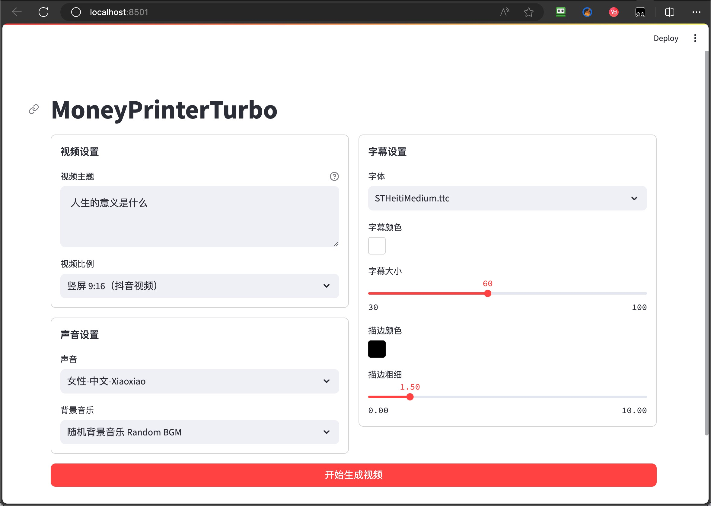
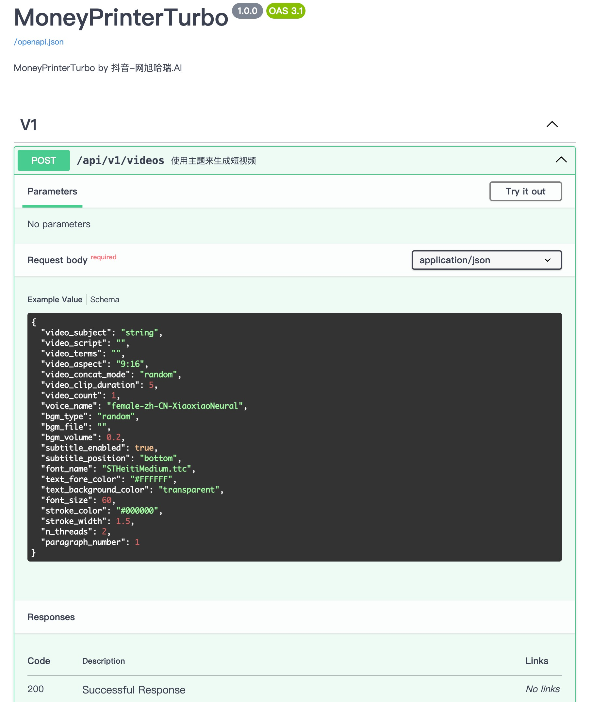
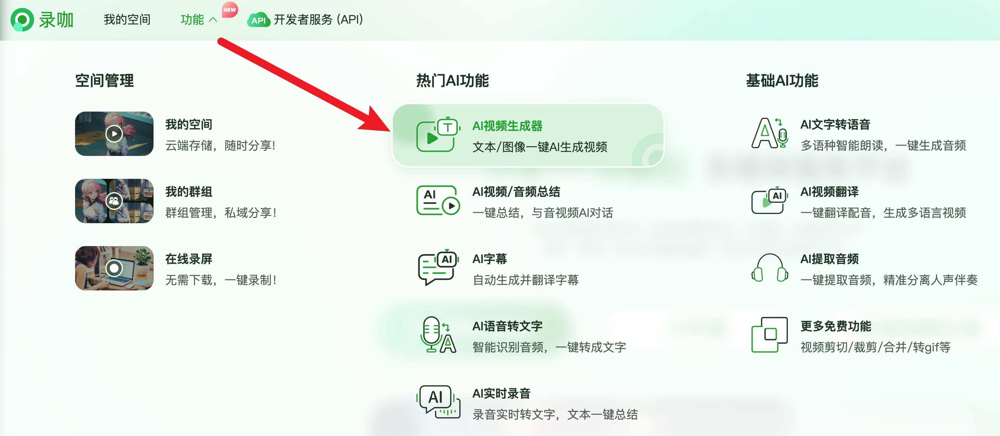

<div align="center">
<h1 align="center">MoneyPrinterTurbo 💸</h1>

<p align="center">
  <a href="https://github.com/harry0703/MoneyPrinterTurbo/stargazers"></a>
  <a href="https://github.com/harry0703/MoneyPrinterTurbo/issues"></a>
  <a href="https://github.com/harry0703/MoneyPrinterTurbo/network/members"></a>
  <a href="https://github.com/harry0703/MoneyPrinterTurbo/blob/main/LICENSE"></a>
</p>
<br>
<h3>简体中文 | <a href="README-en.md">English</a></h3>
<br>
只需提供一个视频 <b>主题</b> 或 <b>关键词</b> ，就可以全自动生成视频文案、视频素材、视频字幕、视频背景音乐，然后合成一个高清的短视频。
<br>

<h4>Web界面</h4>



<h4>API界面</h4>



</div>

## 特别感谢 🙏

由于该项目的 **部署** 和 **使用**，对于一些小白用户来说，还是 **有一定的门槛**，在此特别感谢

**录咖（AI智能 多媒体服务平台）** 网站基于该项目，提供的免费`AI视频生成器`服务，可以不用部署，直接在线使用，非常方便。

- 中文版：https://reccloud.cn
- 英文版：https://reccloud.com



## 功能特性 🎯

- [x] 完整的 **MVC架构**，代码 **结构清晰**，易于维护，支持 `API` 和 `Web界面`
- [x] 支持视频文案 **AI自动生成**，也可以**自定义文案**
- [x] 支持多种 **高清视频** 尺寸
    - [x] 竖屏 9:16，`1080x1920`
    - [x] 横屏 16:9，`1920x1080`
- [x] 支持 **批量视频生成**，可以一次生成多个视频，然后选择一个最满意的
- [x] 支持 **视频片段时长**设置，方便调节素材切换频率
- [x] 支持 **中文** 和 **英文** 视频文案
- [x] 支持 **多种语音** 合成
- [x] 支持 **字幕生成**，可以调整 `字体`、`位置`、`颜色`、`大小`，同时支持`字幕描边`设置
- [x] 支持 **背景音乐**，随机或者指定音乐文件，可设置`背景音乐音量`
- [x] 视频素材来源 **高清**，而且 **无版权**
- [x] 支持 **OpenAI**、**moonshot**、**Azure**、**gpt4free**、**one-api**、**通义千问**、**Google Gemini** 等多种模型接入

### 后期计划 📅

- [ ] GPT-SoVITS 配音支持
- [ ] 优化语音合成，利用大模型，使其合成的声音，更加自然，情绪更加丰富
- [ ] 增加视频转场效果，使其看起来更加的流畅
- [ ] 增加更多视频素材来源，优化视频素材和文案的匹配度
- [ ] OLLAMA 支持
- [ ] 增加视频长度选项：短、中、长
- [ ] 打包成一键启动包（Windows，macOS），方便使用
- [ ] 增加免费网络代理，让访问OpenAI和素材下载不再受限
- [ ] 可以使用自己的素材
- [ ] 朗读声音和背景音乐，提供实时试听
- [ ] 支持更多的语音合成服务商，比如 OpenAI TTS
- [ ] 自动上传到YouTube平台

## 视频演示 📺

### 竖屏 9:16

<table>
<thead>
<tr>
<th align="center"><g-emoji class="g-emoji" alias="arrow_forward">▶️</g-emoji> 《如何增加生活的乐趣》</th>
<th align="center"><g-emoji class="g-emoji" alias="arrow_forward">▶️</g-emoji> 《生命的意义是什么》</th>
</tr>
</thead>
<tbody>
<tr>
<td align="center"><video src="https://github.com/harry0703/MoneyPrinterTurbo/assets/4928832/a84d33d5-27a2-4aba-8fd0-9fb2bd91c6a6"></video></td>
<td align="center"><video src="https://github.com/harry0703/MoneyPrinterTurbo/assets/4928832/112c9564-d52b-4472-99ad-970b75f66476"></video></td>
</tr>
</tbody>
</table>

### 横屏 16:9

<table>
<thead>
<tr>
<th align="center"><g-emoji class="g-emoji" alias="arrow_forward">▶️</g-emoji>《生命的意义是什么》</th>
<th align="center"><g-emoji class="g-emoji" alias="arrow_forward">▶️</g-emoji>《为什么要运动》</th>
</tr>
</thead>
<tbody>
<tr>
<td align="center"><video src="https://github.com/harry0703/MoneyPrinterTurbo/assets/4928832/346ebb15-c55f-47a9-a653-114f08bb8073"></video></td>
<td align="center"><video src="https://github.com/harry0703/MoneyPrinterTurbo/assets/4928832/271f2fae-8283-44a0-8aa0-0ed8f9a6fa87"></video></td>
</tr>
</tbody>
</table>

## 安装部署 📥

- 尽量不要使用 **中文路径**，避免出现一些无法预料的问题
- 请确保你的 **网络** 是正常的，VPN需要打开`全局流量`模式

#### ① 克隆代码

```shell
git clone https://github.com/harry0703/MoneyPrinterTurbo.git
```

#### ② 修改配置文件

- 将 `config.example.toml` 文件复制一份，命名为 `config.toml`
- 按照 `config.toml` 文件中的说明，配置好 `pexels_api_keys` 和 `llm_provider`，并根据 llm_provider 对应的服务商，配置相关的
  API Key

#### ③ 配置大模型(LLM)

- 如果要使用 `GPT-4.0` 或 `GPT-3.5`，需要有 `OpenAI` 的 `API Key`，如果没有，可以将 `llm_provider` 设置为 `g4f` (
  一个免费使用GPT的开源库 https://github.com/xtekky/gpt4free ，但是该免费的服务，稳定性较差，有时候可以用，有时候用不了)
- 或者可以使用到 [月之暗面](https://platform.moonshot.cn/console/api-keys) 申请。注册就送
  15元体验金，可以对话1500次左右。然后设置 `llm_provider="moonshot"` 和 `moonshot_api_key`
- 也可以使用 通义千问，具体请看配置文件里面的注释说明

### Docker部署 🐳

#### ① 启动Docker

如果未安装 Docker，请先安装 https://www.docker.com/products/docker-desktop/

如果是Windows系统，请参考微软的文档：
1. https://learn.microsoft.com/zh-cn/windows/wsl/install
2. https://learn.microsoft.com/zh-cn/windows/wsl/tutorials/wsl-containers

```shell
cd MoneyPrinterTurbo
docker-compose up
```

#### ② 访问Web界面

打开浏览器，访问 http://0.0.0.0:8501

#### ③ 访问API文档

打开浏览器，访问 http://0.0.0.0:8080/docs 或者 http://0.0.0.0:8080/redoc

### 手动部署 📦

> 视频教程

- 完整的使用演示：https://v.douyin.com/iFhnwsKY/
- 如何在Windows上部署：https://v.douyin.com/iFyjoW3M

#### ① 创建虚拟环境

建议使用 [conda](https://conda.io/projects/conda/en/latest/user-guide/install/index.html) 创建 python 虚拟环境

```shell
git clone https://github.com/harry0703/MoneyPrinterTurbo.git
cd MoneyPrinterTurbo
conda create -n MoneyPrinterTurbo python=3.10
conda activate MoneyPrinterTurbo
pip install -r requirements.txt
```

#### ② 安装好 ImageMagick

###### Windows:

- 下载 https://imagemagick.org/archive/binaries/ImageMagick-7.1.1-29-Q16-x64-static.exe
- 安装下载好的 ImageMagick，注意不要修改安装路径
- 修改 `配置文件 config.toml` 中的 `imagemagick_path` 为你的实际安装路径（如果安装的时候没有修改路径，直接取消注释即可）

###### MacOS:

```shell
brew install imagemagick
````

###### Ubuntu

```shell
sudo apt-get install imagemagick
```

###### CentOS

```shell
sudo yum install ImageMagick
```

#### ③ 启动Web界面 🌐

注意需要到 MoneyPrinterTurbo 项目 `根目录` 下执行以下命令

###### Windows

```bat
conda activate MoneyPrinterTurbo
webui.bat
```

###### MacOS or Linux

```shell
conda activate MoneyPrinterTurbo
sh webui.sh
```
启动后，会自动打开浏览器

#### ④ 启动API服务 🚀

```shell
python main.py
```

启动后，可以查看 `API文档` http://127.0.0.1:8080/docs 或者 http://127.0.0.1:8080/redoc 直接在线调试接口，快速体验。

## 语音合成 🗣

所有支持的声音列表，可以查看：[声音列表](./docs/voice-list.txt)

## 字幕生成 📜

当前支持2种字幕生成方式：

- edge: 生成速度更快，性能更好，对电脑配置没有要求，但是质量可能不稳定
- whisper: 生成速度较慢，性能较差，对电脑配置有一定要求，但是质量更可靠。

可以修改 `config.toml` 配置文件中的 `subtitle_provider` 进行切换

建议使用 `edge` 模式，如果生成的字幕质量不好，再切换到 `whisper` 模式

> 注意：
1. whisper 模式下需要到 HuggingFace 下载一个模型文件，大约 3GB 左右，请确保网络通畅
2. 如果留空，表示不生成字幕。

## 背景音乐 🎵

用于视频的背景音乐，位于项目的 `resource/songs` 目录下。
> 当前项目里面放了一些默认的音乐，来自于 YouTube 视频，如有侵权，请删除。

## 字幕字体 🅰

用于视频字幕的渲染，位于项目的 `resource/fonts` 目录下，你也可以放进去自己的字体。

## 常见问题 🤔

### ❓AttributeError: 'str' object has no attribute 'choices'`

这个问题是由于 OpenAI 或者其他 LLM，没有返回正确的回复导致的。

大概率是网络原因， 使用 **VPN**，或者设置 `openai_base_url` 为你的代理 ，应该就可以解决了。

### ❓RuntimeError: No ffmpeg exe could be found

通常情况下，ffmpeg 会被自动下载，并且会被自动检测到。
但是如果你的环境有问题，无法自动下载，可能会遇到如下错误：

```
RuntimeError: No ffmpeg exe could be found.
Install ffmpeg on your system, or set the IMAGEIO_FFMPEG_EXE environment variable.
```

此时你可以从 https://www.gyan.dev/ffmpeg/builds/ 下载ffmpeg，解压后，设置 `ffmpeg_path` 为你的实际安装路径即可。

```toml
[app]
# 请根据你的实际路径设置，注意 Windows 路径分隔符为 \\
ffmpeg_path = "C:\\Users\\harry\\Downloads\\ffmpeg.exe"
```

### ❓生成音频时报错或下载视频报错

[issue 56](https://github.com/harry0703/MoneyPrinterTurbo/issues/56)

```
failed to generate audio, maybe the network is not available. 
if you are in China, please use a VPN.
```

[issue 44](https://github.com/harry0703/MoneyPrinterTurbo/issues/44)

```
failed to download videos, maybe the network is not available. 
if you are in China, please use a VPN.
```

这个大概率是网络原因，无法访问境外的服务，请使用VPN解决。

### ❓ImageMagick is not installed on your computer

[issue 33](https://github.com/harry0703/MoneyPrinterTurbo/issues/33)

1. 按照 `示例配置` 里面提供的 `下载地址`
   ，安装 https://imagemagick.org/archive/binaries/ImageMagick-7.1.1-29-Q16-x64-static.exe, 用静态库
2. 不要安装在中文路径里面，避免出现一些无法预料的问题

[issue 54](https://github.com/harry0703/MoneyPrinterTurbo/issues/54#issuecomment-2017842022)

如果是linux系统，可以手动安装，参考 https://cn.linux-console.net/?p=16978

感谢 [@wangwenqiao666](https://github.com/wangwenqiao666)的研究探索

### ❓ImageMagick的安全策略阻止了与临时文件@/tmp/tmpur5hyyto.txt相关的操作

[issue 92](https://github.com/harry0703/MoneyPrinterTurbo/issues/92)

可以在ImageMagick的配置文件policy.xml中找到这些策略。
这个文件通常位于 /etc/ImageMagick-`X`/ 或 ImageMagick 安装目录的类似位置。
修改包含`pattern="@"`的条目，将`rights="none"`更改为`rights="read|write"`以允许对文件的读写操作。

感谢 [@chenhengzh](https://github.com/chenhengzh)的研究探索

### ❓OSError: [Errno 24] Too many open files

[issue 100](https://github.com/harry0703/MoneyPrinterTurbo/issues/100)

这个问题是由于系统打开文件数限制导致的，可以通过修改系统的文件打开数限制来解决。

查看当前限制

```shell
ulimit -n
```

如果过低，可以调高一些，比如

```shell
ulimit -n 10240
```

### ❓AttributeError: module 'PIL.Image' has no attribute 'ANTIALIAS'

[issue 101](https://github.com/harry0703/MoneyPrinterTurbo/issues/101),
[issue 83](https://github.com/harry0703/MoneyPrinterTurbo/issues/83),
[issue 70](https://github.com/harry0703/MoneyPrinterTurbo/issues/70)

先看下当前的 Pillow 版本是多少

```shell
pip list |grep Pillow
```

如果是 10.x 的版本，可以尝试下降级看看，有用户反馈降级后正常

```shell
pip uninstall Pillow
pip install Pillow==9.5.0
# 或者降级到 8.4.0
pip install Pillow==8.4.0
```

## 反馈建议 📢

- 可以提交 [issue](https://github.com/harry0703/MoneyPrinterTurbo/issues)
  或者 [pull request](https://github.com/harry0703/MoneyPrinterTurbo/pulls)。
- 也可以关注我的 **抖音** 或 **视频号**：`网旭哈瑞.AI`
    - 我会在上面发布一些 **使用教程** 和 **纯技术** 分享。
    - 如果有更新和优化，我也会在上面 **及时通知**。
    - 有问题也可以在上面 **留言**，我会 **尽快回复**。

|                   抖音                    |              |                     视频号                     |
|:---------------------------------------:|:------------:|:-------------------------------------------:|
|  |              |  |

## 参考项目 📚

该项目基于 https://github.com/FujiwaraChoki/MoneyPrinter 重构而来，做了大量的优化，增加了更多的功能。
感谢原作者的开源精神。

## 许可证 📝

点击查看 [`LICENSE`](LICENSE) 文件


## Star History

[](https://star-history.com/#harry0703/MoneyPrinterTurbo&Date)