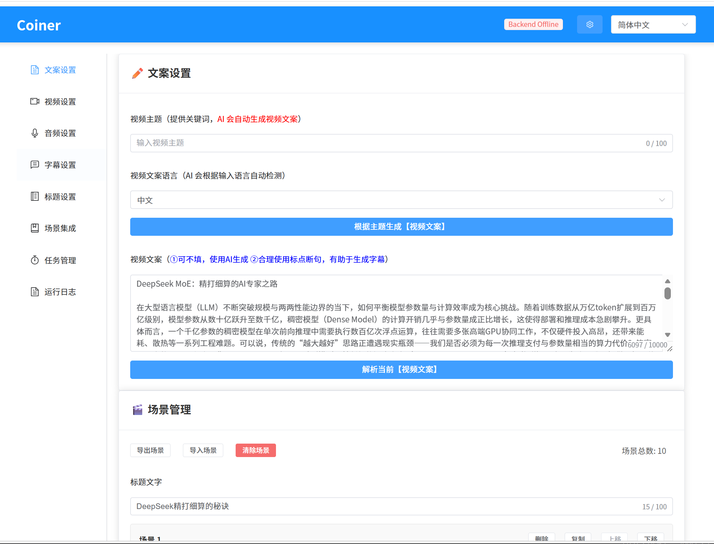

<div align="center">
<h1 align="center">Coiner 💸</h1>

<p align="center">
  <a href="https://github.com/RyanFeiluX/Coiner/stargazers"></a>
  <a href="https://github.com/RyanFeiluX/Coiner/issues"></a>
  <a href="https://github.com/RyanFeiluX/Coiner/network/members"></a>
  <a href="https://github.com/RyanFeiluX/Coiner/LICENSE"></a>
</p>
<br>
只需提供一个视频 <b>主题</b> 或 <b>关键词</b> ，就可以全自动生成视频文案、视频素材、视频字幕、视频背景音乐，然后合成一个高清的中等长度视频。
<br>

<h4>Web界面</h4>



<h4>API界面</h4>


</div>

## 功能特性 🎯

- [x] 完整的 **MVC架构**，代码 **结构清晰**，易于维护，支持 `API` 和 `Web界面`
- [x] 支持视频文案 **AI自动生成**，也可以**自定义文案**
- [x] 支持多种 **高清视频** 尺寸
    - [x] 竖屏 9:16，`1080x1920`
    - [x] 竖屏 3:4，`1080x1440`
    - [x] 横屏 16:9，`1920x1080`
    - [x] 方形 1:1，`1080x1080`
- [x] 支持 **批量视频生成**，可以一次生成多个视频，然后选择一个最满意的
- [x] 支持 **视频片段时长** 设置，方便调节素材切换频率
- [x] 支持 **中文** 和 **英文** 视频文案
- [x] 支持 **多种语音** 合成，可 **实时试听** 效果，包括 **Azure TTS**、**SiliconFlow**、**Gemini TTS**、**Coze TTS**、**Qwen TTS**
- [x] 支持 **字幕生成**，可以调整 `字体`、`位置`、`颜色`、`大小`，同时支持`字幕描边`设置
- [x] 支持 **背景音乐**，随机或者指定音乐文件，可设置`背景音乐音量`
- [x] 视频素材来源 **高清**，而且 **无版权**，也可以使用自己的 **本地素材**
- [x] 支持 **OpenAI**、**Moonshot**、**Azure**、**gpt4free**、**one-api**、**通义千问**、**Google Gemini**、**Ollama**、**DeepSeek**、 **文心一言**, **Pollinations**、**Cloudflare**、**ModelScope** 等多种模型接入
    - 中国用户建议使用 **DeepSeek** 或 **Moonshot** 作为大模型提供商（国内可直接访问，不需要VPN。）


### 未来计划 📅

- [ ] 添加视频过渡效果，提升观看体验流畅度
- [ ] 增加更多视频素材来源，提高视频素材与脚本的匹配度
- [ ] 支持更多语音合成提供商，如 OpenAI TTS

## 视频演示 📺

### 竖屏 9:16

<table>
<thead>
<tr>
<th align="center"><g-emoji class="g-emoji" alias="arrow_forward">▶️</g-emoji> 《如何增加生活的乐趣》</th>
<th align="center"><g-emoji class="g-emoji" alias="arrow_forward">▶️</g-emoji> 《金钱的作用》<br>更真实的合成声音</th>
<th align="center"><g-emoji class="g-emoji" alias="arrow_forward">▶️</g-emoji> 《生命的意义是什么》</th>
</tr>
</thead>
<tbody>
<tr>
<td align="center"><video src="https://github.com/RyanFeiluX/Coiner/assets/4928832/a84d33d5-27a2-4aba-8fd0-9fb2bd91c6a6"></video></td>
<td align="center"><video src="https://github.com/RyanFeiluX/Coiner/assets/4928832/af2f3b0b-002e-49fe-b161-18ba91c055e8"></video></td>
<td align="center"><video src="https://github.com/RyanFeiluX/Coiner/assets/4928832/112c9564-d52b-4472-99ad-970b75f66476"></video></td>
</tr>
</tbody>
</table>

### 横屏 16:9

<table>
<thead>
<tr>
<th align="center"><g-emoji class="g-emoji" alias="arrow_forward">▶️</g-emoji>《生命的意义是什么》</th>
<th align="center"><g-emoji class="g-emoji" alias="arrow_forward">▶️</g-emoji>《为什么要运动》</th>
</tr>
</thead>
<tbody>
<tr>
<td align="center"><video src="https://github.com/RyanFeiluX/Coiner/assets/4928832/346ebb15-c55f-47a9-a653-114f08bb8073"></video></td>
<td align="center"><video src="https://github.com/RyanFeiluX/Coiner/assets/4928832/271f2fae-8283-44a0-8aa0-0ed8f9a6fa87"></video></td>
</tr>
</tbody>
</table>

## 配置要求 📦

- 建议最低 CPU **4核** 或以上，内存 **4G** 或以上，显卡非必须
- Windows 10 或 MacOS 11.0 以上系统


## 快速开始 🚀

### Windows一键启动包

下载一键启动包，解压直接使用（路径不要有 **中文**、**特殊字符**、**空格**）

- 百度网盘（v1.2.66）: https://pan.baidu.com/s/1wg0UaIyXpO3SqIpaq790SQ?pwd=sbqx 提取码: sbqx

下载后，建议先**双击执行** `update.bat` 更新到**最新代码**，然后双击 `start.bat` 启动

启动后，会自动打开浏览器（如果打开是空白，建议换成 **Chrome** 或者 **Edge** 打开）

## 安装部署 📥

### 前提条件

- 尽量不要使用 **中文路径**，避免出现一些无法预料的问题
- 请确保你的 **网络** 是正常的，VPN需要打开`全局流量`模式

#### ① 克隆代码

```shell
git clone https://github.com/RyanFeiluX/Coiner.git
```

#### ② 修改配置文件（可选，建议启动后也可以在 WebUI 里面配置）

- 将 `config.example.toml` 文件复制一份，命名为 `config.toml`
- 按照 `config.toml` 文件中的说明，配置好 `pexels_api_keys` 和 `llm_provider`，并根据 llm_provider 对应的服务商，配置相关的
  API Key

### Docker部署 🐳

#### ① 启动Docker

如果未安装 Docker，请先安装 https://www.docker.com/products/docker-desktop/

如果是Windows系统，请参考微软的文档：

1. https://learn.microsoft.com/zh-cn/windows/wsl/install
2. https://learn.microsoft.com/zh-cn/windows/wsl/tutorials/wsl-containers

```shell
cd Coiner
docker-compose up
```

> 注意：最新版的docker安装时会自动以插件的形式安装docker compose，启动命令调整为docker compose up

#### ② 访问Web界面

打开浏览器，访问 http://0.0.0.0:8080

#### ③ 访问API文档

打开浏览器，访问 http://0.0.0.0:8080/docs 或者 http://0.0.0.0:8080/redoc

### Docker维护 🛠

#### 查看容器状态

```shell
docker-compose ps
```

#### 停止容器

```shell
docker-compose stop
```

#### 启动容器

```shell
docker-compose start
```

#### 重启容器

```shell
docker-compose restart
```

#### 停止并删除容器

```shell
docker-compose down
```

#### 查看容器日志

```shell
# 查看所有容器日志
docker-compose logs

# 查看webui容器日志
docker-compose logs webui

# 查看api容器日志
docker-compose logs api

# 实时查看日志
docker-compose logs -f
```

#### 重新构建镜像

如果修改了Dockerfile或依赖文件，需要重新构建镜像：

```shell
docker-compose up -d --build
```

#### 进入容器

```shell
# 进入webui容器
docker-compose exec webui bash

# 进入api容器
docker-compose exec api bash
```

### 手动部署 📦

> 视频教程

- 完整的使用演示：https://v.douyin.com/iFhnwsKY/
- 如何在Windows上部署：https://v.douyin.com/iFyjoW3M

#### ① 创建虚拟环境

建议使用 [conda](https://conda.io/projects/conda/en/latest/user-guide/install/index.html) 创建 python 虚拟环境

```shell
git clone https://github.com/RyanFeiluX/Coiner.git
cd Coiner
conda create -n condaenv-coiner python=3.12
conda activate condaenv-coiner  
pip install -r requirements.txt
```

#### ② 安装好 ImageMagick

- Windows:
    - 下载 https://imagemagick.org/script/download.php 选择Windows版本，切记一定要选择 **静态库** 版本，比如
      ImageMagick-7.1.1-32-Q16-x64-**static**.exe
    - 安装下载好的 ImageMagick，**注意不要修改安装路径**
    - 修改 `配置文件 config.toml` 中的 `imagemagick_path` 为你的 **实际安装路径**

- MacOS:
  ```shell
  brew install imagemagick
  ````
- Ubuntu
  ```shell
  sudo apt-get install imagemagick
  ```
- CentOS
  ```shell
  sudo yum install ImageMagick
  ```

#### ③ 启动Web界面 🌐

注意需要到 Coiner 项目 `根目录` 下执行以下命令

###### Windows

```bat
webui.bat
```

###### MacOS or Linux

```shell
sh webui.sh
```

启动后，会自动打开浏览器（如果打开是空白，建议换成 **Chrome** 或者 **Edge** 打开）

#### ④ 启动API服务 🚀

```shell
python main.py
```

启动后，可以查看 `API文档` http://127.0.0.1:8000/docs 或者 http://127.0.0.1:8000/redoc 直接在线调试接口，快速体验。

## 语音合成 🗣

所有支持的声音列表，可以查看：[声音列表](./docs/voice-list.txt)

2024-04-16 v1.1.2 新增了9种Azure的语音合成声音，需要配置API KEY，该声音合成的更加真实。

## 字幕生成 📜

当前支持2种字幕生成方式：

- **edge**: 生成`速度快`，性能更好，对电脑配置没有要求，但是质量可能不稳定
- **whisper**: 生成`速度慢`，性能较差，对电脑配置有一定要求，但是`质量更可靠`。

可以修改 `config.toml` 配置文件中的 `subtitle_provider` 进行切换

建议使用 `edge` 模式，如果生成的字幕质量不好，再切换到 `whisper` 模式

> 注意：

1. whisper 模式下需要到 HuggingFace 下载一个模型文件，大约 3GB 左右，请确保网络通畅
2. 如果留空，表示不生成字幕。

> 由于国内无法访问 HuggingFace，可以使用以下方法下载 `whisper-large-v3` 的模型文件

下载地址：

- 百度网盘: https://pan.baidu.com/s/11h3Q6tsDtjQKTjUu3sc5cA?pwd=xjs9
- 夸克网盘：https://pan.quark.cn/s/3ee3d991d64b

模型下载后解压，整个目录放到 `.\Coiner\models` 里面，
最终的文件路径应该是这样: `.\Coiner\models\whisper-large-v3`

```
Coiner  
  ├─models
  │   └─whisper-large-v3
  │          config.json
  │          model.bin
  │          preprocessor_config.json
  │          tokenizer.json
  │          vocabulary.json
```

## 背景音乐 🎵

用于视频的背景音乐，位于项目的 `resource/songs` 目录下。
> 当前项目里面放了一些默认的音乐，来自于 YouTube 视频，如有侵权，请删除。

## 字幕字体 🅰

用于视频字幕的渲染，位于项目的 `resource/fonts` 目录下，你也可以放进去自己的字体。

## 高级配置 ⚙️

项目提供了高级配置选项，可在 `config.toml` 中进行视频生成的精细调整：

### 视频生成设置

- `video_clip_duration`: 每个视频片段的时长（秒，默认：3）
- `video_count`: 使用的视频片段数量（默认：1）。**注意**：系统会从搜索结果中随机选择该数量1.5倍的视频进行下载，确保素材多样性
- `video_style`: 视频素材风格过滤（选项："none", "people", "nature", "animation", "cartoon", "industry", "science", "tech", "business", "ai"）
- `video_quality`: 视频质量预设（选项："low", "medium", "high", "ultra"）
- `video_transition_mode`: 场景过渡效果（选项："none", "fade", "slide"）
- `silence_duration`: 最终视频开头的静止帧时长（秒，默认：0.3）
- `max_parallel_scenes`: 并行处理的场景数量（1=串行，2=推荐，3-4=需要更多内存）

### 开场视频设置

- `intro_video_bg_type`: 开场视频背景类型（选项："solid", "blurred"）
- `intro_video_bg_blur`: 模糊背景的模糊半径（推荐：5-50）
- `intro_video_bg_color`: 纯色背景的颜色（例如："black", "#000000"）

### 字幕设置

- `subtitle_enabled`: 启用字幕生成（默认：true）
- `subtitle_position`: 字幕位置（选项："top", "center", "bottom", "custom"）
- `subtitle_custom_position`: 自定义位置百分比（仅当位置为"custom"时使用，默认：70.0）
- `subtitle_margin`: 字幕边距（视频高度的百分比，默认：0.05）

### 性能设置

- `max_concurrent_tasks`: 最大并发视频生成任务数（默认：5）
- `use_gpu`: 使用GPU进行视频编码（默认：false）

### 服务设置

- `endpoint`: 生成视频的外部下载端点（留空表示自动检测）
- `enable_redis`: 启用Redis进行任务状态管理（默认：false）

### 日志设置

- `console_log_level`: 控制终端输出详细程度（选项："TRACE", "DEBUG", "INFO", "SUCCESS", "WARNING", "ERROR", "CRITICAL"）
  - "DEBUG": 显示所有详情
  - "INFO": 更简洁的控制台输出（推荐）
  - "WARNING": 最小输出

## 常见问题 🤔

### ❓RuntimeError: No ffmpeg exe could be found

通常情况下，ffmpeg 会被自动下载，并且会被自动检测到。
但是如果你的环境有问题，无法自动下载，可能会遇到如下错误：

```
RuntimeError: No ffmpeg exe could be found.
Install ffmpeg on your system, or set the IMAGEIO_FFMPEG_EXE environment variable.
```

此时你可以从 https://www.gyan.dev/ffmpeg/builds/ 下载ffmpeg，解压后，设置 `ffmpeg_path` 为你的实际安装路径即可。

```toml
[app]
# 请根据你的实际路径设置，注意 Windows 路径分隔符为 \\
ffmpeg_path = "C:\\Users\\harry\\Downloads\\ffmpeg.exe"
```

### ❓ImageMagick的安全策略阻止了与临时文件@/tmp/tmpur5hyyto.txt相关的操作

可以在ImageMagick的配置文件policy.xml中找到这些策略。
这个文件通常位于 /etc/ImageMagick-`X`/ 或 ImageMagick 安装目录的类似位置。
修改包含`pattern="@"`的条目，将`rights="none"`更改为`rights="read|write"`以允许对文件的读写操作。

### ❓OSError: [Errno 24] Too many open files

这个问题是由于系统打开文件数限制导致的，可以通过修改系统的文件打开数限制来解决。

查看当前限制

```shell
ulimit -n
```

如果过低，可以调高一些，比如

```shell
ulimit -n 10240
```

### ❓Whisper 模型下载失败，出现如下错误

LocalEntryNotfoundEror: Cannot find an appropriate cached snapshotfolderfor the specified revision on the local disk and
outgoing trafic has been disabled.
To enablerepo look-ups and downloads online, pass 'local files only=False' as input.

或者

An error occured while synchronizing the model Systran/faster-whisper-large-v3 from the Hugging Face Hub:
An error happened while trying to locate the files on the Hub and we cannot find the appropriate snapshot folder for the
specified revision on the local disk. Please check your internet connection and try again.
Trying to load the model directly from the local cache, if it exists.

解决方法：[点击查看如何从网盘手动下载模型](#%E5%AD%97%E5%B9%95%E7%94%9F%E6%88%90-)

## 反馈建议 📢

- 可以提交 [issue](https://github.com/RyanFeiluX/Coiner/issues)
  或者 [pull request](https://github.com/RyanFeiluX/Coiner/pulls)。

## 许可证 📝

点击查看 [`LICENSE`](LICENSE) 文件
