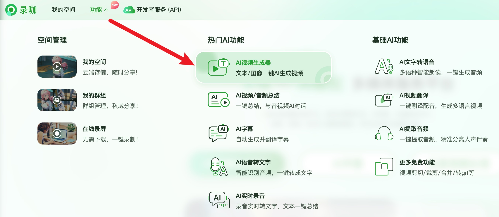
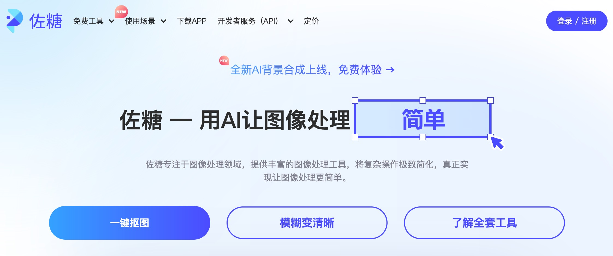

<div align="center">
<h1 align="center">MoneyPrinterTurbo 💸</h1>

<p align="center">
  <a href="https://github.com/harry0703/MoneyPrinterTurbo/stargazers"></a>
  <a href="https://github.com/harry0703/MoneyPrinterTurbo/issues"></a>
  <a href="https://github.com/harry0703/MoneyPrinterTurbo/network/members"></a>
  <a href="https://github.com/harry0703/MoneyPrinterTurbo/blob/main/LICENSE"></a>
</p>
<br>
<h3>한국어 | <a href="README-en.md">English</a></h3>
<div align="center">
  <a href="https://trendshift.io/repositories/8731" target="_blank"></a>
</div>
<br>
동영상 <b>주제</b> 또는 <b>키워드</b> 하나만 제공하면, 동영상 대본, 동영상 소재, 동영상 자막, 동영상 배경음악을 전자동으로 생성한 뒤 고화질 숏폼 동영상으로 합성할 수 있습니다.
<br>

<h4>웹 인터페이스</h4>


<h4>API 인터페이스</h4>


</div>

## 기능 특징 🎯

- [x] 완전한 **MVC 아키텍처**, **구조가 명확한** 코드로 유지보수가 쉽고, `API`와 `웹 인터페이스`를 지원
- [x] 동영상 대본 **AI 자동 생성**을 지원하며, **직접 대본 작성**도 가능
- [x] 다양한 **고화질 동영상** 해상도 지원
    - [x] 세로형 9:16, `1080x1920`
    - [x] 가로형 16:9, `1920x1080`
- [x] **일괄 동영상 생성** 지원, 한 번에 여러 동영상을 생성한 뒤 가장 마음에 드는 것을 선택 가능
- [x] **동영상 클립 길이** 설정 지원, 소재 전환 빈도를 편하게 조절 가능
- [x] **한국어** 및 **영어** 동영상 대본 지원
- [x] **다양한 음성** 합성 지원, **실시간 미리듣기**로 효과 확인 가능
- [x] **자막 생성** 지원, `글꼴`, `위치`, `색상`, `크기`를 조정할 수 있으며 `자막 외곽선` 설정도 지원
- [x] **배경음악** 지원, 랜덤 또는 지정한 음악 파일을 사용하고 `배경음악 볼륨` 설정 가능
- [x] 동영상 소재는 **고화질**이면서 **저작권 무료**이며, 자신의 **로컬 소재**도 사용 가능
- [x] **OpenAI**, **Moonshot**, **Azure**, **gpt4free**, **one-api**, **통이쳰원**, **Google Gemini**, **Ollama**, **DeepSeek**, **MiniMax**, **어니봇(ERNIE)**, **Pollinations**, **ModelScope** 등 다양한 모델 연동 지원
    - 중국 사용자에게는 대형 언어 모델 제공업체로 **DeepSeek** 또는 **Moonshot** 사용을 권장합니다(중국 내에서 바로 접속 가능하며 VPN이 필요 없습니다. 가입만 해도 크레딧을 제공하며 대체로 충분합니다)

## 동영상 데모 📺

### 세로형 9:16

<table>
<thead>
<tr>
<th align="center"><g-emoji class="g-emoji" alias="arrow_forward">▶️</g-emoji> 《삶의 즐거움을 늘리는 방법》</th>
<th align="center"><g-emoji class="g-emoji" alias="arrow_forward">▶️</g-emoji> 《돈의 역할》<br>더 자연스러운 합성 음성</th>
<th align="center"><g-emoji class="g-emoji" alias="arrow_forward">▶️</g-emoji> 《삶의 의미란 무엇인가》</th>
</tr>
</thead>
<tbody>
<tr>
<td align="center"><video src="https://github.com/harry0703/MoneyPrinterTurbo/assets/4928832/a84d33d5-27a2-4aba-8fd0-9fb2bd91c6a6"></video></td>
<td align="center"><video src="https://github.com/harry0703/MoneyPrinterTurbo/assets/4928832/af2f3b0b-002e-49fe-b161-18ba91c055e8"></video></td>
<td align="center"><video src="https://github.com/harry0703/MoneyPrinterTurbo/assets/4928832/112c9564-d52b-4472-99ad-970b75f66476"></video></td>
</tr>
</tbody>
</table>

### 가로형 16:9

<table>
<thead>
<tr>
<th align="center"><g-emoji class="g-emoji" alias="arrow_forward">▶️</g-emoji>《삶의 의미란 무엇인가》</th>
<th align="center"><g-emoji class="g-emoji" alias="arrow_forward">▶️</g-emoji>《왜 운동을 해야 하는가》</th>
</tr>
</thead>
<tbody>
<tr>
<td align="center"><video src="https://github.com/harry0703/MoneyPrinterTurbo/assets/4928832/346ebb15-c55f-47a9-a653-114f08bb8073"></video></td>
<td align="center"><video src="https://github.com/harry0703/MoneyPrinterTurbo/assets/4928832/271f2fae-8283-44a0-8aa0-0ed8f9a6fa87"></video></td>
</tr>
</tbody>
</table>

## 사양 요구사항 📦

- 권장 운영체제: Windows 10 또는 MacOS 11.0 이상, 또는 주요 Linux 배포판
- GPU는 필수가 아니지만, 로컬 전사, 더 빠른 동영상 처리, 더 원활한 일괄 생성 경험을 원한다면 전용 메모리를 갖춘 독립 그래픽카드 사용을 권장합니다

| 항목 | 최소 사양 | 권장 사양 | 이상적 사양 |
| --- | --- | --- | --- |
| CPU | 4 코어 | 6~8 코어 | 8 코어 이상 |
| RAM | 4 GB | 8 GB | 16 GB 이상 |
| GPU | 필수 아님 | VRAM 4 GB 이상 | VRAM 8 GB 이상 |

- 주로 클라우드 LLM, 클라우드 TTS, 온라인 소재 소스에 의존한다면 GPU보다 CPU와 메모리가 더 중요합니다
- `faster-whisper`, 일괄 생성, 또는 더 무거운 로컬 처리 파이프라인을 사용한다면 GPU가 속도를 눈에 띄게 향상시킵니다


## 빠른 시작 🚀

### 권장 사용 방식

- Windows 사용자: 원클릭 실행 패키지를 우선 사용하면 빠르게 체험하기에 적합합니다
- MacOS / Linux 사용자: `uv sync --frozen`을 사용한 로컬 배포를 우선 사용하세요
- 실행 환경을 격리하고 싶다면: Docker 배포를 우선 사용하세요

### Google Colab에서 실행하기
로컬 환경 구성 없이, 클릭 한 번으로 Google Colab에서 MoneyPrinterTurbo를 바로 체험해 보세요

[](https://colab.research.google.com/github/harry0703/MoneyPrinterTurbo/blob/main/docs/MoneyPrinterTurbo.ipynb)


### Windows 원클릭 실행 패키지

원클릭 실행 패키지를 다운로드한 뒤 압축을 풀어 바로 사용하세요(경로에 **한글/중국어**, **특수 문자**, **공백**이 없어야 합니다)
현재 제공되는 설치 패키지는 여전히 `v1.2.6`의 구버전 빌드이므로, 다운로드 후 먼저 `update.bat`을 실행하여 최신 코드로 업데이트하는 것을 권장합니다.

- 바이두 클라우드(v1.2.6): https://pan.baidu.com/s/1wg0UaIyXpO3SqIpaq790SQ?pwd=sbqx 추출 코드: sbqx
- Google Drive (v1.2.6): https://drive.google.com/file/d/1HsbzfT7XunkrCrHw5ncUjFX8XX4zAuUh/view?usp=sharing

다운로드 후에는 먼저 `update.bat`을 **더블클릭하여 실행**해 **최신 코드**로 업데이트한 다음, `start.bat`을 더블클릭하여 시작하는 것을 권장합니다

시작하면 브라우저가 자동으로 열립니다(빈 화면이 뜨면 **Chrome** 또는 **Edge**로 여는 것을 권장합니다)

## 설치 및 배포 📥

### 사전 조건

- 예기치 못한 문제를 피하기 위해 가능한 한 **한글/중국어 경로**를 사용하지 마세요
- **네트워크**가 정상인지 확인하세요. VPN은 `전역 트래픽` 모드를 켜야 합니다

#### ① 코드 클론

```shell
git clone https://github.com/harry0703/MoneyPrinterTurbo.git
```

#### ② 설정 파일 수정(선택 사항이며, 시작 후 WebUI 안에서 설정해도 됩니다)

- `config.example.toml` 파일을 복사하여 `config.toml`로 이름을 변경하세요
- `config.toml` 파일의 설명에 따라 `pexels_api_keys`와 `llm_provider`를 설정하고, llm_provider에 해당하는 서비스 제공업체에 맞춰 관련 API Key를 설정하세요

### Docker 배포 🐳

#### ① Docker 시작

Docker가 설치되어 있지 않다면 먼저 https://www.docker.com/products/docker-desktop/ 에서 설치하세요

Windows 시스템이라면 Microsoft 문서를 참고하세요:

1. https://learn.microsoft.com/zh-cn/windows/wsl/install
2. https://learn.microsoft.com/zh-cn/windows/wsl/tutorials/wsl-containers

```shell
cd MoneyPrinterTurbo
docker-compose up
```

> 참고: 최신 버전의 docker는 설치 시 docker compose를 플러그인 형태로 자동 설치하므로, 시작 명령은 docker compose up으로 변경됩니다

#### ② 웹 인터페이스 접속

브라우저를 열고 http://127.0.0.1:8501 에 접속하세요

#### ③ API 문서 접속

브라우저를 열고 http://0.0.0.0:8080/docs 또는 http://0.0.0.0:8080/redoc 에 접속하세요

### 수동 배포 📦

> 동영상 튜토리얼

- 전체 사용 데모: https://v.douyin.com/iFhnwsKY/
- Windows에서 배포하는 방법: https://v.douyin.com/iFyjoW3M

#### ① 가상 환경 생성

Python 환경과 의존성 관리를 위해 [uv](https://docs.astral.sh/uv/) 사용을 권장하며, 기본적으로 Python `3.11`을 사용합니다

```shell
git clone https://github.com/harry0703/MoneyPrinterTurbo.git
cd MoneyPrinterTurbo
uv python install 3.11
uv sync --frozen
```

당분간 `uv`를 사용하지 않는다면, 계속해서 `venv + pip`을 사용해도 됩니다

```shell
python3.11 -m venv .venv
source .venv/bin/activate
pip install -r requirements.txt
```

설명:
- `pyproject.toml`은 주요 의존성 정의 파일입니다
- `uv.lock`은 잠금 파일이며, 기본적으로 `uv sync --frozen` 실행을 권장합니다
- `requirements.txt`는 기존 `pip` 설치 방식과의 호환을 위해서만 남겨두었습니다

#### ② ImageMagick 설치

- Windows:
    - https://imagemagick.org/script/download.php 에서 다운로드할 때 Windows 버전을 선택하되, 반드시 **정적 라이브러리(static)** 버전을 선택하세요. 예: ImageMagick-7.1.1-32-Q16-x64-**static**.exe
    - 다운로드한 ImageMagick을 설치하되, **설치 경로를 변경하지 마세요**
    - `설정 파일 config.toml`의 `imagemagick_path`를 본인의 **실제 설치 경로**로 수정하세요

- MacOS:
  ```shell
  brew install imagemagick
  ````
- Ubuntu
  ```shell
  sudo apt-get install imagemagick
  ```
- CentOS
  ```shell
  sudo yum install ImageMagick
  ```

#### ③ 웹 인터페이스 시작 🌐

다음 명령은 MoneyPrinterTurbo 프로젝트의 `루트 디렉터리`에서 실행해야 합니다

###### Windows

```powershell
.\webui.bat
```

CMD에서도 `webui.bat`을 실행할 수 있습니다.
`webui.bat`은 프로젝트의 `.venv` 또는 원클릭 패키지에 내장된 Python을 우선 사용합니다. 프로젝트 Python을 찾지 못했지만 `uv`가 설치되어 있다면 자동으로 `uv run streamlit`으로 전환됩니다.
같은 로컬 네트워크의 다른 기기에서 WebUI에 접속하도록 허용하려면, 먼저 `set MPT_WEBUI_HOST=0.0.0.0`을 실행한 다음 `webui.bat`을 실행하세요.

###### MacOS or Linux

```shell
uv run streamlit run ./webui/Main.py --browser.gatherUsageStats=False
```

가상 환경을 이미 수동으로 활성화한 경우 다음을 바로 실행해도 됩니다:

```shell
sh webui.sh
```

시작하면 브라우저가 자동으로 열립니다(빈 화면이 뜨면 **Chrome** 또는 **Edge**로 여는 것을 권장합니다)

#### ④ API 서비스 시작 🚀

```shell
uv run python main.py
```

가상 환경을 이미 수동으로 활성화한 경우 다음을 바로 실행해도 됩니다:

```shell
python main.py
```

## 특별 감사 🙏

이 프로젝트의 **배포**와 **사용**은 일부 초보 사용자에게는 **어느 정도 진입 장벽**이 있습니다. 이에 이 프로젝트를 기반으로 무료 `AI 동영상 생성기` 서비스를 제공하는 **录咖(AI 지능형 멀티미디어 서비스 플랫폼)** 웹사이트에 특별히 감사드립니다. 배포 없이 온라인에서 바로 사용할 수 있어 매우 편리합니다.

- 중국어판: https://reccloud.cn
- 영어판: https://reccloud.com



## 후원 감사 🙏

이 프로젝트에 대한 지원과 후원으로 지속적인 업데이트와 유지보수를 가능하게 해준 佐糖(PicWish) https://picwish.cn 에 감사드립니다.

佐糖(PicWish)은 **이미지 처리 분야**에 특화되어 있으며, 다양한 **이미지 처리 도구**를 제공하여 복잡한 작업을 극도로 단순화함으로써 이미지 처리를 진정으로 더 쉽게 만듭니다.



시작한 후에는 `API 문서` http://127.0.0.1:8080/docs 또는 http://127.0.0.1:8080/redoc 에서 온라인으로 바로 API를 디버깅하며 빠르게 체험할 수 있습니다.

## 음성 합성 🗣

지원되는 모든 음성 목록은 다음에서 확인할 수 있습니다: [음성 목록](./docs/voice-list.txt)

2024-04-16 v1.1.2에서는 Azure 음성 합성 음성 9종이 추가되었습니다. API KEY 설정이 필요하며, 이 음성 합성은 더욱 자연스럽습니다.

## 자막 생성 📜

현재 2가지 자막 생성 방식을 지원합니다:

- **edge**: 생성 `속도가 빠르고` 성능이 더 좋으며 컴퓨터 사양에 대한 요구가 없지만, 품질이 불안정할 수 있습니다
- **whisper**: 생성 `속도가 느리고` 성능이 떨어지며 컴퓨터 사양에 대한 일정 수준의 요구가 있지만, `품질이 더 안정적`입니다.

`config.toml` 설정 파일의 `subtitle_provider`를 수정하여 전환할 수 있습니다

`edge` 모드 사용을 권장하며, 생성된 자막의 품질이 좋지 않으면 `whisper` 모드로 전환하세요

> 참고:

1. whisper 모드에서는 HuggingFace에서 약 3GB 정도의 모델 파일을 다운로드해야 하므로 네트워크가 원활한지 확인하세요
2. 비워두면 자막을 생성하지 않음을 의미합니다.

> 중국 내에서는 HuggingFace에 접속할 수 없으므로, 다음 방법으로 `whisper-large-v3` 모델 파일을 다운로드할 수 있습니다

다운로드 주소:

- 바이두 클라우드: https://pan.baidu.com/s/11h3Q6tsDtjQKTjUu3sc5cA?pwd=xjs9
- 콰크 클라우드: https://pan.quark.cn/s/3ee3d991d64b

모델을 다운로드한 후 압축을 풀고, 전체 디렉터리를 `.\MoneyPrinterTurbo\models` 안에 넣으세요.
최종 파일 경로는 다음과 같아야 합니다: `.\MoneyPrinterTurbo\models\whisper-large-v3`

```
MoneyPrinterTurbo  
  ├─models
  │   └─whisper-large-v3
  │          config.json
  │          model.bin
  │          preprocessor_config.json
  │          tokenizer.json
  │          vocabulary.json
```

## 배경음악 🎵

동영상에 사용되는 배경음악은 프로젝트의 `resource/songs` 디렉터리에 있습니다.
> 현재 프로젝트에는 YouTube 동영상에서 가져온 몇 가지 기본 음악이 포함되어 있습니다. 저작권 침해가 있다면 삭제해 주세요.

## 자막 글꼴 🅰

동영상 자막 렌더링에 사용되는 글꼴은 프로젝트의 `resource/fonts` 디렉터리에 있으며, 자신의 글꼴을 넣을 수도 있습니다.

## 자주 묻는 질문 🤔

### ❓RuntimeError: No ffmpeg exe could be found

일반적으로 ffmpeg는 자동으로 다운로드되고 자동으로 감지됩니다.
그러나 환경에 문제가 있어 자동 다운로드가 안 되는 경우 다음과 같은 오류가 발생할 수 있습니다:

```
RuntimeError: No ffmpeg exe could be found.
Install ffmpeg on your system, or set the IMAGEIO_FFMPEG_EXE environment variable.
```

이 경우 https://www.gyan.dev/ffmpeg/builds/ 에서 ffmpeg를 다운로드하고 압축을 푼 뒤, `ffmpeg_path`를 본인의 실제 설치 경로로 설정하면 됩니다.

```toml
[app]
# 본인의 실제 경로에 맞게 설정하세요. Windows 경로 구분자는 \\ 임에 주의하세요
ffmpeg_path = "C:\\Users\\harry\\Downloads\\ffmpeg.exe"
```

### ❓ImageMagick의 보안 정책이 임시 파일 @/tmp/tmpur5hyyto.txt 관련 작업을 차단합니다

이러한 정책은 ImageMagick의 설정 파일 policy.xml에서 찾을 수 있습니다.
이 파일은 일반적으로 /etc/ImageMagick-`X`/ 또는 ImageMagick 설치 디렉터리의 유사한 위치에 있습니다.
`pattern="@"`를 포함하는 항목을 수정하여, `rights="none"`을 `rights="read|write"`로 변경하면 해당 파일에 대한 읽기/쓰기 작업이 허용됩니다.

### ❓OSError: [Errno 24] Too many open files

이 문제는 시스템의 열린 파일 수 제한 때문에 발생하며, 시스템의 열린 파일 수 제한을 수정하여 해결할 수 있습니다.

현재 제한 확인

```shell
ulimit -n
```

너무 낮으면 다음과 같이 좀 더 높일 수 있습니다

```shell
ulimit -n 10240
```

### ❓Whisper 모델 다운로드에 실패하고 다음과 같은 오류가 발생합니다

LocalEntryNotfoundEror: Cannot find an appropriate cached snapshotfolderfor the specified revision on the local disk and
outgoing trafic has been disabled.
To enablerepo look-ups and downloads online, pass 'local files only=False' as input.

또는

An error occurred while synchronizing the model Systran/faster-whisper-large-v3 from the Hugging Face Hub:
An error happened while trying to locate the files on the Hub and we cannot find the appropriate snapshot folder for the
specified revision on the local disk. Please check your internet connection and try again.
Trying to load the model directly from the local cache, if it exists.

해결 방법: [클라우드에서 모델을 수동으로 다운로드하는 방법 보기](#%E5%AD%97%E5%B9%95%E7%94%9F%E6%88%90-)

## 피드백 및 제안 📢

- [issue](https://github.com/harry0703/MoneyPrinterTurbo/issues) 또는 [pull request](https://github.com/harry0703/MoneyPrinterTurbo/pulls)를 제출할 수 있습니다.

## 라이선스 📝

[`LICENSE`](LICENSE) 파일을 클릭하여 확인하세요

## Star History

[](https://star-history.com/#harry0703/MoneyPrinterTurbo&Date)
