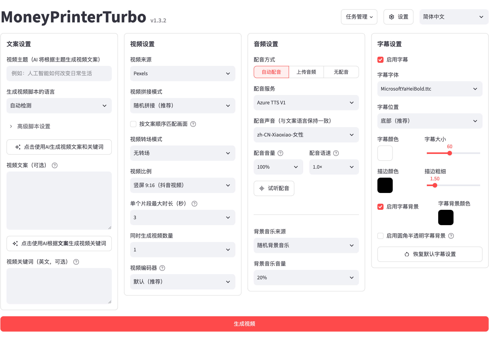
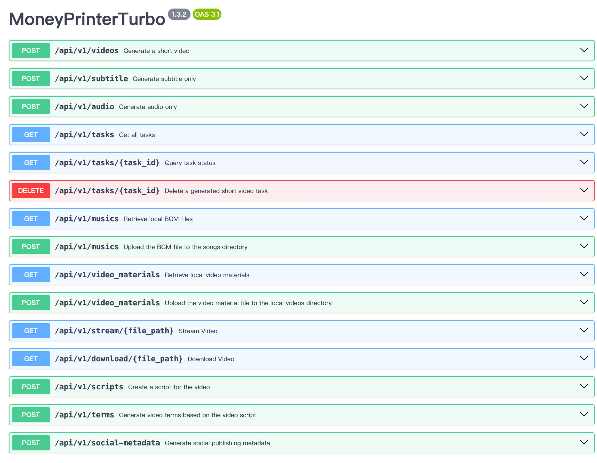

<div align="center">
<h1 align="center">MoneyPrinterTurbo 💸</h1>

<p align="center">
  <a href="https://github.com/harry0703/MoneyPrinterTurbo/stargazers"></a>
  <a href="https://github.com/harry0703/MoneyPrinterTurbo/issues"></a>
  <a href="https://github.com/harry0703/MoneyPrinterTurbo/network/members"></a>
  <a href="https://github.com/harry0703/MoneyPrinterTurbo/blob/main/LICENSE"></a>
</p>
<br>
<h3>简体中文 | <a href="README-en.md">English</a> | <a href="README-ar.md">العربية</a></h3>
<div align="center">
  <a href="https://trendshift.io/repositories/8731" target="_blank"></a>
</div>

<br>
只需提供一个视频 <b>主题</b> 或 <b>关键词</b> ，就可以全自动生成视频文案、视频素材、视频字幕、视频背景音乐，然后合成一个高清的短视频。
<br>

<h4>Web界面</h4>



<h4>API界面</h4>



</div>

## 特别感谢 🙏

<table align="center">
  <tr>
    <td align="center" width="160">
      <a href="https://aihubmix.com/?aff=CEve"><strong>AIHubMix</strong></a>
    </td>
    <td align="left">
      <sub>感谢 <a href="https://aihubmix.com/?aff=CEve">AIHubMix</a> 对本项目的赞助。AIHubMix 深度适配 OpenAI、Claude、Gemini、DeepSeek、智谱、千问等全球顶级最新模型，一站式快速接入 GPT-5.5、deepseek-v4-flash 等 700+ 模型（含多个免费模型），提供企业级生产稳定性保障。</sub>
    </td>
  </tr>

  <tr>
    <td align="center" width="160">
      <a href="https://www.volcengine.com/activity/codingplan?utm_campaign=hw&utm_content=hw&utm_medium=devrel_tool_web&utm_source=OWO&utm_term=MoneyPrinterTurbo"></a><br>
      <a href="https://ai.volcengine.com/activity/agentplan?utm_campaign=hw&utm_content=hw&utm_medium=devrel_tool_web&utm_source=OWO&utm_term=MoneyPrinterTurbo"><strong>方舟 Agent Plan</strong></a>
    </td>
    <td align="left">
      <sub>感谢 <a href="https://ai.volcengine.com/activity/agentplan?utm_campaign=hw&utm_content=hw&utm_medium=devrel_tool_web&utm_source=OWO&utm_term=MoneyPrinterTurbo">方舟 Agent Plan</a> 对本项目的赞助。模型自由，工具不限，最新支持 MiniMax-M3 与 GLM-5.1，受邀下单叠加 9.5 折！集合主流优秀国产编程模型，多生态兼容，无缝融入您的工具链，依托字节资源保障和工程能力，更大容量，更快、更稳、更丝滑！</sub>
    </td>
  </tr>
  <tr>
    <td align="center" width="160">
      <a href="https://www.ccsub.net/register?ref=VCVDAWWY"></a><br>
      <a href="https://www.ccsub.net/register?ref=VCVDAWWY"><strong>CCSub</strong></a>
    </td>
    <td align="left">
      <sub>感谢 <a href="https://www.ccsub.net/register?ref=VCVDAWWY">CCSub</a> 赞助本项目！CCSub 是稳定、实惠的 AI API 中转平台，是 Claude Code 官方订阅的超强平替。一个 API Key 即可调用 Claude Opus 4.8、Sonnet 4.6、Haiku 4.5、GPT-5、Gemini 等模型，价格约为官方直连的 1/3，全球直连无需梯子。兼容 Claude Code、Codex、Cursor、Cline、Continue、Windsurf 等所有主流 AI 编程工具。前往 <a href="https://www.ccsub.net/register?ref=VCVDAWWY">www.ccsub.net</a> 注册即送 $5 体验额度。</sub>
    </td>
  </tr>
  <tr>
    <td align="center" width="160">
      <a href="https://reccloud.cn"></a><br>
      <a href="https://reccloud.cn"><strong>录咖 AI</strong></a>
    </td>
    <td align="left">
      <sub>由于该项目的 <strong>部署</strong> 和 <strong>使用</strong>，对于一些小白用户来说，还是 <strong>有一定的门槛</strong>，在此特别感谢 <a href="https://reccloud.cn">录咖（AI智能 多媒体服务平台）</a> 网站基于该项目，提供的免费 <code>AI视频生成器</code> 服务，可以不用部署，直接在线使用，非常方便。中文版：<a href="https://reccloud.cn">https://reccloud.cn</a>，英文版：<a href="https://reccloud.com">https://reccloud.com</a></sub>
    </td>
  </tr>
  <tr>
    <td align="center" width="160">
      <a href="https://picwish.cn"></a><br>
      <a href="https://picwish.cn"><strong>佐糖</strong></a>
    </td>
    <td align="left">
      <sub>感谢 <a href="https://picwish.cn">佐糖</a> 对该项目的支持和赞助，使得该项目能够持续的更新和维护。佐糖专注于<strong>图像处理领域</strong>，提供丰富的<strong>图像处理工具</strong>，将复杂操作极致简化，真正实现让图像处理更简单。</sub>
    </td>
  </tr>
</table>

## 功能特性 🎯

- [x] 完整的 **MVC架构**，代码 **结构清晰**，易于维护，支持 `API` 和 `Web界面`
- [x] 支持视频文案 **AI自动生成**，也可以**自定义文案**
- [x] 支持多种 **高清视频** 尺寸
  - [x] 竖屏 9:16，`1080x1920`
  - [x] 横屏 16:9，`1920x1080`
- [x] 支持 **批量视频生成**，可以一次生成多个视频，然后选择一个最满意的
- [x] 支持 **视频片段时长** 设置，方便调节素材切换频率
- [x] 支持 **中文** 和 **英文** 视频文案
- [x] 支持 **多种语音** 合成，可 **实时试听** 效果
- [x] 支持 **字幕生成**，可以调整 `字体`、`位置`、`颜色`、`大小`，同时支持`字幕描边`设置
- [x] 支持 **背景音乐**，随机或者指定音乐文件，可设置`背景音乐音量`
- [x] 视频素材来源 **高清**，而且 **无版权**，也可以使用自己的 **本地素材**
- [x] 支持多种素材源:**Pexels**、**Pixabay**、**Coverr**(免费高清/4K 素材库,使用须遵守 [Coverr 许可条款](https://coverr.co/license),以 16:9 横屏为主;在 [coverr.co/developers](https://coverr.co/developers?ctx=header_navigation) 注册即可,Demo 套餐 50 次/小时)
- [x] 支持 **OpenAI**、**AIHubMix**、**AIML API**、**Moonshot**、**Azure**、**gpt4free**、**one-api**、**通义千问**、**Google Gemini**、**Ollama**、**DeepSeek**、**MiniMax**、 **文心一言**, **Pollinations**、**ModelScope** 等多种模型接入

## 视频演示 📺

### 竖屏 9:16

<table>
<thead>
<tr>
<th align="center"><g-emoji class="g-emoji" alias="arrow_forward">▶️</g-emoji> 《如何增加生活的乐趣》</th>
<th align="center"><g-emoji class="g-emoji" alias="arrow_forward">▶️</g-emoji> 《金钱的作用》<br>更真实的合成声音</th>
<th align="center"><g-emoji class="g-emoji" alias="arrow_forward">▶️</g-emoji> 《生命的意义是什么》</th>
</tr>
</thead>
<tbody>
<tr>
<td align="center"><video src="https://github.com/harry0703/MoneyPrinterTurbo/assets/4928832/a84d33d5-27a2-4aba-8fd0-9fb2bd91c6a6"></video></td>
<td align="center"><video src="https://github.com/harry0703/MoneyPrinterTurbo/assets/4928832/af2f3b0b-002e-49fe-b161-18ba91c055e8"></video></td>
<td align="center"><video src="https://github.com/harry0703/MoneyPrinterTurbo/assets/4928832/112c9564-d52b-4472-99ad-970b75f66476"></video></td>
</tr>
</tbody>
</table>

### 横屏 16:9

<table>
<thead>
<tr>
<th align="center"><g-emoji class="g-emoji" alias="arrow_forward">▶️</g-emoji>《生命的意义是什么》</th>
<th align="center"><g-emoji class="g-emoji" alias="arrow_forward">▶️</g-emoji>《为什么要运动》</th>
</tr>
</thead>
<tbody>
<tr>
<td align="center"><video src="https://github.com/harry0703/MoneyPrinterTurbo/assets/4928832/346ebb15-c55f-47a9-a653-114f08bb8073"></video></td>
<td align="center"><video src="https://github.com/harry0703/MoneyPrinterTurbo/assets/4928832/271f2fae-8283-44a0-8aa0-0ed8f9a6fa87"></video></td>
</tr>
</tbody>
</table>

## 配置要求 📦

- 建议系统：Windows 10 或 MacOS 11.0 以上，或主流 Linux 发行版
- GPU 不是必需项，但如果你希望本地转录、更快的视频处理或更顺畅的批量生成体验，建议使用带显存的独立显卡

| 项目 | 最低配置 | 推荐配置        | 理想配置        |
| ---- | -------- | --------------- | --------------- |
| CPU  | 4 核     | 6 到 8 核       | 8 核及以上      |
| RAM  | 4 GB     | 8 GB            | 16 GB 及以上    |
| GPU  | 非必须   | 4 GB 显存及以上 | 8 GB 显存及以上 |

- 如果你主要依赖云端 LLM、云端 TTS 和在线素材源，CPU 与内存比 GPU 更重要
- 如果你启用 `faster-whisper`、批量生成或更重的本地处理链路，GPU 会明显提升速度

## 快速开始 🚀

### 推荐使用方式

- Windows 用户：优先使用一键启动包，适合快速体验
- MacOS / Linux 用户：优先使用 `uv sync --frozen` 进行本地部署
- 想要隔离运行环境：优先使用 Docker 部署

### 在 Google Colab 中运行

免去本地环境配置，点击直接在 Google Colab 中快速体验 MoneyPrinterTurbo

[](https://colab.research.google.com/github/harry0703/MoneyPrinterTurbo/blob/main/docs/MoneyPrinterTurbo.ipynb)

### Windows一键启动包

下载一键启动包，解压直接使用（路径不要有 **中文**、**特殊字符**、**空格**）

- GitHub Release: https://github.com/harry0703/MoneyPrinterTurbo/releases/latest

下载后，建议先**双击执行** `update.bat` 更新到**最新代码**，然后双击 `start.bat` 启动

启动后，会自动打开浏览器（如果打开是空白，建议换成 **Chrome** 或者 **Edge** 打开）

## 安装部署 📥

### 前提条件

- 尽量不要使用 **中文路径**，避免出现一些无法预料的问题
- 请确保你的 **网络** 是正常的，VPN需要打开`全局流量`模式

#### ① 克隆代码

```shell
git clone https://github.com/harry0703/MoneyPrinterTurbo.git
```

#### ② 修改配置文件（可选，建议启动后也可以在 WebUI 里面配置）

- 将 `config.example.toml` 文件复制一份，命名为 `config.toml`
- 按照 `config.toml` 文件中的说明，配置好 `pexels_api_keys` 和 `llm_provider`，并根据 llm_provider 对应的服务商，配置相关的
  API Key
- 如果希望使用推荐的大模型平台，也可以将 `llm_provider` 设置为 `aihubmix`，并填写对应的 API Key。

### Docker部署 🐳

#### ① 启动Docker

如果未安装 Docker，请先安装 https://www.docker.com/products/docker-desktop/

如果是Windows系统，请参考微软的文档：

1. https://learn.microsoft.com/zh-cn/windows/wsl/install
2. https://learn.microsoft.com/zh-cn/windows/wsl/tutorials/wsl-containers

```shell
cd MoneyPrinterTurbo
docker compose -f docker-compose.release.yml up
```

> 默认推荐使用 `docker-compose.release.yml`，它会直接拉取 GitHub Container Registry 上的预构建镜像：`ghcr.io/harry0703/moneyprinterturbo:latest`。
> 如果你需要本地重新构建镜像，可以继续使用 `docker compose up`。
> 注意：首次启动前请确保项目根目录下存在 `config.toml`，可以从 `config.example.toml` 复制一份。

#### ② 访问Web界面

打开浏览器，访问 http://127.0.0.1:8501

#### ③ 访问API文档

打开浏览器，访问 http://127.0.0.1:8080/docs 或者 http://127.0.0.1:8080/redoc

### 手动部署 📦

> 视频教程

- 完整的使用演示：https://v.douyin.com/iFhnwsKY/
- 如何在Windows上部署：https://v.douyin.com/iFyjoW3M

#### ① 创建虚拟环境

推荐使用 [uv](https://docs.astral.sh/uv/) 管理 Python 环境和依赖，默认使用 Python `3.11`

```shell
git clone https://github.com/harry0703/MoneyPrinterTurbo.git
cd MoneyPrinterTurbo
uv python install 3.11
uv sync --frozen
```

如果你暂时不使用 `uv`，也可以继续使用 `venv + pip`

```shell
python3.11 -m venv .venv
source .venv/bin/activate
pip install -r requirements.txt
```

说明：

- `pyproject.toml` 是主依赖定义文件
- `uv.lock` 是锁文件，建议默认执行 `uv sync --frozen`
- `requirements.txt` 仅保留给旧的 `pip` 安装方式兼容使用

#### ② 启动Web界面 🌐

注意需要到 MoneyPrinterTurbo 项目 `根目录` 下执行以下命令

###### Windows

```powershell
.\webui.bat
```

在 CMD 中也可以执行 `webui.bat`。
`webui.bat` 会优先使用项目 `.venv` 或一键包内置 Python；如果没有找到项目 Python，但已安装 `uv`，会自动切换为 `uv run streamlit`。
如需允许局域网内其他设备访问 WebUI，可以先执行 `set MPT_WEBUI_HOST=0.0.0.0`，再运行 `webui.bat`。

###### MacOS or Linux

```shell
uv run streamlit run ./webui/Main.py --browser.gatherUsageStats=False --server.showEmailPrompt=False
```

如果你已经手动激活了虚拟环境，也可以直接执行：

```shell
sh webui.sh
```

启动后，会自动打开浏览器（如果打开是空白，建议换成 **Chrome** 或者 **Edge** 打开）

#### ③ 启动API服务 🚀

```shell
uv run python main.py
```

如果你已经手动激活了虚拟环境，也可以直接执行：

```shell
python main.py
```

#### ④ 纯命令行方式（无浏览器）⌨️

如果你无法使用浏览器或端口转发，可以直接在命令行生成视频：

```shell
uv run python cli.py --video-subject "金钱的作用"
```

也可以指定本地素材并仅运行到某个阶段：

```shell
uv run python cli.py \
  --video-subject "金钱的作用" \
  --video-source local \
  --video-materials "1.mp4,2.mp4" \
  --stop-at video
```

## 语音合成 🗣

所有支持的声音列表，可以查看：[声音列表](./docs/voice-list.txt)

默认 TTS 服务是 **Edge TTS**（免费，不需要 API Key）。在 WebUI 中它显示为 **“Azure TTS V1”**，两者指的是同一个免费服务。你可以在 `config.toml` 中设置 `voice_name`，也可以直接在 WebUI 的声音下拉框中选择。

> **说明：** WebUI 中的 “Azure TTS V1”（Edge TTS，免费）和 “Azure TTS V2”（付费 Azure Speech SDK）是两个不同选项，只有 V2 需要配置 Azure API Key。

如果你希望使用质量更高的 **Azure TTS V2** 声音，需要在 `config.toml` 中配置 Azure Speech 凭据：

```toml
[azure]
speech_key = "your-azure-speech-key"
speech_region = "eastus"
```

Azure TTS V2 需要开通 [Azure Speech Services](https://portal.azure.com/) 订阅。v1.1.2 新增的 9 种 Azure 声音整体会比 Edge TTS 更自然。

## 字幕生成 📜

当前支持2种字幕生成方式：

- **edge**: 使用 Edge TTS 返回的时间戳对齐字幕。速度快，不需要 GPU，普通机器也可以运行；但复杂句子的时间戳偶尔可能不够准确。
- **whisper**: 使用本地 `faster-whisper` 转写生成后的音频，并生成更细粒度的时间戳。速度较慢（CPU 上通常需要几秒到约 1 分钟，取决于模型大小），需要下载模型（`large-v3-turbo` 约 250 MB，`large-v3` 约 3 GB），但不依赖 TTS provider 的时间戳，字幕准确性通常更好。

可以修改 `config.toml` 配置文件中的 `subtitle_provider` 进行切换

建议使用 `edge` 模式，如果生成的字幕质量不好，再切换到 `whisper` 模式

> 注意：

1. whisper 模式下需要到 HuggingFace 下载一个模型文件，大约 3GB 左右，请确保网络通畅
2. 如果留空，表示不生成字幕。

> 由于国内无法访问 HuggingFace，可以使用以下方法下载 `whisper-large-v3` 的模型文件

下载地址：

- 百度网盘: https://pan.baidu.com/s/11h3Q6tsDtjQKTjUu3sc5cA?pwd=xjs9
- 夸克网盘：https://pan.quark.cn/s/3ee3d991d64b

模型下载后解压，整个目录放到 `.\MoneyPrinterTurbo\models` 里面，
最终的文件路径应该是这样: `.\MoneyPrinterTurbo\models\whisper-large-v3`

```
MoneyPrinterTurbo
  ├─models
  │   └─whisper-large-v3
  │          config.json
  │          model.bin
  │          preprocessor_config.json
  │          tokenizer.json
  │          vocabulary.json
```

## 背景音乐 🎵

用于视频的背景音乐，位于项目的 `resource/songs` 目录下。

> 当前项目里面放了一些默认的音乐，来自于 YouTube 视频，如有侵权，请删除。

## 字幕字体 🅰

用于视频字幕的渲染，位于项目的 `resource/fonts` 目录下，你也可以放进去自己的字体。

## 常见问题 🤔

### ❓RuntimeError: No ffmpeg exe could be found

通常情况下，ffmpeg 会被自动下载，并且会被自动检测到。
但是如果你的环境有问题，无法自动下载，可能会遇到如下错误：

```
RuntimeError: No ffmpeg exe could be found.
Install ffmpeg on your system, or set the IMAGEIO_FFMPEG_EXE environment variable.
```

此时你可以从 https://www.gyan.dev/ffmpeg/builds/ 下载ffmpeg，解压后，设置 `ffmpeg_path` 为你的实际安装路径即可。

```toml
[app]
# 请根据你的实际路径设置，注意 Windows 路径分隔符为 \\
ffmpeg_path = "C:\\Users\\harry\\Downloads\\ffmpeg.exe"
```

### ❓ImageMagick 相关错误

> **当前版本已经不需要 ImageMagick。**
>
> 项目升级到 **MoviePy 2.x** 后，字幕渲染已经改为使用 **Pillow**，不再依赖 ImageMagick。如果你仍然看到 ImageMagick 相关错误，通常说明运行的是旧版本代码。请先执行 `git pull` 更新代码，Windows 用户也可以运行 `update.bat` 更新。

### ❓OSError: [Errno 24] Too many open files

这个问题是由于系统打开文件数限制导致的，可以通过修改系统的文件打开数限制来解决。

查看当前限制

```shell
ulimit -n
```

如果过低，可以调高一些，比如

```shell
ulimit -n 10240
```

### ❓Whisper 模型下载失败，出现如下错误

```
LocalEntryNotFoundError: Cannot find an appropriate cached snapshot folder for the specified revision on the local disk and
outgoing traffic has been disabled.
To enable repo look-ups and downloads online, pass 'local_files_only=False' as input.
```

或者

```
An error occurred while synchronizing the model Systran/faster-whisper-large-v3 from the Hugging Face Hub:
An error happened while trying to locate the files on the Hub and we cannot find the appropriate snapshot folder for the
specified revision on the local disk. Please check your internet connection and try again.
Trying to load the model directly from the local cache, if it exists.
```

解决方法：[点击查看如何从网盘手动下载模型](#%E5%AD%97%E5%B9%95%E7%94%9F%E6%88%90-)

## 反馈建议 📢

- 可以提交 [issue](https://github.com/harry0703/MoneyPrinterTurbo/issues)
  或者 [pull request](https://github.com/harry0703/MoneyPrinterTurbo/pulls)。

## 许可证 📝

点击查看 [`LICENSE`](LICENSE) 文件

## Star History

[](https://star-history.com/#harry0703/MoneyPrinterTurbo&Date)
