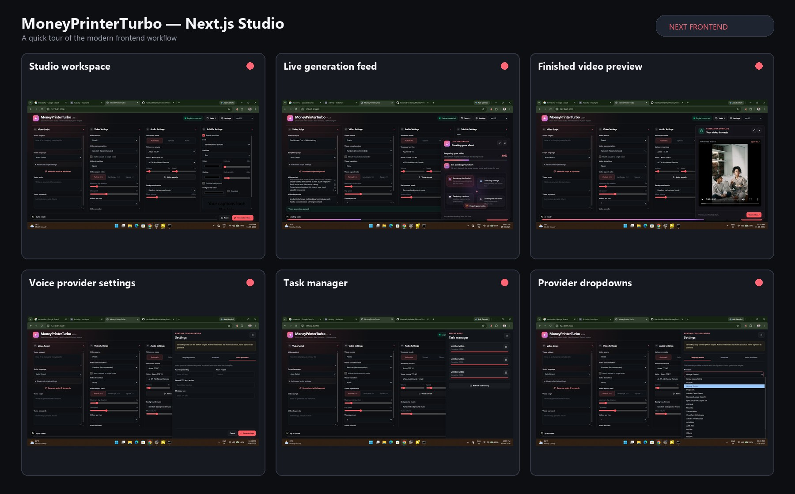

<div align="center">

# MoneyPrinterTurbo 💸

### An All-in-One AI Short Video Generator

Provide a video <b>topic</b> or <b>keyword</b>, and MoneyPrinterTurbo will generate the script, match footage, create subtitles and background music, and produce an HD short video.

[](https://github.com/harry0703/MoneyPrinterTurbo/releases)
[](https://github.com/harry0703/MoneyPrinterTurbo/releases/latest)
[](https://www.python.org/)
[](https://github.com/harry0703/MoneyPrinterTurbo/releases/latest)

<a href="https://trendshift.io/repositories/8731" target="_blank"></a>
<a href="https://www.star-history.com/harry0703/moneyprinterturbo"></a>

Chinese | [English](README-en.md) | [Releases](https://github.com/harry0703/MoneyPrinterTurbo/releases) | [Issues](https://github.com/harry0703/MoneyPrinterTurbo/issues)

</div>

## Screenshots 🖥️

<h4 align="center">WebUI</h4>



<h4 align="center">API</h4>


## Special Thanks ❤️

<div align="center">
  <a href="https://platform.kimi.com/?aff=MoneyPrinterTurbo" target="_blank"></a>
</div>

Thanks to [Kimi](https://platform.kimi.com/?aff=MoneyPrinterTurbo) for sponsoring this project! [Kimi K3](https://www.kimi.com/blog/kimi-k3?aff=MoneyPrinterTurbo) is Moonshot AI's most capable model and the world's first open 3T-class model. With native vision and a 1-million-token context window, K3 delivers frontier performance across knowledge work, reasoning, and long-horizon tasks. Within MoneyPrinterTurbo, K3 powers video creation by writing scripts and extracting the search keywords that determine the final footage-the better it understands the content, the more relevant the results.

**MoneyPrinterTurbo already supports Kimi. Visit the Kimi Open Platform ([China site](https://platform.kimi.com/?aff=MoneyPrinterTurbo) | [Global](https://platform.kimi.ai/?aff=MoneyPrinterTurbo)) to try the API, or explore the [Kimi Code subscription](https://www.kimi.com/code?aff=MoneyPrinterTurbo).**
<br>

<table align="center">
  <tr>
    <td align="center" width="120">
      <a href="https://www.volcengine.com/activity/ai618?utm_campaign=hw&utm_content=hw&utm_medium=devrel_tool_web&utm_source=OWO&utm_term=MoneyPrinterTurbo"></a><br>
      <a href="https://www.volcengine.com/activity/ai618?utm_campaign=hw&utm_content=hw&utm_medium=devrel_tool_web&utm_source=OWO&utm_term=MoneyPrinterTurbo"><strong>BytePlus ModelArk</strong></a>
    </td>
    <td align="left">
      Thanks to Dola Seed for sponsoring this project! <a href="https://www.byteplus.com/en/product/modelark?utm_campaign=hw&utm_content=MoneyPrinterTurbo&utm_medium=devrel_tool_web&utm_source=OWO&utm_term=MoneyPrinterTurbo">Dola Seed 2.0</a> is a full-modal general large model independently developed by ByteDance for the global market. Built on a unified multimodal architecture, it supports joint understanding and generation of text, images, audio, and video. It natively enables agent collaboration, with strong reasoning, long-task execution, tool integration, and coding capabilities. Register via this link to get 500,000 tokens of free inference quota per model.
    </td>
  </tr>
  <tr>
    <td align="center" width="120">
      <a href="https://www.ccsub.net/register?ref=VCVDAWWY"></a><br>
      <a href="https://www.ccsub.net/register?ref=VCVDAWWY"><strong>CCSub</strong></a>
    </td>
    <td align="left">
      Thanks to <a href="https://www.ccsub.net/register?ref=VCVDAWWY">CCSub</a> for sponsoring this project! CCSub is a stable, affordable AI API relay platform — your drop-in replacement for a Claude.ai subscription. One API key gives you access to Claude Opus 4.8, Sonnet, Haiku, GPT-5, and Gemini at roughly 30% of direct API cost, with no VPN required from anywhere in the world. Compatible with Claude Code, Codex, Cursor, Cline, Continue, Windsurf, and all major AI coding tools. Register at <a href="https://www.ccsub.net/register?ref=VCVDAWWY">www.ccsub.net</a> and get $5 free credit on sign-up.
    </td>
  </tr>
  <tr>
    <td align="center" width="120">
      <a href="https://cubence.com/signup?code=SCE1CJPE&source=mpt"></a><br>
      <a href="https://cubence.com/signup?code=SCE1CJPE&source=mpt"><strong>Cubence</strong></a>
    </td>
    <td align="left">
      Thanks to <a href="https://cubence.com/signup?code=SCE1CJPE&source=mpt">Cubence</a> for supporting this project. Cubence is a platform focused on AI model API access, helping developers and teams call models in a stable and convenient way. Since its launch in September 2025, Cubence has supported API access scenarios for Claude Code, Codex, Gemini, and other AI models and developer tools, making it suitable for users who need unified management and access to multiple model capabilities. Cubence offers MoneyPrinterTurbo users an exclusive discount code: <a href="https://cubence.com/signup?code=SCE1CJPE&source=mpt"><code>MPT</code></a>. Use it on your first purchase to get <a href="https://cubence.com/signup?code=SCE1CJPE&source=mpt">10% off</a>.
    </td>
  </tr>
  <tr>
    <td align="center" width="120">
      <a href="https://www.quya.org/?promo=AFF1"></a><br>
      <a href="https://www.quya.org/?promo=AFF1"><strong>0029.org</strong></a>
    </td>
    <td align="left">
      Thanks to <a href="https://www.quya.org/?promo=AFF1">0029.org</a> for sponsoring this project! 0029.org is a one-stop AI API relay platform offering the latest models for Claude Code, Codex, and Gemini. It provides stable, responsive, and cost-effective access through monthly subscriptions or pay-as-you-go plans, supports both individual and enterprise users, and is directly accessible from mainland China without a VPN. Pricing starts at 1.2% of official rates. <a href="https://www.quya.org/?promo=AFF1">Visit 0029.org</a>.
    </td>
  </tr>
  <tr>
    <td align="center" width="120">
      <a href="https://ergouapi.com/r/gh-moneyprinterturbo"></a><br>
      <a href="https://ergouapi.com/r/gh-moneyprinterturbo"><strong>Ergou API</strong></a>
    </td>
    <td align="left">
      Thanks to <a href="https://ergouapi.com/r/gh-moneyprinterturbo">Ergou API</a> for sponsoring this project! Ergou API: The rock-solid AI API Gateway. Unlock ultra-low multipliers (0.1x - 0.2x) across the board. We provide 100% genuine, unfiltered endpoints for top-tier LLMs including Claude, GPT, and Gemini. Powered by premium IPLC routes and dual residential ISP redundancy, Ergou guarantees battle-tested stability and ultra-low latency for your global traffic. Built for developers and studios. <a href="https://ergouapi.com/r/gh-moneyprinterturbo">Sign up and start building today</a>.
    </td>
  </tr>
  <tr>
    <td align="center" width="120">
      <a href="https://reccloud.cn"></a><br>
      <a href="https://reccloud.com"><strong>RecCloud</strong></a>
    </td>
    <td align="left">
      Due to the <strong>deployment</strong> and <strong>usage</strong> of this project, there is a certain threshold for some beginner users. We would like to express our special thanks to <a href="https://reccloud.com">RecCloud (AI-Powered Multimedia Service Platform)</a> for providing a free <code>AI Video Generator</code> service based on this project. It allows for online use without deployment, which is very convenient.
    </td>
  </tr>
  <tr>
    <td align="center" width="120">
      <a href="https://picwish.cn"></a><br>
      <a href="https://picwish.com"><strong>Picwish</strong></a>
    </td>
    <td align="left">
      Thanks to <a href="https://picwish.com">Picwish</a> for supporting and sponsoring this project, enabling continuous updates and maintenance. Picwish focuses on the <strong>image processing field</strong>, providing a rich set of <strong>image processing tools</strong> that extremely simplify complex operations, truly making image processing easier.
    </td>
  </tr>
</table>

## Features 🎯

- [x] Provides **AI Agent**, **WebUI**, **API**, and **CLI** workflows, with code organized by controller, service, and model responsibilities
- [x] Supports **AI-generated video scripts** and custom scripts
- [x] Supports various **high-definition video** sizes
  - [x] Portrait 9:16, `1080x1920`
  - [x] Landscape 16:9, `1920x1080`
- [x] Supports **batch video generation**, allowing the creation of multiple videos at once, then selecting the most satisfactory one
- [x] Supports setting the **duration of video clips**, facilitating adjustments to material switching frequency
- [x] Supports **multilingual video script** generation
- [x] Supports **Edge TTS**, **Azure Speech**, **SiliconFlow**, **Google Gemini**, **Xiaomi MiMo**, **ElevenLabs**, and **Chatterbox** speech synthesis with real-time previews
- [x] Supports **subtitle generation** with configurable fonts, position, color, size, outline, and background styles
- [x] Supports random or custom **background music** with adjustable volume
- [x] Supports your own **local assets** and free-to-use HD footage from **Pexels**, **Pixabay**, and **Coverr**
- [x] Supports leading model providers including **Kimi / Moonshot AI**, **OpenAI**, **Google Gemini**, **DeepSeek**, **Alibaba Cloud Qwen**, **Microsoft Azure OpenAI**, **ByteDance VolcEngine Ark**, **xAI Grok**, **MiniMax**, and **Xiaomi MiMo**, plus unified gateways, aggregators, and local runtimes such as **Cloudflare AI Gateway**, **Alibaba ModelScope**, **AIHubMix**, **AIML API**, **EvoLink**, **Ollama**, **OneAPI**, **LiteLLM**, **Groq**, and **Pollinations AI**
- [x] Supports one-click **cross-platform publishing** to **TikTok**, **Instagram**, and **YouTube Shorts** after video generation

## 作品展示 🎬

以下示例均由 MoneyPrinterTurbo 实际生成。

### 竖屏 9:16

<table width="100%">
<tr>
<td align="center" width="25%"><a href="https://harry0703.github.io/mpt-assets/?video=03-zh-portrait-city-morning.mp4"></a><br><strong>城市醒来的时刻</strong><br>中文 · 14 秒</td>
<td align="center" width="25%"><a href="https://harry0703.github.io/mpt-assets/?video=05-zh-portrait-clean-energy.mp4"></a><br><strong>清洁能源的未来</strong><br>中文 · 24 秒</td>
<td align="center" width="25%"><a href="https://harry0703.github.io/mpt-assets/?video=07-zh-portrait-space-exploration.mp4"></a><br><strong>为什么我们仍要探索太空</strong><br>中文 · 27 秒</td>
<td align="center" width="25%"><a href="https://harry0703.github.io/mpt-assets/?video=17-zh-portrait-seed-journey.mp4"></a><br><strong>一粒种子的旅程</strong><br>中文 · 44 秒</td>
</tr>
<tr>
<td align="center" width="25%"><a href="https://harry0703.github.io/mpt-assets/?video=09-en-portrait-future-robotics.mp4"></a><br><strong>The Future of Everyday Robotics</strong><br>English · 21 sec</td>
<td align="center" width="25%"><a href="https://harry0703.github.io/mpt-assets/?video=11-en-portrait-small-habits.mp4"></a><br><strong>Small Habits, Lasting Change</strong><br>English · 19 sec</td>
<td align="center" width="25%"><a href="https://harry0703.github.io/mpt-assets/?video=13-en-portrait-creative-work.mp4"></a><br><strong>Making Space for Creative Work</strong><br>English · 20 sec</td>
<td align="center" width="25%"><a href="https://harry0703.github.io/mpt-assets/?video=15-en-portrait-coffee-science.mp4"></a><br><strong>The Science Inside Coffee</strong><br>English · 23 sec</td>
</tr>
</table>

### 横屏 16:9

<table width="100%">
<tr>
<td align="center" width="25%"><a href="https://harry0703.github.io/mpt-assets/?video=02-zh-landscape-deep-ocean.mp4"></a><br><strong>深海里的微光</strong><br>中文 · 23 秒</td>
<td align="center" width="25%"><a href="https://harry0703.github.io/mpt-assets/?video=04-zh-landscape-reading-power.mp4"></a><br><strong>阅读如何塑造我们</strong><br>中文 · 23 秒</td>
<td align="center" width="25%"><a href="https://harry0703.github.io/mpt-assets/?video=06-zh-landscape-pour-over-coffee.mp4"></a><br><strong>一杯手冲咖啡的细节</strong><br>中文 · 23 秒</td>
<td align="center" width="25%"><a href="https://harry0703.github.io/mpt-assets/?video=08-zh-landscape-spring-journey.mp4"></a><br><strong>春天适合出发</strong><br>中文 · 14 秒</td>
</tr>
<tr>
<td align="center" width="25%"><a href="https://harry0703.github.io/mpt-assets/?video=10-en-landscape-ocean-conservation.mp4"></a><br><strong>Why Ocean Conservation Matters</strong><br>English · 25 sec</td>
<td align="center" width="25%"><a href="https://harry0703.github.io/mpt-assets/?video=14-en-landscape-sustainable-cities.mp4"></a><br><strong>Designing More Sustainable Cities</strong><br>English · 27 sec</td>
<td align="center" width="25%"><a href="https://harry0703.github.io/mpt-assets/?video=16-en-landscape-mountain-perspective.mp4"></a><br><strong>What Mountains Teach Us</strong><br>English · 18 sec</td>
<td align="center" width="25%"><a href="https://harry0703.github.io/mpt-assets/?video=18-en-landscape-history-of-flight.mp4"></a><br><strong>A Brief History of Human Flight</strong><br>English · 59 sec</td>
</tr>
</table>

## 配置要求 📦

- 建议系统：Windows 10、macOS 11.0 或更高版本，以及主流 Linux 发行版
- 本地部署需要 Python 3.11 或更高版本，推荐使用 Python 3.11
- GPU 不是必需项，但如果你希望本地转录、更快的视频处理或更顺畅的批量生成体验，建议使用带显存的独立显卡

| 项目 | 最低配置 | 推荐配置        | 理想配置        |
| ---- | -------- | --------------- | --------------- |
| CPU  | 4 核     | 6 到 8 核       | 8 核及以上      |
| RAM  | 4 GB     | 8 GB            | 16 GB 及以上    |
| GPU  | 非必须   | 4 GB 显存及以上 | 8 GB 显存及以上 |

- 如果你主要依赖云端 LLM、云端 TTS 和在线素材源，CPU 与内存比 GPU 更重要
- 如果你启用 `faster-whisper`、批量生成或更重的本地处理链路，GPU 会明显提升速度

## 快速开始 🚀

### 推荐使用方式

- 不想手动安装和配置：直接使用 AI Agent 生成视频
- Windows 用户：优先使用一键启动包，适合快速体验
- macOS / Linux 用户：优先使用 `uv` 进行本地部署
- 想要隔离运行环境：优先使用 Docker 部署

### 使用 AI Agent 生成视频

如果你的 AI Agent 支持读取 Skill 文档并操作本地终端，可以直接发送下面这段话。Agent 会自动完成安装、配置和视频生成；只有缺少必要的 API Key 时才会向你询问，完成后会返回生成的视频文件路径。目前支持 macOS 和 Windows。

```text
使用这个 Skill：https://raw.githubusercontent.com/harry0703/MoneyPrinterTurbo/main/docs/skill/SKILL.md
帮我生成一个主题为“人工智能如何改变普通人的日常生活”的视频。
```

### 在 Google Colab 中运行

免去本地环境配置，点击直接在 Google Colab 中快速体验 MoneyPrinterTurbo

[](https://colab.research.google.com/github/harry0703/MoneyPrinterTurbo/blob/main/docs/MoneyPrinterTurbo.ipynb)

### Windows 一键启动包

下载一键启动包，解压直接使用（路径不要有 **中文**、**特殊字符**、**空格**）

- GitHub Releases：https://github.com/harry0703/MoneyPrinterTurbo/releases/latest

下载后，建议先**双击执行** `update.bat` 更新到**最新代码**，然后双击 `start.bat` 启动

启动后，会自动打开浏览器（如果打开是空白，建议换成 **Chrome** 或者 **Edge** 打开）

## 安装部署 📥

### 前提条件

- 本地部署需要 Python 3.11 或更高版本
- Windows 用户建议避免使用包含中文、特殊字符或空格的项目路径

#### ① 克隆代码

```shell
git clone https://github.com/harry0703/MoneyPrinterTurbo.git
```

#### ② 配置项目（可选）

首次启动时，项目会根据 `config.example.toml` 自动创建 `config.toml`。大模型 Provider、素材来源和相关 API Key 可以直接在 WebUI 的基础设置中配置。

### Docker 部署 🐳

#### ① 启动 Docker

如果未安装 Docker，请先安装 https://www.docker.com/products/docker-desktop/

Windows 用户可以参考微软的文档：

1. https://learn.microsoft.com/zh-cn/windows/wsl/install
2. https://learn.microsoft.com/zh-cn/windows/wsl/tutorials/wsl-containers

```shell
cd MoneyPrinterTurbo
docker compose -f docker-compose.release.yml up
```

> 默认推荐使用 `docker-compose.release.yml`，它会直接拉取 GitHub Container Registry 上的预构建镜像：`ghcr.io/harry0703/moneyprinterturbo:latest`。
> 如果你需要本地重新构建镜像，可以继续使用 `docker compose up`。
> 首次启动前，请将 `config.example.toml` 复制为 `config.toml`，供容器挂载使用。

#### ② 访问 WebUI

打开浏览器，访问 http://127.0.0.1:8501

#### ③ 访问 API 文档

打开浏览器，访问 http://127.0.0.1:8080/docs 或者 http://127.0.0.1:8080/redoc

### 手动部署 📦

> 视频教程

- 完整的使用演示：https://v.douyin.com/iFhnwsKY/
- 如何在 Windows 上部署：https://v.douyin.com/iFyjoW3M

#### ① 创建虚拟环境

推荐使用 [uv](https://docs.astral.sh/uv/) 管理 Python 环境和依赖。项目支持 Python 3.11 或更高版本，以下示例使用 Python 3.11。

```shell
git clone https://github.com/harry0703/MoneyPrinterTurbo.git
cd MoneyPrinterTurbo
uv python install 3.11
uv sync --frozen
```

如果你暂时不使用 `uv`，也可以继续使用 `venv + pip`

```shell
python3.11 -m venv .venv
source .venv/bin/activate
pip install -r requirements.txt
```

说明：

- `pyproject.toml` 是主依赖定义文件
- `uv.lock` 是锁文件，建议默认执行 `uv sync --frozen`
- `requirements.txt` 仅保留给旧的 `pip` 安装方式兼容使用

#### ② 启动 WebUI 🌐

注意需要到 MoneyPrinterTurbo 项目 `根目录` 下执行以下命令

###### Windows

```powershell
.\webui.bat
```

在 CMD 中也可以执行 `webui.bat`。
`webui.bat` 会优先使用项目 `.venv` 或一键包内置 Python；如果没有找到项目 Python，但已安装 `uv`，会自动切换为 `uv run streamlit`。
如需允许局域网内其他设备访问 WebUI，可以先执行 `set MPT_WEBUI_HOST=0.0.0.0`，再运行 `webui.bat`。

###### macOS 或 Linux

```shell
sh webui.sh
```

脚本会自动使用项目虚拟环境或 `uv`，并选择可用的本地端口。如需允许局域网内其他设备访问，可以执行：

```shell
MPT_WEBUI_HOST=0.0.0.0 sh webui.sh
```

启动后，会自动打开浏览器（如果打开是空白，建议换成 **Chrome** 或者 **Edge** 打开）

#### ③ 启动 API 服务 🚀

```shell
uv run python main.py
```

如果你已经手动激活了虚拟环境，也可以直接执行：

```shell
python main.py
```

#### ④ 纯命令行方式（无浏览器）⌨️

如果你无法使用浏览器或端口转发，可以直接在命令行生成视频。最简单的完整视频生成命令如下：

```shell
uv run python cli.py --video-subject "人工智能如何改变日常生活"
```

如需查看完整命令、参数说明和使用方法，可以执行：

```shell
uv run python cli.py --help
```

## 语音合成 🗣

默认使用免费的 **Edge TTS**，在 WebUI 中显示为 **Azure TTS V1**。项目同时支持 **Azure TTS V2**、**SiliconFlow TTS**、**Google Gemini TTS**、**小米 MiMo TTS**、**ElevenLabs TTS**、自托管 **Chatterbox TTS**，以及无配音模式。

可直接在 WebUI 中选择 Provider 和音色，并按照界面提示填写所需凭据。Edge TTS 不需要 API Key；[Azure TTS V2](https://portal.azure.com/) 及其他云端服务需要对应平台的凭据。Edge TTS 音色可查看：[音色列表](./docs/voice-list.txt)。

## 字幕生成 📜

当前支持两种字幕生成方式：

- **edge**：使用 TTS 时间戳生成字幕，速度快，不需要 GPU，默认使用该模式。
- **whisper**：使用本地 `faster-whisper` 转写音频，适用于需要更准确字幕时间轴的场景。首次使用时需要下载模型。

在 `config.toml` 中修改 `subtitle_provider` 即可切换模式。Whisper 默认使用约 3 GB 的 `large-v3`；如需更小、更快的模型，可以使用约 1.6 GB 的 `large-v3-turbo`：

```toml
[app]
subtitle_provider = "whisper"

[whisper]
model_size = "large-v3-turbo"
```

> 首次使用 Whisper 时，程序会自动从 Hugging Face 下载模型。如果当前网络无法自动下载，可以从 [Hugging Face](https://huggingface.co/Systran/faster-whisper-large-v3) 手动下载 `whisper-large-v3`。

下载并解压后，将整个目录放到 `.\MoneyPrinterTurbo\models`，最终路径应为 `.\MoneyPrinterTurbo\models\whisper-large-v3`：

```
MoneyPrinterTurbo
  ├─models
  │   └─whisper-large-v3
  │          config.json
  │          model.bin
  │          preprocessor_config.json
  │          tokenizer.json
  │          vocabulary.json
```

## 背景音乐 🎵

用于视频的背景音乐，位于项目的 `resource/songs` 目录下。

> 当前项目里面放了一些默认的音乐，来自于 YouTube 视频，如有侵权，请删除。

## 字幕字体 🅰

用于视频字幕的渲染，位于项目的 `resource/fonts` 目录下，你也可以放进去自己的字体。

## 常见问题 🤔

<details>
<summary>如何发布到 TikTok、Instagram 或 YouTube Shorts？</summary>

注册 [Upload-Post](https://upload-post.com/) 账号并获取 API Key，然后在 `config.toml` 的 `[app]` 下添加以下配置：

```toml
[app]
upload_post_enabled = true
upload_post_api_key = "your-api-key"
upload_post_username = "your-username"
upload_post_platforms = ["tiktok", "instagram", "youtube"]
upload_post_auto_upload = true
upload_post_youtube_privacy_status = "public"
```

保存配置并重启项目。视频生成完成后，程序会自动发布到已配置的平台。YouTube 可见性可设置为 `public`、`unlisted` 或 `private`。

</details>

<details>
<summary>RuntimeError: No ffmpeg exe could be found</summary>

通常情况下，ffmpeg 会被自动下载，并且会被自动检测到。
但是如果你的环境有问题，无法自动下载，可能会遇到如下错误：

```
RuntimeError: No ffmpeg exe could be found.
Install ffmpeg on your system, or set the IMAGEIO_FFMPEG_EXE environment variable.
```

此时你可以从 https://www.gyan.dev/ffmpeg/builds/ 下载ffmpeg，解压后，设置 `ffmpeg_path` 为你的实际安装路径即可。

```toml
[app]
# 请根据你的实际路径设置，注意 Windows 路径分隔符为 \\
ffmpeg_path = "C:\\Users\\harry\\Downloads\\ffmpeg.exe"
```

</details>

<details>
<summary>OSError: [Errno 24] Too many open files</summary>

这个问题是由于系统打开文件数限制导致的，可以通过修改系统的文件打开数限制来解决。

查看当前限制

```shell
ulimit -n
```

如果过低，可以调高一些，比如

```shell
ulimit -n 10240
```

</details>

<details>
<summary>Whisper 模型下载失败</summary>

```
LocalEntryNotFoundError: Cannot find an appropriate cached snapshot folder for the specified revision on the local disk and
outgoing traffic has been disabled.
To enable repo look-ups and downloads online, pass 'local_files_only=False' as input.
```

或者

```
An error occurred while synchronizing the model Systran/faster-whisper-large-v3 from the Hugging Face Hub:
An error happened while trying to locate the files on the Hub and we cannot find the appropriate snapshot folder for the
specified revision on the local disk. Please check your internet connection and try again.
Trying to load the model directly from the local cache, if it exists.
```

解决方法：[查看如何从 Hugging Face 手动下载模型](#%E5%AD%97%E5%B9%95%E7%94%9F%E6%88%90-)

</details>

## 反馈建议 📢

- 可以提交 [issue](https://github.com/harry0703/MoneyPrinterTurbo/issues) 或者 [pull request](https://github.com/harry0703/MoneyPrinterTurbo/pulls)。

## 许可证 📝

点击查看 [`LICENSE`](LICENSE) 文件

## Star History

<a href="https://www.star-history.com/?repos=harry0703%2FMoneyPrinterTurbo&type=date&legend=top-left">
 <picture>
   <source media="(prefers-color-scheme: dark)" srcset="https://api.star-history.com/chart?repos=harry0703/MoneyPrinterTurbo&type=date&theme=dark&legend=top-left&sealed_token=AtOR8By6GcNKd46eJLixrnucHF_99GOSBBKfc60pAm2xsDylemaYxDMcvTlPRz-G_onzDrs-hDrM0xdKkn0L6PgDin3fv02ViVtsZvgRYgk0YOzkX2KgLG8wro66VGphii-u6GNpzD8JocrqGGKvsFSpmbRqo5g-2mEDaN7-ESdtF48ZH0rDOCpoc1Mh" />
   <source media="(prefers-color-scheme: light)" srcset="https://api.star-history.com/chart?repos=harry0703/MoneyPrinterTurbo&type=date&legend=top-left&sealed_token=AtOR8By6GcNKd46eJLixrnucHF_99GOSBBKfc60pAm2xsDylemaYxDMcvTlPRz-G_onzDrs-hDrM0xdKkn0L6PgDin3fv02ViVtsZvgRYgk0YOzkX2KgLG8wro66VGphii-u6GNpzD8JocrqGGKvsFSpmbRqo5g-2mEDaN7-ESdtF48ZH0rDOCpoc1Mh" />
   
 </picture>
</a>
