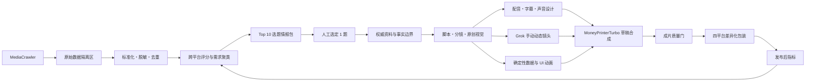

# MediaCrawler 驱动的精品爆款视频系统设计

**日期：** 2026-08-18

**状态：** 已通过对话设计审批，待书面规格复核

**目标：** 用 MediaCrawler 建立可复核的跨平台趋势情报，以 MoneyPrinterTurbo、原创视觉、专业中文配音、Grok 手动动态镜头和确定性后期生产顶级泛健康短视频，并用真实发布数据验证后再扩量。

## 1. 背景与独立判断

MediaCrawler 已安装在 `E:\MoneyPrinterTurbo-3期\MediaCrawler`，固定官方源码 commit `d6f7c5bb906b6dac40ddf343ef9e26438a3de092`，具备抖音、小红书、B站、快手、微博、知乎和贴吧入口。当前项目已有脚本、配音、字幕、首帧、图文、Grok 手动包和 MoneyPrinterTurbo 合成能力，但没有可以证明新流程有效的真实成片表现数据。

本设计不把“能采集更多数据”等同于“能预测爆款”。爆款概率只能通过规范化市场样本、高质量原创生产和发布后自有数据反馈逐步提高，不得声称必然爆款。

另一个实施前置问题是：2026-08-18 的工作树快照显示 240 个已跟踪 Grok 手动包文件处于删除状态。在任何新集成开始前，必须先做只读差异审计，确认这些删除是用户意图、文件系统状态还是资产缺失。未经用户确认不得自动恢复、提交或清理。

## 2. 范围与非目标

### 2.1 本期范围

- 首轮数据源只用抖音和小红书。
- 内容边界为泛健康生活方式：饮食、睡眠、久坐、日常运动和精力管理。
- 用专用研究账号登录，只由用户本人扫码。
- 先建立数据样本，再规划具体选题和成片。
- 先制作 1 条顶级标杆片，再做 2 条复现片；达标后扩到 10 条，最后进入 50 条滚动库。
- 只输出草稿，由用户人工检查后发布。

### 2.2 非目标

- 不做自动登录、验证码绕过、限流绕过或自动反复尝试。
- 不下载、搬运或改编抓取到的他人原视频、图片或音频。
- 不把公开评论用户名、头像、原文或可识别个人信息放入成片。
- 不进行疾病诊断、用药、治疗效果或医疗身份宣称。
- 不在单条视频中强制展示所有软件、设备和技术。只使用对当期叙事有价值的能力。
- 不自动发布，不根据单条视频宣称流程已稳定。

## 3. 总体架构

采用隔离式“数据情报 → 人工选题 → 精品生产 → 发布反馈”架构，不让 MediaCrawler 直接驱动成片生成。

### 3.1 系统边界

- MediaCrawler 保持在 `E:\MoneyPrinterTurbo-3期\MediaCrawler`，不安装到 MoneyPrinterTurbo 虚拟环境。
- 新增独立数据根目录 `E:\MoneyPrinterTurbo-3期\health-trend-intelligence`，避免污染 MediaCrawler 源码库和 MoneyPrinterTurbo 生产目录。
- 只有 Approved 交换层可进入 `09_泛健康日更/data/trend-intelligence/<batch-id>/`。
- MoneyPrinterTurbo 只消费带 schema 版本、批次 ID、生成时间、输入哈希和人工选题状态的结构化交换包。

## 4. 数据情报层

### 4.1 三层存储

`health-trend-intelligence` 使用以下边界：

- `raw/`：原始抓取结果与快照，仅本机可见，永不进入 Git，默认保留 30 天。
- `curated/`：统一字段、时区、时间窗和平台标识；用户标识哈希化，评论文本脱敏，重复项归并。
- `approved/`：只保存人工批准的 Top 10 选题及其证据摘要，不包含账号凭据、原始用户标识或媒体文件。

专用研究账号的登录状态只保留在 MediaCrawler 本机浏览器会话中，必须被 Git 排除，不复制到交换包、日志、截图或报告。

### 4.2 结构化字段

帖子清洗记录至少包含：

- `platform`、`source_post_key`、`source_url_restricted`
- `published_at`、`snapshot_at`、`age_hours`
- `author_key_hash`、`follower_band`
- `title_redacted`、`topic_terms`
- `view_count`、`like_count`、`comment_count`、`collect_count`、`share_count`
- `query_id`、`rank_in_query`、`duplicate_cluster_id`
- `ad_signal`、`suspicious_engagement_signal`、`medical_risk_signal`
- `media_reuse_allowed=false`、`license_status=unknown`

评论清洗记录至少包含：

- `comment_key_hash`、`source_post_key`、`created_at`
- `text_redacted`、`like_count`
- `need_cluster`、`objection_cluster`、`question_cluster`
- `contains_personal_data`、`excluded_reason`

### 4.3 采集规模与停止条件

1. 先采集约 500 条数据验证字段、登录、限流、断点、去重和脱敏。
2. 验证通过后，对 30–50 组泛健康关键词采集近 30 日的 3,000–5,000 条唯一帖子。
3. 单一作者最多进入有效分析样本 5 条。
4. 对高潜帖子采集 10,000–30,000 条公开评论，脱敏后聚类。
5. 对 Top 300 帖子在首次快照后 24 小时和 72 小时重新读取公开互动数据。
6. 若最后 500 条新样本的新主题增加率低于 5%，主题层视为基本饱和；否则继续分批扩样。

任何验证码、登录失效或明确限流会立即中断当前批次。系统可断点续跑，但不自动反复登录或绕过平台校验。

### 4.4 跨平台评分

抖音和小红书在各自平台内计算百分位，不直接相加原始播放或点赞数。综合分为：

- 20%：发布时间和 24/72 小时互动增长速度。
- 20%：同粉丝区间、同时间窗内的互动效率。
- 20%：两平台主题共振，而不是单条内容的直接复制。
- 15%：评论中的问题、需求、反对意见和误解密度。
- 15%：原创叙事、生活情境和可视化潜力。
- 10%：事实可核查性与泛健康生活方式边界。

单独扣分项包括：广告导向、疑似刷量、医疗治疗承诺、纯猎奇、依赖未授权素材、无法用原创画面表达。

当平台不提供可靠的粉丝量时，使用查询内排名、发布年龄和互动指标百分位替代，并在结果中标记置信度下降。

### 4.5 Top 10 情报包

每个候选必须包含：

- 主题、两平台独立排名和增长证据。
- 用户高频问题、需求、误解和反对意见。
- 现有内容的同质化模式。
- 可形成差异的叙事空白和原创视觉方案。
- 事实、平台、隐私、版权和广告感风险。
- 推荐置信度、缺失数据和不确定性。
- 限制性声明：该包只是选题情报，不是医学事实来源或可直接发布的脚本。

## 5. 从情报到标杆片

### 5.1 人工选题与事实层

用户从 Top 10 中选定 1 题后，生成不可静默改写的选题合同：

- 目标人群与具体生活情境。
- 用户真正关心的问题。
- 一句话核心结论。
- 明确不讲的内容。
- 事实证据和证据强度。
- 与现有同类内容的差异。
- 成片唯一行动建议。

热度数据只可优化表达和包装，不得作为健康事实证据。核心结论必须重新查询官方资料、指南、原始研究或系统综述，并明确限制外推。

### 5.2 脚本与镜头

标杆片为 55–65 秒、8–10 镜，中文配音建议 3.0–3.6 字/秒。必须逐镜检查局部语速，不得只使用全片平均值。

叙事节奏：

- 0–3 秒：具体生活瞬间，不使用泛化开场问句。
- 3–10 秒：让观众识别“这就是我”。
- 10–25 秒：呈现常见误判或矛盾。
- 25–43 秒：用一个机制、观察或数据变化完成认知转折。
- 43–55 秒：提供一个可执行的小动作。
- 55–65 秒：收束核心结论并留下自然评论入口。

该结构是标杆片的时间合同，不是后续 50 条的固定文案模板。扩量时必须保持选题特异性并限制跨期句式相似度。

### 5.3 视觉分工

- **原创生活场景：** 使用锁定人物和生活空间，负责共鸣。
- **Grok 浏览器扩展：** 只生成需要自然人物运动的镜头，由用户手动操作；高风险动态镜头至少 2 个独立候选。
- **确定性后期：** 数据、时间、步骤、趋势、结束板和手机空屏贴图不交给生成模型，避免乱码、伪 UI 和曲线漂移。
- **体脂秤、健康卫士和减重云：** 只在选题确实相关时使用。表达顺序是设备采集 → 脱敏数据 → 趋势观察，不宣称未证实的自动同步或诊断能力。
- **MediaCrawler：** 只提供选题证据和匿名需求表达，不为成片提供媒体。

正式母版为 1080×1920。画面不得出现模型生成文字、Logo、水印、伪 UI、医学仪表感、纸笔本子记录逻辑或未授权的他人账号信息。手机屏幕一律使用真实截图的脱敏版或确定性重绘版进行后期追踪。

### 5.4 配音、音乐和字幕

标杆片先用 2–3 个短样本选择声线和语气，不把“能合成”当成“可交付”。默认使用已可用且权限清楚的普通话声音；若使用付费或克隆声音，必须先确认授权和凭据配置，且凭据不得进入产物。

技术目标：

- 普通话自然，无明显机械断句或冒充医生的表演。
- 配音母带约 -16 LUFS，True Peak 不高于 -1.5 dBFS。
- 背景音乐只使用授权明确的素材，并对人声自动压低。
- 关键动作只用少量环境声或音效，不用音效覆盖叙事。
- 字幕必须根据最终配音音频重新对齐，最多两行，在 25% 和 360px 预览中仍可读。

### 5.5 MoneyPrinterTurbo 的角色

MoneyPrinterTurbo 负责批准后的脚本、配音、字幕、素材编排、草稿合成和成片技术验证。它不直接读取 Raw 或 Curated 采集数据，不自动调用 Grok 浏览器扩展，不自动发布。

每条草稿必须从实际媒体制品重算质量状态，不允许调用方仅修改 manifest 字段便声称 QA 通过。

## 6. 质量门与四平台包装

成片按以下顺序失败关闭：

1. **事实与表达边界：** 核心结论、来源、限制外推和禁止表达。
2. **视觉：** 人物一致性、手部、设备、手机比例、AI 伪影、生成文字和安全区。
3. **声音：** 配音、字幕对齐、音乐授权、响度、峰值、底噪和断句。
4. **技术：** 黑帧、重复帧、跳变、闪烁、编码、时长、分辨率和媒体完整解码。
5. **预览：** 原尺寸、25%、360px 与平台实机控件遮挡。
6. **包装：** 抖音、小红书、视频号和快手分别生成封面、标题、首句和说明文案。
7. **最终人工检查：** 不设置复杂签名或外部审批流程，但用户必须在发布前检查真实草稿。

任一质量门失败必须返工，不得仅修改状态字段。这些质量门是制作验收，不是对“必然爆款”的承诺。

## 7. 发布后验证

### 7.1 时间窗

每个平台分别保存：

- 2 小时：首轮分发和前 3 秒留存。
- 24 小时：播放、完播、平均观看、点赞、评论、收藏和分享。
- 72 小时：增长速度与二次分发。
- 7 天：长尾表现、有效评论主题和误解。

四平台不直接合并播放量。优先比较同平台、相近粉丝区间和相近发布时间的百分位，同时与本账号最近 20 条内容对比。没有账号历史时，使用 MediaCrawler 匹配样本作临时基线，并标记不确定性。

分享率、收藏率和有效评论优先于点赞总数。“像广告”、对核心结论的误解和负反馈必须单独统计。

### 7.2 扩量门槛

标杆片通过制作质量门后，再选择两个不同主题制作复现片。从 3 条扩到 10 条需同时满足：

- 3 条中至少 2 条在两个或以上平台进入匹配样本前 25%。
- 3 条均无事实、版权、隐私和明显 AI 伪影问题。
- 至少 2 条的分享或收藏效率高于匹配样本中位数。
- 制作流程可复用，没有每条都依赖未记录的临时抢救。

10 条批次通过后方可进入 50 条滚动库。日更启动前必须已有至少 7 条完整通过质量门的库存，不采用“今天做、今天发”的高风险方式。

连续 3 条明显低于基线时暂停扩量，回到数据、选题、脚本和包装层查明原因。

## 8. 现实产能与存储成本

一条精品片预计 8–10 镜，其中约 4–6 个为 Grok 人物动态镜头。按高风险动态镜头至少 2 个候选计算，每条约需 8–12 次手动 Grok 生成，10 条批次可能需要 80–120 次。人工生成、选片和逐帧质检是实际产能瓶颈，不是脚本生成。

不下载原始平台媒体时，3,000–5,000 帖子和 10,000–30,000 评论的结构化数据成本可控。真正存储成本来自 Grok 候选、配音母带、中间帧和成片。实施时需为每期设置原始候选、入选、淘汰、中间件和成片的分层保留规则，不得把全部中间件无期限累积。

## 9. 错误处理与恢复

- 采集批次使用唯一 batch ID、输入查询清单哈希和快照时间，支持断点续跑。
- 只有字段校验、脱敏、去重和数量对账都通过的批次可进入 Curated。
- 快照缺失、时间倒退、互动指标异常或平台字段语义变化时，当批评分失败关闭。
- 任何选题证据必须可追溯到已脱敏记录和受限原链接，但成片不显示原账号身份。
- 生产资产使用哈希清单绑定脚本、配音、字幕、首帧、Grok 候选、后期动画、封面和成片。
- 任何合同改动都需生成新版本，不覆盖已发布或已用于效果分析的旧版本。

## 10. 安全、隐私、版权和许可

- MediaCrawler 的 `NON-COMMERCIAL LEARNING LICENSE` 必须保留。当前使用边界是用户声明的非商业学习研究。
- 采集和数据使用必须遵守相应平台规则、当地法律和账号授权范围。
- Cookie、手机号、验证码、代理密钥、API 密钥和浏览器 profile 不得进入 Git、日志、截图或交换包。
- 公开帖子和评论用于统计研究不代表拥有内容版权。
- 只有自有账号素材、作者明确授权或有可验证再利用许可的媒体才可进入成片。默认值始终是不可复用。
- 发布的视频画面、配音、音乐、音效、字幕、图表和封面必须有可追溯的自制或授权记录。

## 11. 分阶段交付顺序

1. **资产完整性子项目：** 只读审计 240 个删除记录、远端分支和 LFS/大文件状态，由用户裁决恢复或保留删除。
2. **情报数据基础子项目：** 建立独立目录、schema、脱敏、去重、批次清单和断点。
3. **抖音/小红书采集子项目：** 专用账号人工扫码，先 500 条验证，后扩到正式样本。
4. **评分与研究报告子项目：** 跨平台百分位、评论需求聚类、24/72 小时快照和 Top 10 情报包。
5. **标杆片子项目：** 人工选题、事实边界、脚本、视觉、配音、Grok 候选、合成和四平台草稿。
6. **效果回流子项目：** 2 小时、24 小时、72 小时和 7 天指标归档与误解/需求反馈。
7. **扩量子项目：** 两条复现片 → 10 条批次 → 7 条合格库存 → 50 条滚动库。

上述子项目应分别生成可独立审查和验收的实施计划。首个实施计划只覆盖“资产完整性只读审计”，不在同一计划中同时采集、修复、集成和生产。

## 12. 验收结论

本设计的成功不以“安装了更多软件”或“抓到了更多数据”为标准，而以以下可验证结果为标准：

- 原始数据、凭据、批准情报和生产资产边界清楚。
- 选题报告可追溯，分数可重算，平台偏差和数据缺失已披露。
- 成片所有媒体都是原创或授权可用，不依赖抓取到的他人视频。
- 标杆片通过事实、视觉、声音、技术和实机预览质量门。
- 至少 3 条独立主题的真实发布结果支持或否定扩量假设。
- 只有达到明确扩量门槛后才进入 10 条和 50 条生产。
